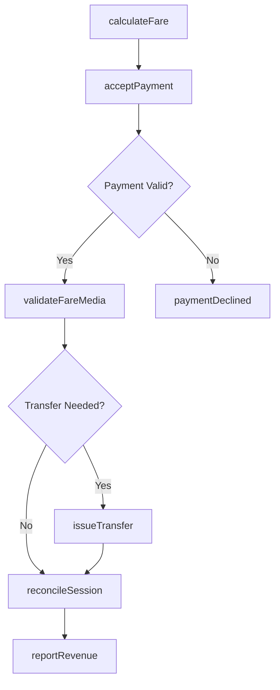
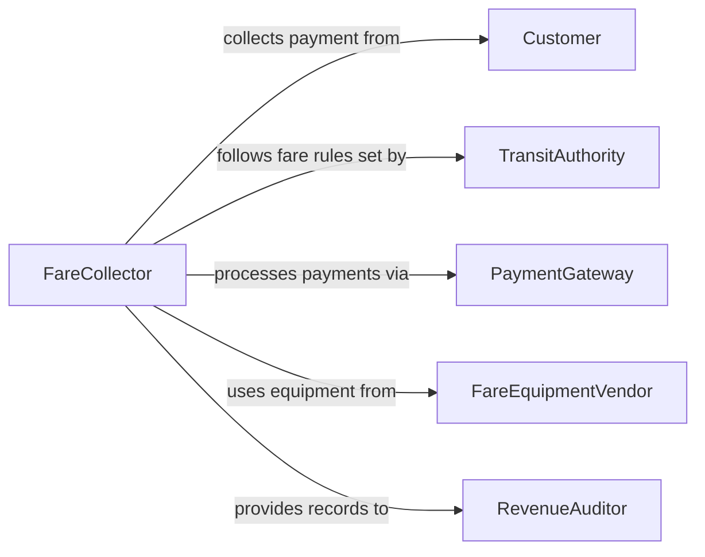

# Collect Fares Payment Customers

> Business-as-Code definition for collecting fares or payment from customers. Models the fare calculation, payment acceptance, and reconciliation process used in transportation, transit, and admission-based services.

## Overview

Collecting fares or payments from customers involves calculating the amount owed based on service type, distance, zone, or admission category, then accepting payment through various methods at the point of service. This activity is common in public transit, ride services, tolling, and venue admissions. The definition covers fare determination through collection, validation, and revenue reconciliation, supporting both manned and automated collection points.

## Actors

| Actor | Description |
|-------|-------------|
| Customer | The passenger, rider, or patron who owes a fare or admission fee |
| TransitAuthority | Sets fare structures, policies, and revenue targets |
| PaymentGateway | Processes electronic fare payments including contactless and mobile transactions |
| FareEquipmentVendor | Supplies and maintains fare boxes, turnstiles, and validators |
| RevenueAuditor | Reviews fare collection accuracy and identifies revenue leakage |

## Roles

| Role | Description |
|------|-------------|
| FareCollector | Accepts payments from customers at the point of service |
| TransitOperator | Operates vehicles or gates while monitoring fare compliance |
| RevenueAnalyst | Tracks collection volumes, reconciles deposits, and reports on revenue |
| StationAttendant | Assists customers with fare media, machines, and payment issues |

## Entities

| Entity | Description |
|--------|-------------|
| FareTransaction | A single fare payment event including amount, method, and timestamp |
| FareStructure | The pricing rules defining base fares, zones, transfers, and discounts |
| FareMedia | A physical or digital instrument used to pay fares such as cards, passes, or tickets |
| CollectionSession | A shift-level or device-level record of all fares collected during a period |
| RevenueReport | A summary of fare revenue collected across routes, stations, or time periods |

## Actions

| Action | Description |
|--------|-------------|
| calculateFare | Determine the amount owed based on route, zone, distance, or service type |
| acceptPayment | Receive fare payment via cash, card, mobile, or fare media |
| validateFareMedia | Verify that a ticket, pass, or stored-value card is valid for the trip |
| issueTransfer | Provide a transfer credential allowing continuation on another route or mode |
| reconcileSession | Match collected fares against expected revenue for a shift or device |
| reportRevenue | Generate fare revenue summaries by route, station, or time period |

## Events

| Event | Description |
|-------|-------------|
| fareCalculated | The amount owed has been determined for the customer |
| paymentAccepted | Fare payment has been successfully received |
| fareMediaValidated | A ticket, pass, or card has been verified as valid |
| transferIssued | A transfer credential has been provided to the customer |
| sessionReconciled | Collected fares have been matched against expected totals |
| revenueReported | Fare revenue summary has been generated and submitted |
| paymentDeclined | A fare payment attempt has been rejected |

## Searches

| Search | Description |
|--------|-------------|
| findFareTransactions | Search fare transactions by route, station, payment method, or date |
| getCollectionSessions | Retrieve session-level collection records by operator, device, or date |
| getRevenueReports | Look up revenue summaries by route, time period, or fare type |

## Workflow



## Actor Relationships



## Usage

### Calling Actions

```typescript
import { collectFaresPaymentCustomers } from '@headlessly/collect-fares-payment-customers'

const fares = collectFaresPaymentCustomers()

// Calculate fare for a bus trip
const fare = await fares.calculateFare({
  routeId: 'route-42-express',
  origin: 'stop-downtown-hub',
  destination: 'stop-airport-terminal',
  passengerType: 'adult',
  time: '2026-03-15T08:30:00Z'
})

// Accept contactless payment
const payment = await fares.acceptPayment({
  fareId: fare.id,
  method: 'contactless-card',
  cardToken: 'tok_visa_9283',
  amount: fare.amount
})

// Issue transfer for connecting route
await fares.issueTransfer({
  transactionId: payment.transactionId,
  validFor: 120,
  routes: ['route-15-local', 'route-22-crosstown']
})
```

### Event-Driven Automation

```typescript
// Auto-reconcile at end of collection session
fares.paymentAccepted(async ({ sessionId, amount }) => {
  const session = await fares.getCollectionSession(sessionId)
  if (session.endTime && new Date() >= new Date(session.endTime)) {
    await fares.reconcileSession({ sessionId })
  }
})

// Alert on high decline rates
fares.paymentDeclined(async ({ deviceId, routeId }) => {
  const recentDeclines = await fares.findFareTransactions({
    deviceId,
    status: 'declined',
    since: '1h'
  })
  if (recentDeclines.length > 10) {
    await notify({
      to: 'fare-operations',
      message: `High decline rate on device ${deviceId}, route ${routeId}`
    })
  }
})
```
