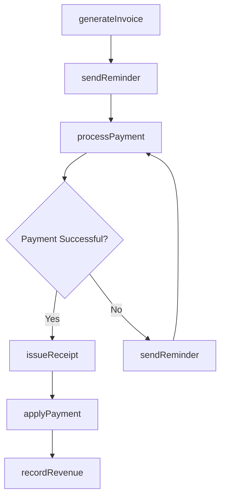
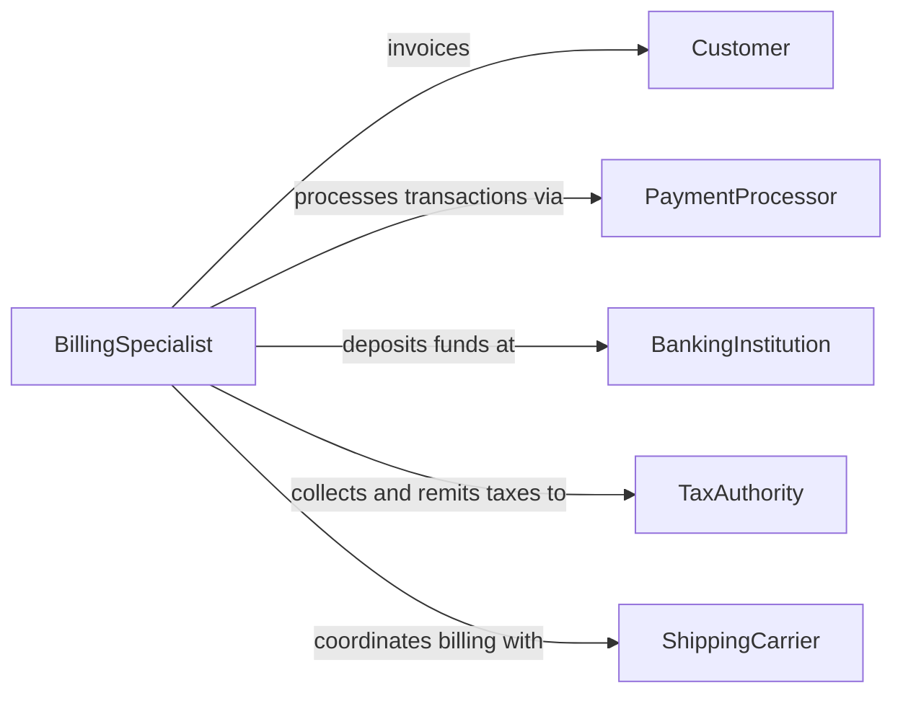

# Collect Payments Goods Services

> Business-as-Code definition for collecting payments for goods or services. Models the invoicing, payment acceptance, and revenue recording process for commercial transactions across retail, wholesale, and service-based businesses.

## Overview

Collecting payments for goods or services involves generating invoices or transaction totals, accepting payment through various methods, and recording revenue in the accounting system. This activity spans point-of-sale retail transactions, subscription billing, service invoicing, and wholesale order settlements. The definition covers the payment lifecycle from billing through collection, receipt generation, and accounts receivable management.

## Actors

| Actor | Description |
|-------|-------------|
| Customer | The buyer who purchases goods or services and submits payment |
| PaymentProcessor | Handles credit card, debit, ACH, and digital wallet transactions |
| BankingInstitution | Settles funds and provides merchant account services |
| TaxAuthority | Sets sales tax rates and requires remittance of collected taxes |
| ShippingCarrier | Delivers goods, triggering payment collection for shipped orders |

## Roles

| Role | Description |
|------|-------------|
| Cashier | Processes payments at the point of sale for in-person transactions |
| BillingSpecialist | Generates invoices and manages billing cycles for services and orders |
| AccountsReceivableManager | Tracks outstanding payments and manages collection follow-up |
| RevenueAccountant | Records collected payments and reconciles with the general ledger |

## Entities

| Entity | Description |
|--------|-------------|
| Invoice | A document itemizing goods or services provided and the amount due |
| Payment | A monetary transaction settling all or part of an invoice or purchase |
| Receipt | A document confirming payment has been received |
| SalesOrder | A record of goods or services ordered by the customer |
| PaymentMethod | The instrument used for payment such as credit card, check, or wire transfer |
| AccountBalance | The current outstanding amount owed by a customer |

## Actions

| Action | Description |
|--------|-------------|
| generateInvoice | Create a billing document for goods delivered or services rendered |
| processPayment | Accept and authorize a payment transaction from the customer |
| issueReceipt | Generate and deliver a payment confirmation to the customer |
| applyPayment | Match a received payment to the correct invoice or account balance |
| recordRevenue | Enter the collected amount into the accounting system |
| sendReminder | Notify the customer of an upcoming or past-due payment |
| writeOffBalance | Remove an uncollectable amount from accounts receivable |

## Events

| Event | Description |
|-------|-------------|
| invoiceGenerated | A billing document has been created and delivered to the customer |
| paymentProcessed | A payment has been successfully authorized and captured |
| receiptIssued | A payment confirmation has been sent to the customer |
| paymentApplied | A payment has been matched to the corresponding invoice |
| revenueRecorded | Collected funds have been entered into the general ledger |
| reminderSent | A payment reminder has been delivered to the customer |
| balanceWrittenOff | An uncollectable amount has been removed from receivables |

## Searches

| Search | Description |
|--------|-------------|
| findPayments | Search payments by customer, date range, amount, or method |
| getOutstandingInvoices | Retrieve unpaid invoices filtered by customer, due date, or aging bucket |
| getRevenueByPeriod | Look up collected revenue by date range, product category, or channel |
| getCustomerBalance | Retrieve the current outstanding balance for a specific customer |

## Workflow



## Actor Relationships



## Usage

### Calling Actions

```typescript
import { collectPaymentsGoodsServices } from '@headlessly/collect-payments-goods-services'

const payments = collectPaymentsGoodsServices()

// Generate an invoice for consulting services
const invoice = await payments.generateInvoice({
  customerId: 'cust-acme-corp',
  lineItems: [
    { description: 'Strategic consulting - January 2026', quantity: 80, rate: 250, unit: 'hours' },
    { description: 'Travel expenses', amount: 1200 }
  ],
  dueDate: '2026-02-28',
  taxRate: 0.0825
})

// Process payment when received
const payment = await payments.processPayment({
  invoiceId: invoice.id,
  method: 'ach-transfer',
  amount: invoice.totalDue,
  referenceNumber: 'ACH-20260225-4491'
})

// Apply payment and record revenue
await payments.applyPayment({ paymentId: payment.id, invoiceId: invoice.id })
await payments.recordRevenue({ paymentId: payment.id, glAccount: '4100-consulting-revenue' })
```

### Event-Driven Automation

```typescript
// Auto-issue receipt when payment is processed
payments.paymentProcessed(async ({ paymentId, customerId }) => {
  await payments.issueReceipt({ paymentId })
})

// Send reminder for invoices approaching due date
payments.invoiceGenerated(async ({ invoiceId, dueDate, customerId }) => {
  const reminderDate = new Date(dueDate)
  reminderDate.setDate(reminderDate.getDate() - 7)
  await schedule({
    at: reminderDate,
    action: () => payments.sendReminder({ invoiceId, customerId })
  })
})
```
