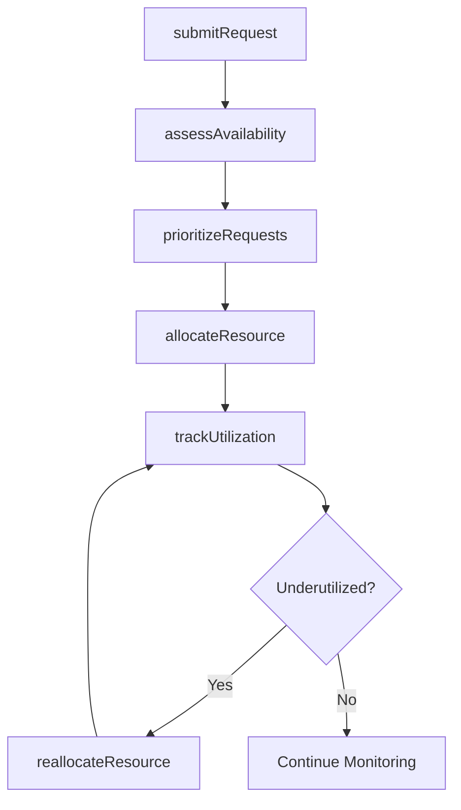
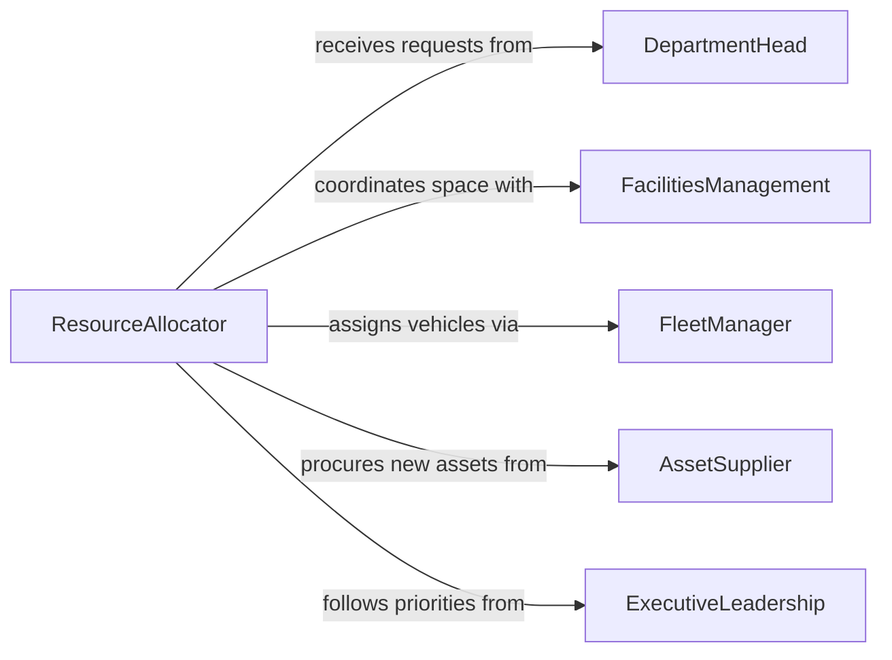

# Allocate Physical Resources Within Organizations

> Business-as-Code definition for allocating physical resources within organizations. Models the planning, assignment, and tracking of tangible assets such as equipment, vehicles, workspace, and supplies across departments and projects.

## Overview

Allocating physical resources within organizations involves assessing departmental needs, evaluating asset availability, and distributing tangible resources to maximize utilization and minimize waste. This includes equipment, vehicles, office space, furniture, and shared tools. The definition covers the resource allocation lifecycle from demand assessment through assignment, utilization tracking, and reallocation when priorities shift.

## Actors

| Actor | Description |
|-------|-------------|
| DepartmentHead | Submits resource requests based on team operational needs |
| FacilitiesManagement | Manages physical spaces, furniture, and building infrastructure |
| FleetManager | Oversees vehicle assignments, maintenance schedules, and availability |
| AssetSupplier | Provides new equipment, furniture, or supplies when current inventory is insufficient |
| ExecutiveLeadership | Sets organizational priorities that guide resource distribution |

## Roles

| Role | Description |
|------|-------------|
| ResourceAllocator | Evaluates requests and assigns physical resources across the organization |
| AssetManager | Tracks the lifecycle, condition, and location of all physical assets |
| OperationsCoordinator | Coordinates resource movement and logistics between departments |
| CapacityPlanner | Forecasts resource demand and identifies shortfalls before they occur |

## Entities

| Entity | Description |
|--------|-------------|
| ResourceRequest | A formal request from a department or project for physical assets |
| PhysicalAsset | A tangible item such as equipment, vehicle, workspace, or furniture |
| AllocationRecord | A documented assignment of an asset to a department, project, or individual |
| UtilizationReport | A summary of how allocated resources are being used over a period |
| ReallocationOrder | An instruction to transfer a resource from one assignment to another |
| AssetInventory | A catalog of all physical resources with their current status and location |

## Actions

| Action | Description |
|--------|-------------|
| submitRequest | Create a resource request specifying the asset type, quantity, and timeframe |
| assessAvailability | Check current inventory and utilization to determine what can be allocated |
| prioritizeRequests | Rank competing resource requests based on organizational priorities |
| allocateResource | Assign a physical asset to a department, project, or individual |
| trackUtilization | Monitor how allocated resources are being used and identify underuse |
| reallocateResource | Transfer a resource from one assignment to another based on changing needs |
| retireAsset | Remove an asset from the allocable pool due to end of life or disposal |

## Events

| Event | Description |
|-------|-------------|
| requestSubmitted | A department has submitted a request for physical resources |
| availabilityAssessed | Current inventory and utilization have been reviewed |
| requestsPrioritized | Competing requests have been ranked by organizational priority |
| resourceAllocated | A physical asset has been assigned to a department or project |
| utilizationTracked | Resource usage data has been collected and analyzed |
| resourceReallocated | An asset has been transferred to a different assignment |
| assetRetired | An asset has been removed from service |

## Searches

| Search | Description |
|--------|-------------|
| findAvailableAssets | Search physical assets by type, condition, location, and availability |
| getResourceRequests | Retrieve requests filtered by department, status, or priority |
| getUtilizationReports | Look up utilization data by asset type, department, or time period |
| getAllocationHistory | View the assignment history for a specific asset or department |

## Workflow



## Actor Relationships



## Usage

### Calling Actions

```typescript
import { allocatePhysicalResourcesWithinOrganizations } from '@headlessly/allocate-physical-resources-within-organizations'

const allocation = allocatePhysicalResourcesWithinOrganizations()

// Submit a request for additional laptops for the engineering team
const request = await allocation.submitRequest({
  departmentId: 'dept-engineering',
  assetType: 'laptop',
  quantity: 12,
  specifications: { minRAM: 32, minStorage: 512, os: 'macOS' },
  needed: '2026-04-01',
  justification: 'New hires starting Q2'
})

// Assess availability from current inventory
const availability = await allocation.assessAvailability({
  assetType: 'laptop',
  specifications: request.specifications
})

// Allocate available units and flag shortfall
await allocation.allocateResource({
  requestId: request.id,
  assets: availability.available.slice(0, 8).map(a => a.id),
  note: '8 of 12 units allocated from existing inventory; 4 require procurement'
})
```

### Event-Driven Automation

```typescript
// Auto-notify department when resources are allocated
allocation.resourceAllocated(async ({ requestId, departmentId, assetCount }) => {
  await notify({
    to: departmentId,
    message: `${assetCount} resources have been allocated for request ${requestId}`
  })
})

// Trigger reallocation review when utilization drops below threshold
allocation.utilizationTracked(async ({ assetId, utilizationRate }) => {
  if (utilizationRate < 0.3) {
    await notify({
      to: 'resource-planning',
      message: `Asset ${assetId} utilization at ${(utilizationRate * 100).toFixed(0)}% - consider reallocation`
    })
  }
})
```
