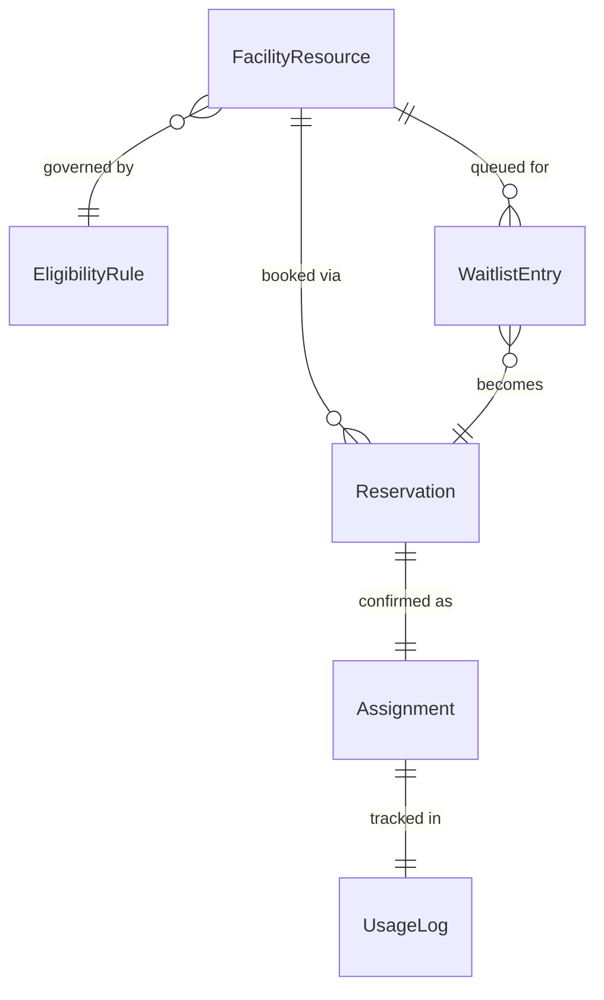
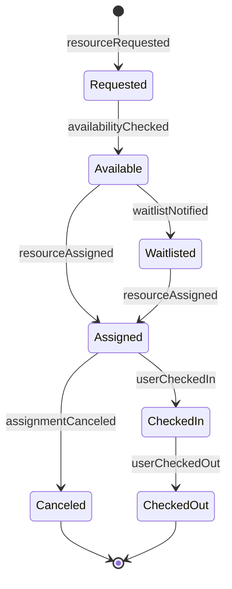
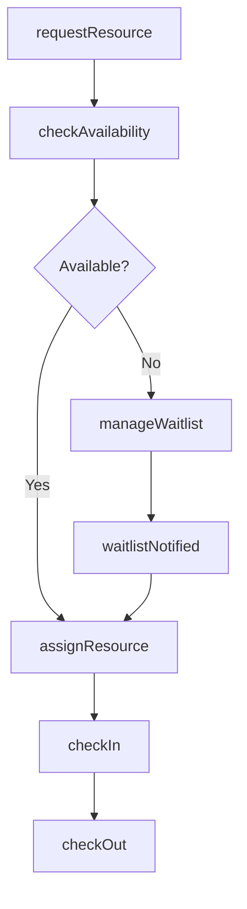
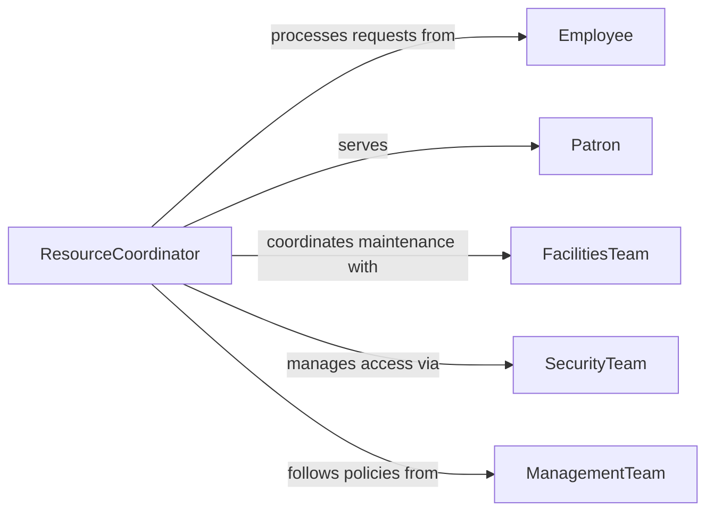

# Assign Resources Facilities Patrons Employees

> Business-as-Code definition for assigning resources or facilities to patrons or employees. Models the reservation, assignment, and management of shared spaces, equipment, and amenities for internal staff and external visitors.

## Overview

Assigning resources or facilities to patrons or employees involves managing the allocation of shared spaces such as meeting rooms, workstations, lockers, parking spots, and equipment to individuals based on eligibility, availability, and organizational policy. This activity balances competing demands, enforces booking rules, and tracks usage. The definition covers the assignment lifecycle from request or reservation through confirmation, check-in, and resource release.

## Actors

| Actor | Description |
|-------|-------------|
| Employee | An internal staff member requesting workspace, equipment, or facilities |
| Patron | An external visitor, member, or customer requesting facility access or resources |
| FacilitiesTeam | Maintains the physical spaces, amenities, and shared resources |
| SecurityTeam | Controls access to facilities and verifies authorized assignments |
| ManagementTeam | Sets policies governing resource priorities, eligibility, and usage limits |

## Roles

| Role | Description |
|------|-------------|
| ResourceCoordinator | Manages requests, schedules assignments, and resolves conflicts |
| FrontDeskAttendant | Processes walk-in requests and handles check-in and check-out |
| FacilitiesScheduler | Maintains the booking calendar and ensures resource availability |
| PolicyAdministrator | Configures eligibility rules, booking limits, and priority tiers |

## Entities

| Entity | Description |
|--------|-------------|
| FacilityResource | A shared space or asset available for assignment such as a room, desk, or locker |
| Reservation | A time-bound booking of a resource for a specific individual or group |
| Assignment | A confirmed allocation of a resource to a patron or employee |
| UsageLog | A record of check-in, check-out, and actual usage duration |
| EligibilityRule | A policy defining who can access specific resources and under what conditions |
| WaitlistEntry | A queued request for a resource that is currently fully booked |

## Actions

| Action | Description |
|--------|-------------|
| requestResource | Submit a request or reservation for a facility or shared resource |
| checkAvailability | Verify that the requested resource is open during the desired time |
| assignResource | Confirm the allocation of a resource to the requester |
| checkIn | Record the start of resource usage by the assigned individual |
| checkOut | Record the end of resource usage and release the resource for reassignment |
| cancelAssignment | Release a previously confirmed assignment and update availability |
| manageWaitlist | Add requesters to a queue and notify them when resources become available |

## Events

| Event | Description |
|-------|-------------|
| resourceRequested | A request or reservation has been submitted for a facility or resource |
| availabilityChecked | Resource availability has been confirmed for the requested time |
| resourceAssigned | A facility or resource has been allocated to the requester |
| userCheckedIn | The assigned individual has begun using the resource |
| userCheckedOut | The assigned individual has finished and the resource is released |
| assignmentCanceled | A confirmed assignment has been released |
| waitlistNotified | A queued requester has been alerted that a resource is now available |

## Searches

| Search | Description |
|--------|-------------|
| findAvailableResources | Search facilities and resources by type, location, capacity, and time slot |
| getReservations | Retrieve reservations by individual, resource, or date range |
| getUsageLogs | Look up resource usage history by individual, resource, or period |
| getWaitlist | View queued requests for a specific resource or facility |

## Entity Relationships



## State Diagram



## Workflow



## Actor Relationships



## Usage

### Calling Actions

```typescript
import { assignResourcesFacilitiesPatronsEmployees } from '@headlessly/assign-resources-facilities-patrons-employees'

const facilities = assignResourcesFacilitiesPatronsEmployees()

// Request a conference room for a team meeting
const reservation = await facilities.requestResource({
  requesterId: 'emp-sarah-lin',
  resourceType: 'conference-room',
  requirements: { capacity: 10, av: true, whiteboard: true },
  date: '2026-03-12',
  startTime: '10:00',
  endTime: '11:30'
})

// Assign the resource after availability check
const assignment = await facilities.assignResource({
  reservationId: reservation.id,
  resourceId: 'room-3b-eagle',
  confirmationEmail: true
})

// Check in when the meeting starts
await facilities.checkIn({
  assignmentId: assignment.id,
  userId: 'emp-sarah-lin'
})
```

### Event-Driven Automation

```typescript
// Auto-release resources if no check-in within 15 minutes
facilities.resourceAssigned(async ({ assignmentId, startTime }) => {
  const graceDeadline = new Date(startTime)
  graceDeadline.setMinutes(graceDeadline.getMinutes() + 15)
  await schedule({
    at: graceDeadline,
    action: async () => {
      const usage = await facilities.getUsageLogs({ assignmentId })
      if (!usage.checkedIn) {
        await facilities.cancelAssignment({ assignmentId, reason: 'no-show' })
      }
    }
  })
})

// Notify waitlisted users when a resource is freed
facilities.assignmentCanceled(async ({ resourceId, date, timeSlot }) => {
  const waitlist = await facilities.getWaitlist({ resourceId, date })
  if (waitlist.length > 0) {
    await notify({
      to: waitlist[0].requesterId,
      message: `${resourceId} is now available for ${date} ${timeSlot}`
    })
  }
})
```
