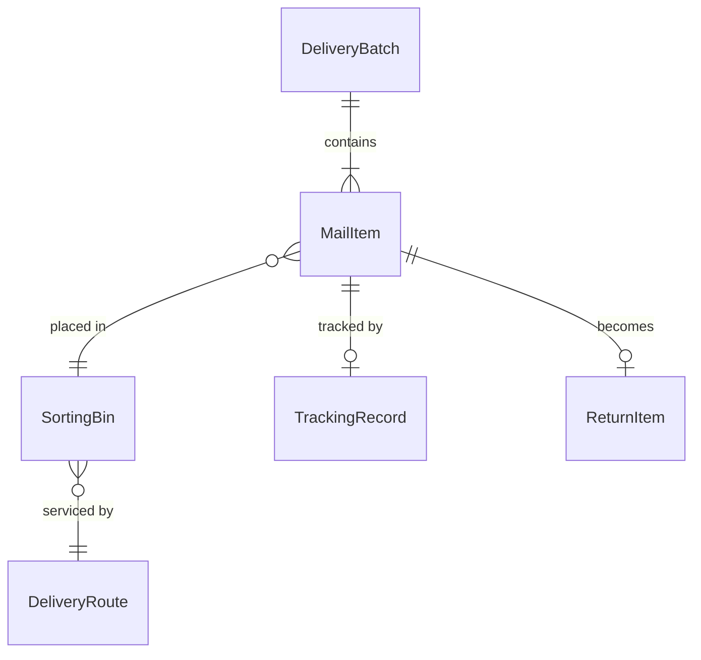
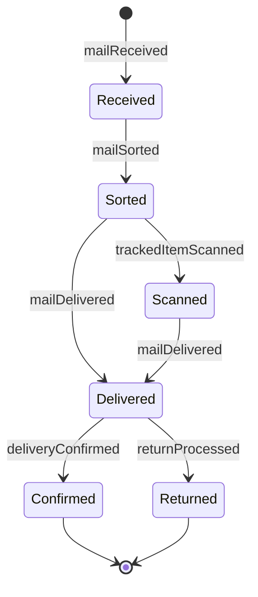
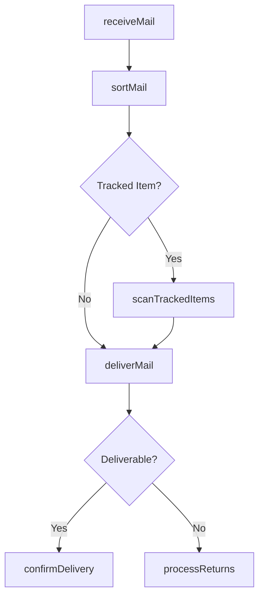
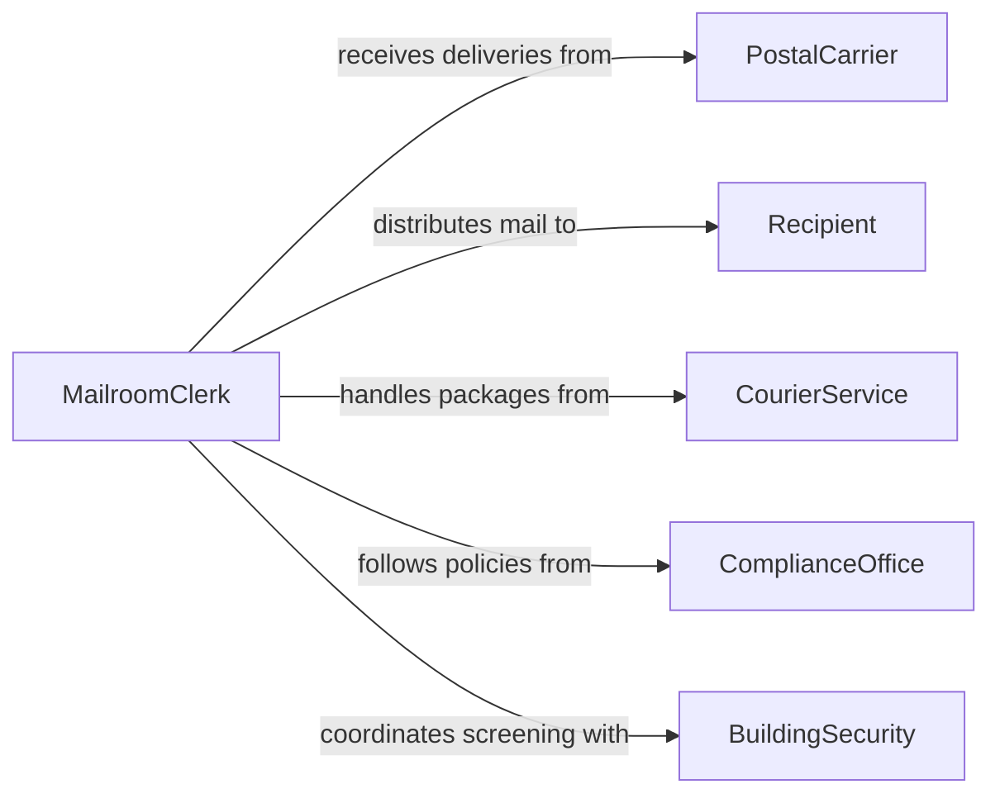

# Distribute Incoming Mail

> Business-as-Code definition for distributing incoming mail. Models the receiving, sorting, routing, and delivery of physical mail and packages to recipients within an organization.

## Overview

Distributing incoming mail involves receiving postal deliveries, courier packages, and interoffice correspondence, then sorting and routing items to the correct departments, offices, or individuals. This process requires accurate addressee identification, timely delivery, and tracking of accountable items such as registered mail and packages requiring signatures. The definition covers the mail handling lifecycle from receipt at the mailroom through sorting, delivery, and confirmation of receipt.

## Actors

| Actor | Description |
|-------|-------------|
| PostalCarrier | Delivers mail and packages from external postal services and couriers |
| Recipient | The individual or department for whom the mail item is intended |
| CourierService | Provides tracked and expedited delivery of packages and documents |
| ComplianceOffice | Sets policies for handling sensitive, regulated, or classified mail |
| BuildingSecurity | Screens incoming packages for safety and access compliance |

## Roles

| Role | Description |
|------|-------------|
| MailroomClerk | Receives, sorts, and delivers mail to recipients throughout the facility |
| MailroomSupervisor | Oversees mail operations, staffing, and service level adherence |
| MailroomRunner | Physically delivers sorted mail to floors, departments, or individual offices |
| RecordsSpecialist | Logs and tracks accountable mail items requiring signature or chain of custody |

## Entities

| Entity | Description |
|--------|-------------|
| MailItem | A single piece of incoming correspondence, package, or interoffice envelope |
| DeliveryBatch | A group of mail items received during a single postal or courier delivery |
| SortingBin | A designated container or slot for a specific department, floor, or individual |
| DeliveryRoute | A defined path through the facility for distributing sorted mail |
| TrackingRecord | A log entry for accountable mail items including receipt and delivery timestamps |
| ReturnItem | A piece of mail that cannot be delivered due to incorrect addressing or unknown recipient |

## Actions

| Action | Description |
|--------|-------------|
| receiveMail | Accept and log incoming mail and packages from postal carriers and couriers |
| sortMail | Categorize and route mail items to the appropriate department or individual |
| scanTrackedItems | Record tracking numbers and signatures for accountable packages and registered mail |
| deliverMail | Physically transport sorted mail to recipient locations within the facility |
| confirmDelivery | Obtain signature or acknowledgment from the recipient for tracked items |
| processReturns | Handle undeliverable mail by forwarding, returning to sender, or holding |

## Events

| Event | Description |
|-------|-------------|
| mailReceived | A delivery batch has been accepted and logged at the mailroom |
| mailSorted | Mail items have been categorized and placed in sorting bins |
| trackedItemScanned | An accountable mail item has been logged with its tracking number |
| mailDelivered | Sorted mail has been transported to recipient locations |
| deliveryConfirmed | A tracked item has been signed for or acknowledged by the recipient |
| returnProcessed | An undeliverable item has been forwarded, returned, or placed on hold |

## Searches

| Search | Description |
|--------|-------------|
| findMailItems | Search mail items by recipient, sender, tracking number, or delivery date |
| getDeliveryBatches | Retrieve batch records by carrier, date, or time of receipt |
| getTrackingRecords | Look up tracked item status by tracking number, recipient, or date |

## Entity Relationships



## State Diagram



## Workflow



## Actor Relationships



## Usage

### Calling Actions

```typescript
import { distributeIncomingMail } from '@headlessly/distribute-incoming-mail'

const mailroom = distributeIncomingMail()

// Receive a morning delivery batch
const batch = await mailroom.receiveMail({
  carrier: 'usps',
  deliveryTime: '2026-03-10T09:15:00Z',
  itemCount: 47,
  trackedItems: 3
})

// Sort mail into department bins
await mailroom.sortMail({
  batchId: batch.id,
  assignments: [
    { itemId: 'mail-001', destination: 'dept-finance', floor: 3 },
    { itemId: 'mail-002', destination: 'dept-legal', floor: 5 },
    { itemId: 'pkg-003', destination: 'emp-david-park', floor: 2, tracked: true }
  ]
})

// Scan tracked package and confirm delivery
await mailroom.scanTrackedItems({
  batchId: batch.id,
  items: [{ itemId: 'pkg-003', trackingNumber: '9400111899223100047' }]
})

await mailroom.confirmDelivery({
  itemId: 'pkg-003',
  recipientId: 'emp-david-park',
  signedBy: 'David Park'
})
```

### Event-Driven Automation

```typescript
// Notify recipients when tracked packages arrive
mailroom.trackedItemScanned(async ({ itemId, recipientId, trackingNumber }) => {
  await notify({
    to: recipientId,
    message: `Package ${trackingNumber} has arrived at the mailroom and is ready for delivery`
  })
})

// Alert mailroom supervisor for undeliverable items
mailroom.returnProcessed(async ({ itemId, reason, sender }) => {
  await notify({
    to: 'mailroom-supervisor',
    message: `Undeliverable item ${itemId} from ${sender} - reason: ${reason}`
  })
})
```
