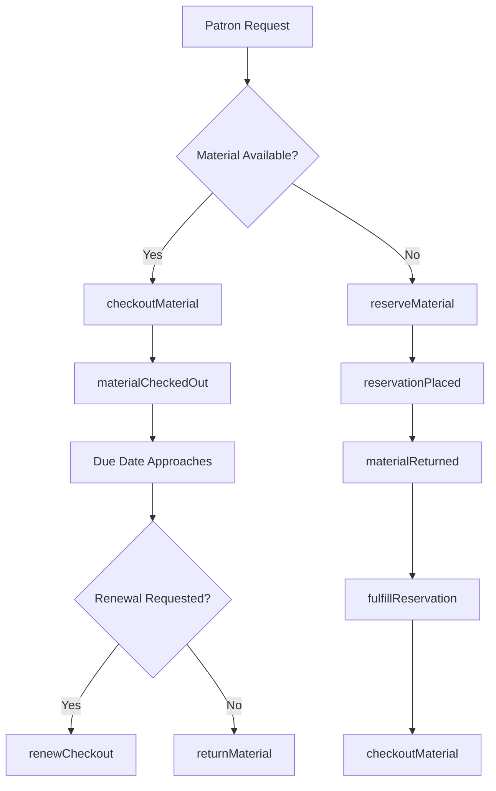
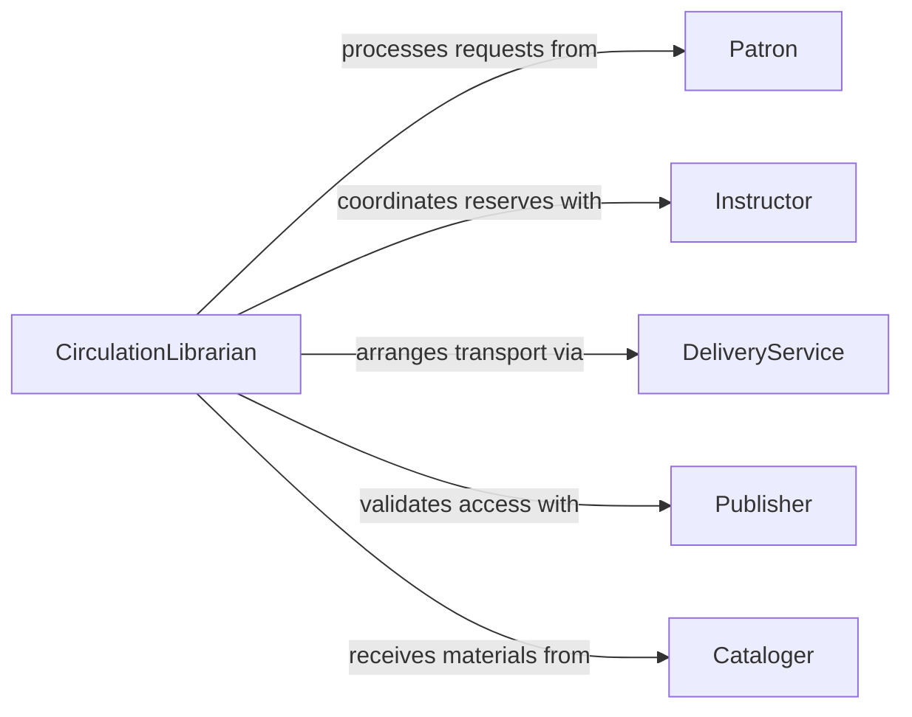

# Distribute Instructional Library Materials

> Business-as-Code definition for instructional and library material distribution. Models circulation, lending, and delivery of educational resources and library collections.

## Overview

Instructional and library material distribution involves managing the circulation, reservation, and delivery of educational resources to patrons and learners. This definition exposes actions for checkout processing, reservation management, and material tracking across physical and digital library collections.

## Actors

| Actor | Description |
|-------|-------------|
| Patron | Requests and receives library materials |
| Instructor | Requests course reserves and supplementary materials |
| Publisher | Provides licensing and access to digital resources |
| DeliveryService | Transports materials for interlibrary loans |
| Donor | Contributes materials to library collection |
| Cataloger | Maintains metadata and collection organization |

## Roles

| Role | Description |
|------|-------------|
| CirculationLibrarian | Manages material checkout and returns |
| ReferenceLibrarian | Assists patrons with resource discovery and access |
| ReservesCoordinator | Handles course reserve requests and distribution |
| CollectionManager | Oversees material acquisition and availability |

## Entities

| Entity | Description |
|--------|-------------|
| LibraryMaterial | Physical or digital resource in collection |
| Checkout | Record of material loaned to patron |
| Reservation | Request to borrow material currently unavailable |
| CourseReserve | Materials designated for specific course access |
| DeliveryRequest | Request for material transport or digital access |
| CirculationPolicy | Rules governing loan periods and restrictions |

## Actions

| Action | Description |
|--------|-------------|
| checkoutMaterial | Loan material to patron with due date |
| returnMaterial | Process returned material and update availability |
| reserveMaterial | Place hold on material currently checked out |
| fulfillReservation | Notify patron and prepare reserved material |
| createCourseReserve | Designate materials for specific course access |
| deliverMaterial | Arrange physical or digital delivery to patron |
| renewCheckout | Extend loan period for checked-out material |

## Events

| Event | Description |
|-------|-------------|
| materialCheckedOut | Material has been loaned to patron |
| materialReturned | Material has been returned to library |
| reservationPlaced | Hold has been placed on unavailable material |
| reservationFulfilled | Reserved material is ready for pickup |
| courseReserveCreated | Materials have been designated for course |
| materialDelivered | Material has been transported to patron |
| checkoutRenewed | Loan period has been extended |

## Searches

| Search | Description |
|--------|-------------|
| findAvailableMaterials | List materials available for checkout |
| getActiveCheckouts | Retrieve materials currently on loan |
| getPendingReservations | List holds awaiting fulfillment |
| getCourseReserves | Find materials designated for specific courses |

## Workflow



## Actor Relationships



## Usage

### Calling Actions

```typescript
import { distributeInstructionalLibraryMaterials } from '@headlessly/distribute-instructional-library-materials'

const circulation = distributeInstructionalLibraryMaterials()

// Checkout material to patron
const checkout = await circulation.checkoutMaterial({
  materialId: 'BOOK-2024-1547',
  patronId: 'P-89432',
  dueDate: '2026-03-15',
  loanPeriod: '21 days'
})

// Place reservation on unavailable material
const reservation = await circulation.reserveMaterial({
  materialId: 'BOOK-2024-1547',
  patronId: 'P-90214',
  notificationPreference: 'email'
})

// Create course reserve for instructor
const courseReserve = await circulation.createCourseReserve({
  courseId: 'ECON-301',
  instructorId: 'I-4523',
  materials: [
    { id: 'BOOK-2024-8821', loanPeriod: '2 hours' },
    { id: 'JOURNAL-2025-445', loanPeriod: '24 hours' }
  ],
  semester: 'Spring 2026'
})

// Process material return
await circulation.returnMaterial({
  checkoutId: checkout.id,
  condition: 'good',
  returnDate: '2026-03-10'
})
```

### Event-Driven Automation

```typescript
// Auto-notify patron when reserved material becomes available
circulation.reservationFulfilled(async ({ reservationId, materialId, patronId }) => {
  const patron = await getPatron(patronId)

  await notify({
    to: patron.email,
    subject: 'Library Hold Ready for Pickup',
    body: `Your reserved material is now available. Please pick up within 7 days.`
  })
})

// Send overdue notices
circulation.materialCheckedOut(async ({ checkoutId, dueDate }) => {
  const reminderDate = new Date(dueDate)
  reminderDate.setDate(reminderDate.getDate() - 3)

  await scheduleNotification({
    date: reminderDate,
    action: 'sendDueReminder',
    checkoutId
  })
})
```
