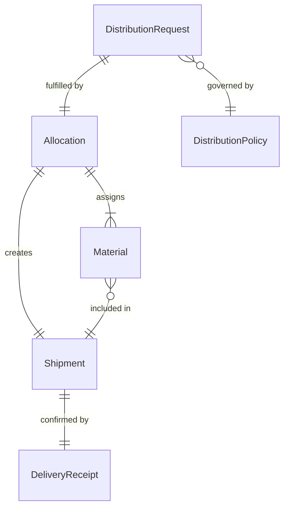
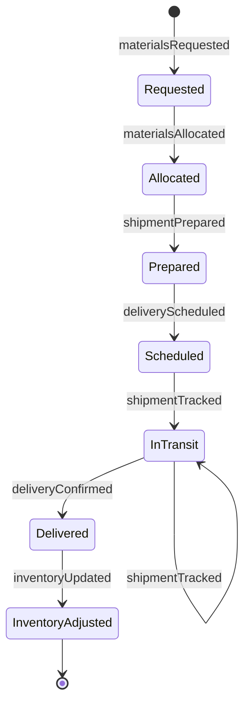
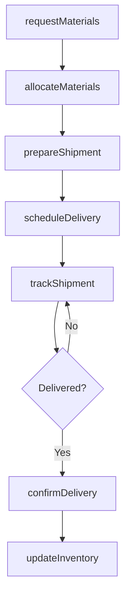
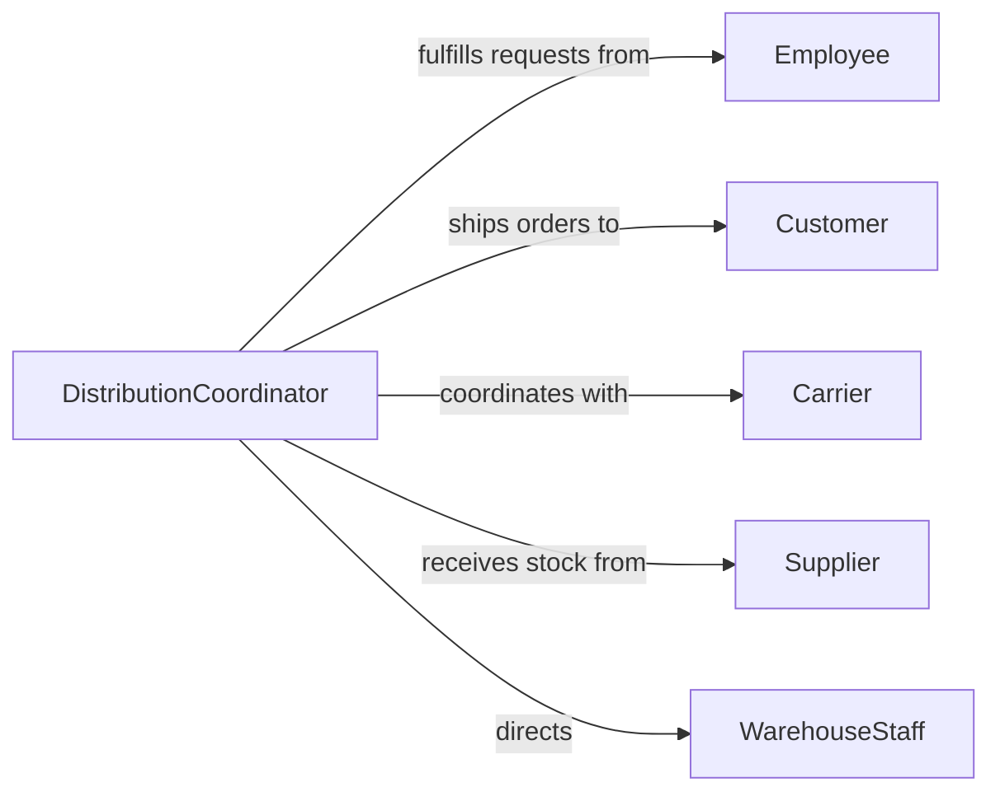

# Distribute Materials Employees Customers

> Business-as-Code definition for material distribution. Models allocation, delivery, and tracking of materials to internal employees and external customers.

## Overview

Material distribution involves managing the allocation and delivery of physical resources to employees for operational use and to customers as part of product fulfillment or service delivery. This definition exposes actions for distribution planning, shipment coordination, and delivery tracking across internal and external recipients.

## Actors

| Actor | Description |
|-------|-------------|
| Employee | Receives materials for work assignments and projects |
| Customer | Receives materials as part of product orders or services |
| Supplier | Provides materials for distribution |
| Carrier | Transports materials to recipients |
| WarehouseStaff | Prepares materials for distribution |
| QualityControl | Verifies material condition before distribution |

## Roles

| Role | Description |
|------|-------------|
| DistributionCoordinator | Manages material allocation and delivery scheduling |
| InventoryManager | Oversees material availability and replenishment |
| LogisticsSpecialist | Coordinates transportation and tracking |
| FulfillmentAgent | Processes and packages material orders |

## Entities

| Entity | Description |
|--------|-------------|
| Material | Physical item or resource to be distributed |
| DistributionRequest | Order or requisition for materials |
| Allocation | Assignment of materials to specific recipient |
| Shipment | Package of materials in transit to recipient |
| DeliveryReceipt | Confirmation of material receipt by recipient |
| DistributionPolicy | Rules governing material eligibility and limits |

## Actions

| Action | Description |
|--------|-------------|
| requestMaterials | Submit requisition for materials |
| allocateMaterials | Assign available materials to recipient |
| prepareShipment | Package materials for delivery |
| scheduleDelivery | Arrange transportation to recipient location |
| trackShipment | Monitor delivery status and location |
| confirmDelivery | Record receipt of materials by recipient |
| updateInventory | Adjust stock levels after distribution |

## Events

| Event | Description |
|-------|-------------|
| materialsRequested | Requisition has been submitted |
| materialsAllocated | Materials have been assigned to recipient |
| shipmentPrepared | Package is ready for dispatch |
| deliveryScheduled | Transportation has been arranged |
| shipmentTracked | Delivery status has been updated |
| deliveryConfirmed | Materials received by recipient |
| inventoryUpdated | Stock levels have been adjusted |

## Searches

| Search | Description |
|--------|-------------|
| findRequests | Retrieve distribution requests by status or recipient |
| getAllocations | List material allocations by date or type |
| trackShipments | Search active shipments and delivery status |
| getDeliveryHistory | Find past distributions by recipient or material |

## Entity Relationships



## State Diagram



## Workflow



## Actor Relationships



## Usage

### Calling Actions

```typescript
import { distributeMaterialsEmployeesCustomers } from '@headlessly/distribute-materials-employees-customers'

const distribution = distributeMaterialsEmployeesCustomers()

// Employee requests materials for project
const employeeRequest = await distribution.requestMaterials({
  requestor: 'E-4523',
  requestorType: 'employee',
  materials: [
    { itemId: 'TOOL-892', quantity: 2, purpose: 'Installation Project 45' },
    { itemId: 'SUPPLY-334', quantity: 50, purpose: 'Field repairs' }
  ],
  deliveryLocation: 'Site Office - Building 3',
  urgency: 'standard'
})

// Allocate materials and prepare for distribution
await distribution.allocateMaterials({
  requestId: employeeRequest.id,
  allocations: [
    { itemId: 'TOOL-892', quantity: 2, warehouseLocation: 'B-14' },
    { itemId: 'SUPPLY-334', quantity: 50, warehouseLocation: 'C-08' }
  ]
})

// Customer order distribution
const customerOrder = await distribution.requestMaterials({
  requestor: 'C-78432',
  requestorType: 'customer',
  orderId: 'ORD-2026-8834',
  materials: [
    { itemId: 'PROD-1147', quantity: 10 }
  ],
  deliveryAddress: '1425 Industrial Blvd, Austin TX 78723'
})

const shipment = await distribution.prepareShipment({
  requestId: customerOrder.id,
  packingInstructions: 'Fragile - Handle with care',
  carrierPreference: 'FedEx Ground'
})

await distribution.scheduleDelivery({
  shipmentId: shipment.id,
  carrier: 'FedEx',
  serviceLevel: 'Ground',
  estimatedDelivery: '2026-02-10'
})
```

### Event-Driven Automation

```typescript
// Auto-send tracking information to recipient
distribution.deliveryScheduled(async ({ shipmentId, trackingNumber, recipientId }) => {
  const recipient = await getRecipient(recipientId)

  await notify({
    to: recipient.email,
    subject: `Shipment on the way - Tracking ${trackingNumber}`,
    body: `Your materials are en route. Track your delivery at...`
  })
})

// Alert inventory team when stock levels drop
distribution.inventoryUpdated(async ({ itemId, newQuantity, reorderPoint }) => {
  if (newQuantity <= reorderPoint) {
    await createTask({
      type: 'InventoryReplenishment',
      priority: 'high',
      item: itemId,
      currentStock: newQuantity,
      action: 'Reorder from supplier'
    })
  }
})
```
