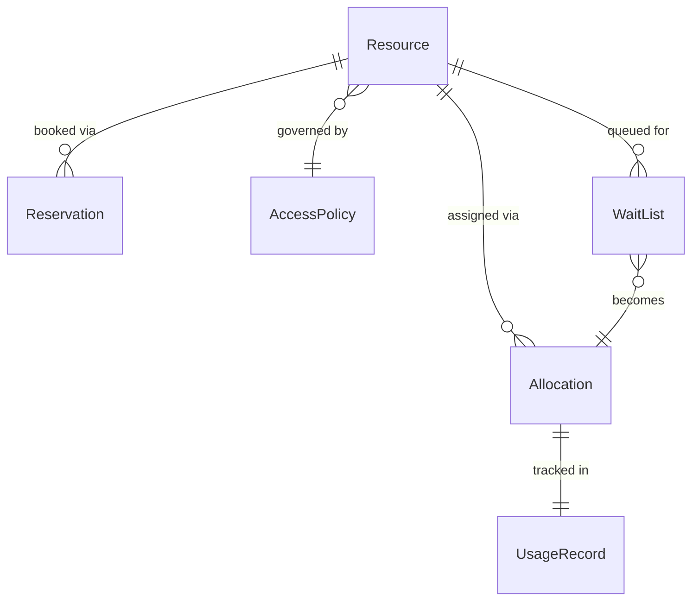
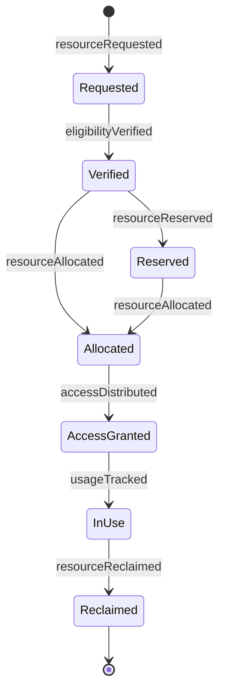
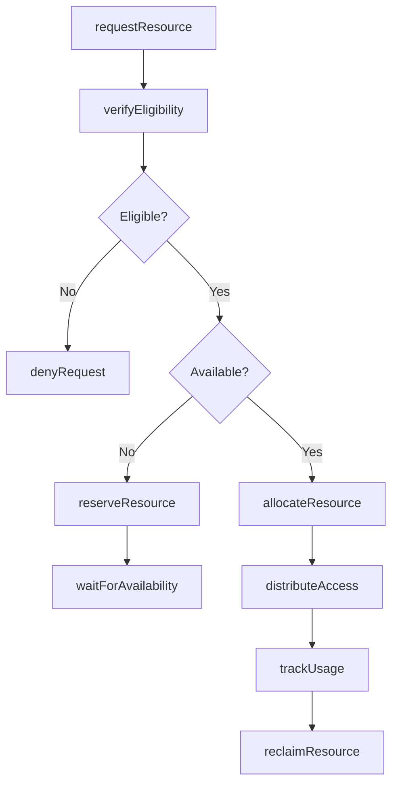
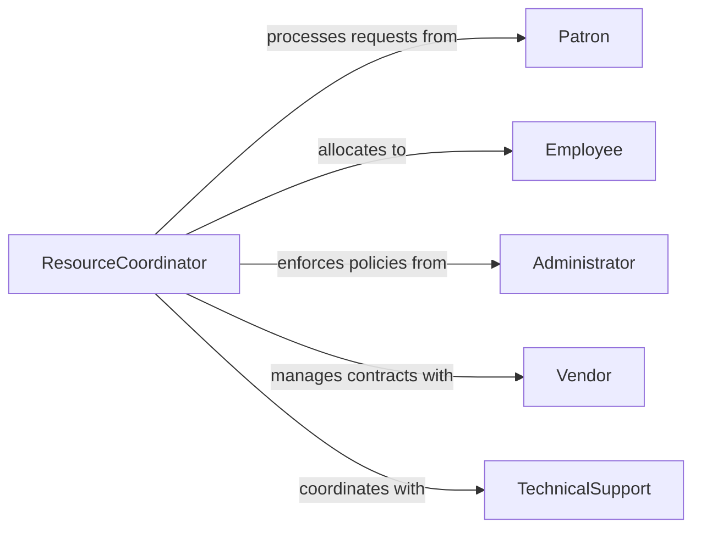

# Distribute Resources Patrons Employees

> Business-as-Code definition for resource distribution. Models allocation and delivery of shared organizational resources to patrons and employees based on eligibility and availability.

## Overview

Resource distribution involves managing access to and allocation of shared organizational assets including equipment, facilities, digital resources, and support services. This definition exposes actions for resource reservation, allocation management, and usage tracking across patron and employee populations.

## Actors

| Actor | Description |
|-------|-------------|
| Patron | External individual requesting organizational resources |
| Employee | Internal staff member requiring work resources |
| Administrator | Oversees resource policies and access controls |
| Vendor | Provides resources under contract or license |
| Sponsor | Funds or authorizes special resource allocations |
| TechnicalSupport | Assists with resource setup and troubleshooting |

## Roles

| Role | Description |
|------|-------------|
| ResourceCoordinator | Manages resource allocation and scheduling |
| AccessManager | Controls eligibility and permission settings |
| UtilizationAnalyst | Monitors resource usage and optimization |
| SupportSpecialist | Assists recipients with resource access |

## Entities

| Entity | Description |
|--------|-------------|
| Resource | Shared asset available for allocation |
| Allocation | Assignment of resource to specific recipient |
| Reservation | Scheduled access to resource for future use |
| AccessPolicy | Rules governing resource eligibility and duration |
| UsageRecord | Documentation of resource utilization |
| WaitList | Queue of pending requests when resource unavailable |

## Actions

| Action | Description |
|--------|-------------|
| requestResource | Submit request for resource access |
| verifyEligibility | Confirm recipient meets access requirements |
| allocateResource | Assign resource to eligible recipient |
| reserveResource | Schedule future resource access |
| distributeAccess | Provide credentials or physical access to resource |
| trackUsage | Monitor resource utilization by recipient |
| reclaimResource | Return resource to available pool |

## Events

| Event | Description |
|-------|-------------|
| resourceRequested | Request for resource access has been submitted |
| eligibilityVerified | Access requirements have been confirmed |
| resourceAllocated | Resource has been assigned to recipient |
| resourceReserved | Future access has been scheduled |
| accessDistributed | Credentials or access have been provided |
| usageTracked | Resource utilization has been recorded |
| resourceReclaimed | Resource has been returned to pool |

## Searches

| Search | Description |
|--------|-------------|
| findAvailableResources | List resources available for allocation |
| getAllocations | Retrieve current resource assignments |
| getReservations | Find scheduled resource access by date or recipient |
| getUsageMetrics | Search utilization data by resource or period |

## Entity Relationships



## State Diagram



## Workflow



## Actor Relationships



## Usage

### Calling Actions

```typescript
import { distributeResourcesPatronsEmployees } from '@headlessly/distribute-resources-patrons-employees'

const resources = distributeResourcesPatronsEmployees()

// Patron requests access to meeting room
const patronRequest = await resources.requestResource({
  requestorId: 'PATRON-8432',
  requestorType: 'patron',
  resourceType: 'meetingRoom',
  resourceId: 'ROOM-204',
  startTime: '2026-02-15T14:00:00',
  duration: '2 hours',
  purpose: 'Community workshop'
})

// Verify eligibility and allocate
const eligibility = await resources.verifyEligibility({
  requestId: patronRequest.id,
  policyId: 'PATRON-FACILITY-POLICY'
})

if (eligibility.approved) {
  await resources.allocateResource({
    requestId: patronRequest.id,
    allocation: {
      resourceId: 'ROOM-204',
      startTime: '2026-02-15T14:00:00',
      endTime: '2026-02-15T16:00:00'
    }
  })
}

// Employee requests equipment checkout
const employeeRequest = await resources.requestResource({
  requestorId: 'E-5623',
  requestorType: 'employee',
  resourceType: 'equipment',
  resourceId: 'LAPTOP-45',
  startDate: '2026-02-10',
  duration: '14 days',
  purpose: 'Remote work assignment'
})

// Track resource usage
await resources.trackUsage({
  allocationId: employeeRequest.id,
  usageDate: '2026-02-12',
  metrics: {
    utilizationHours: 8,
    location: 'Remote',
    condition: 'good'
  }
})
```

### Event-Driven Automation

```typescript
// Auto-distribute access credentials when resource is allocated
resources.resourceAllocated(async ({ allocationId, resourceId, recipientId }) => {
  const resource = await getResource(resourceId)

  if (resource.requiresCredentials) {
    await resources.distributeAccess({
      allocationId,
      credentials: await generateAccess(recipientId, resourceId),
      instructions: resource.accessInstructions
    })
  }
})

// Send return reminders before allocation expires
resources.accessDistributed(async ({ allocationId, endTime }) => {
  const reminderTime = new Date(endTime)
  reminderTime.setDate(reminderTime.getDate() - 1)

  await scheduleNotification({
    time: reminderTime,
    action: 'sendReturnReminder',
    allocationId
  })
})
```
