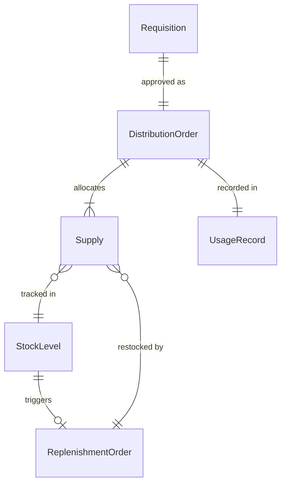
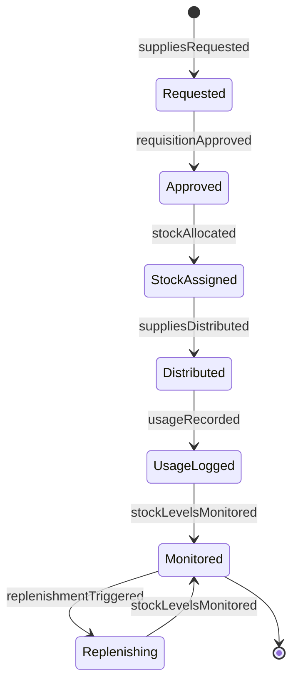
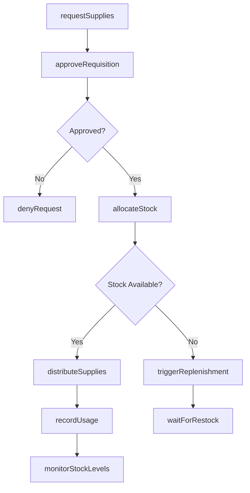
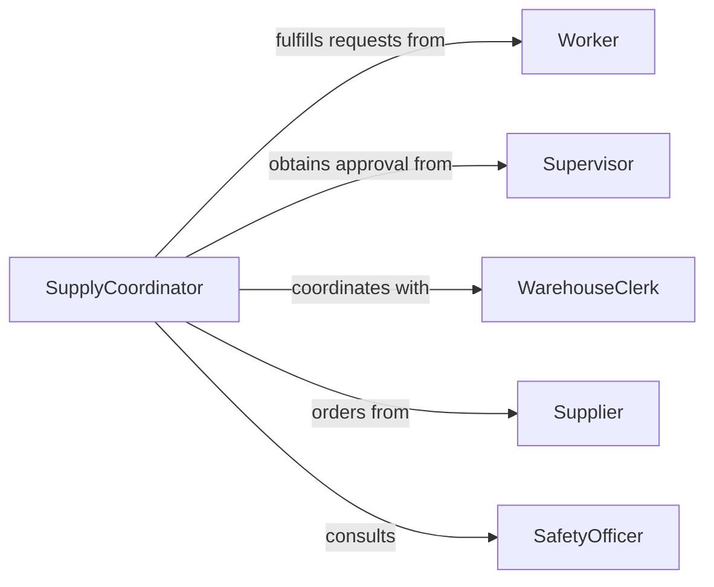

# Distribute Supplies Workers

> Business-as-Code definition for worker supply distribution. Models allocation and tracking of consumables, tools, and safety equipment to workforce personnel.

## Overview

Worker supply distribution involves managing the allocation, delivery, and replenishment of consumable materials, tools, and personal protective equipment needed for job performance. This definition exposes actions for requisition processing, inventory management, and usage tracking across distributed workforce locations.

## Actors

| Actor | Description |
|-------|-------------|
| Worker | Receives supplies for job tasks and assignments |
| Supervisor | Approves supply requests and monitors usage |
| Supplier | Provides supplies through procurement agreements |
| WarehouseClerk | Maintains inventory and prepares distributions |
| SafetyOfficer | Ensures proper protective equipment distribution |
| ProjectManager | Oversees supply needs for specific work assignments |

## Roles

| Role | Description |
|------|-------------|
| SupplyCoordinator | Manages supply requisitions and distributions |
| InventoryController | Monitors stock levels and reordering |
| DistributionAgent | Processes and delivers supplies to workers |
| UsageAnalyst | Tracks consumption patterns and waste |

## Entities

| Entity | Description |
|--------|-------------|
| Supply | Consumable material or tool for work tasks |
| Requisition | Worker request for supplies |
| DistributionOrder | Approved allocation of supplies to worker |
| StockLevel | Current inventory quantity by location |
| UsageRecord | Documentation of supply consumption |
| ReplenishmentOrder | Request to restock depleted supplies |

## Actions

| Action | Description |
|--------|-------------|
| requestSupplies | Submit requisition for needed supplies |
| approveRequisition | Authorize supply distribution to worker |
| allocateStock | Assign available supplies from inventory |
| distributeSupplies | Deliver supplies to worker location |
| recordUsage | Document supply consumption by worker |
| monitorStockLevels | Track inventory quantities across locations |
| triggerReplenishment | Initiate reorder when stock reaches threshold |

## Events

| Event | Description |
|-------|-------------|
| suppliesRequested | Requisition has been submitted by worker |
| requisitionApproved | Supply request has been authorized |
| stockAllocated | Supplies have been assigned from inventory |
| suppliesDistributed | Supplies have been delivered to worker |
| usageRecorded | Consumption has been documented |
| stockLevelsMonitored | Inventory check has been completed |
| replenishmentTriggered | Reorder has been initiated |

## Searches

| Search | Description |
|--------|-------------|
| findRequisitions | Retrieve supply requests by worker or status |
| getStockLevels | Check inventory quantities by location or item |
| getDistributions | List supply deliveries by date or worker |
| getUsageHistory | Find consumption patterns by supply or worker |

## Entity Relationships



## State Diagram



## Workflow



## Actor Relationships



## Usage

### Calling Actions

```typescript
import { distributeSuppliesWorkers } from '@headlessly/distribute-supplies-workers'

const supplies = distributeSuppliesWorkers()

// Worker requests supplies for job
const requisition = await supplies.requestSupplies({
  workerId: 'W-4521',
  jobSite: 'Construction Site Alpha',
  items: [
    { supplyId: 'PPE-GLOVE-L', quantity: 10, urgency: 'routine' },
    { supplyId: 'TOOL-DRILL-BIT-5MM', quantity: 5, urgency: 'immediate' },
    { supplyId: 'SUPPLY-FASTENER-M8', quantity: 200, urgency: 'routine' }
  ],
  deliveryLocation: 'Site Office Trailer',
  requestedDate: '2026-02-08'
})

// Supervisor approves requisition
await supplies.approveRequisition({
  requisitionId: requisition.id,
  approverId: 'S-823',
  comments: 'Approved for Phase 2 installation work'
})

// Allocate and distribute supplies
const allocation = await supplies.allocateStock({
  requisitionId: requisition.id,
  warehouseId: 'WH-02',
  allocationDate: '2026-02-07'
})

await supplies.distributeSupplies({
  allocationId: allocation.id,
  deliveryMethod: 'site_delivery',
  estimatedDelivery: '2026-02-08T09:00:00'
})

// Record usage after distribution
await supplies.recordUsage({
  workerId: 'W-4521',
  items: [
    { supplyId: 'PPE-GLOVE-L', quantityUsed: 2, date: '2026-02-08' },
    { supplyId: 'TOOL-DRILL-BIT-5MM', quantityUsed: 1, date: '2026-02-08' }
  ]
})
```

### Event-Driven Automation

```typescript
// Auto-trigger replenishment when stock is low
supplies.stockLevelsMonitored(async ({ locationId, items }) => {
  for (const item of items) {
    if (item.currentStock <= item.reorderPoint) {
      await supplies.triggerReplenishment({
        supplyId: item.id,
        locationId,
        reorderQuantity: item.standardOrderSize,
        priority: item.currentStock === 0 ? 'urgent' : 'routine'
      })
    }
  }
})

// Notify worker when supplies are ready for pickup
supplies.suppliesDistributed(async ({ allocationId, workerId, deliveryLocation }) => {
  const worker = await getWorker(workerId)

  await notify({
    to: worker.phone,
    type: 'sms',
    message: `Your supplies are ready for pickup at ${deliveryLocation}`
  })
})
```
