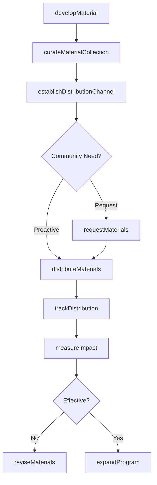
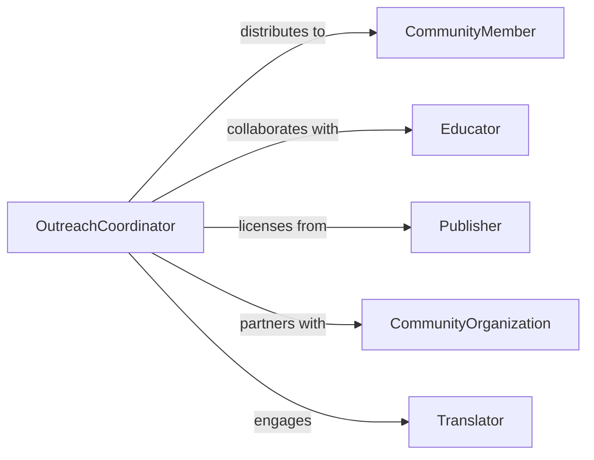

# Provide Educational Materials Community Members

> Business-as-Code definition for community educational material provision. Models creation, distribution, and tracking of learning resources for community education and outreach programs.

## Overview

Educational material provision involves developing, curating, and distributing learning resources to community members through libraries, schools, nonprofits, and public programs. This definition exposes actions for content development, distribution channel management, and impact tracking across diverse community populations.

## Actors

| Actor | Description |
|-------|-------------|
| CommunityMember | Receives educational materials and resources |
| Educator | Creates and recommends educational content |
| Publisher | Provides licensed educational materials |
| CommunityOrganization | Partners in distribution and outreach |
| Sponsor | Funds educational material development and distribution |
| Translator | Adapts materials for multilingual communities |

## Roles

| Role | Description |
|------|-------------|
| OutreachCoordinator | Manages community engagement and distribution |
| ContentCurator | Selects and organizes educational resources |
| DistributionManager | Oversees delivery channels and logistics |
| ImpactAnalyst | Measures reach and effectiveness of materials |

## Entities

| Entity | Description |
|--------|-------------|
| EducationalMaterial | Resource designed for community learning |
| DistributionChannel | Method or location for material delivery |
| CommunityRequest | Request for specific educational resources |
| Distribution | Record of materials provided to community members |
| AccessPoint | Physical or digital location for material access |
| ImpactMetric | Measurement of material reach and effectiveness |

## Actions

| Action | Description |
|--------|-------------|
| developMaterial | Create or acquire educational resources |
| curateMaterialCollection | Organize resources by topic or audience |
| establishDistributionChannel | Set up method for material delivery |
| requestMaterials | Submit need for specific educational content |
| distributeMaterials | Deliver resources to community members |
| trackDistribution | Monitor material reach and usage |
| measureImpact | Assess effectiveness and community benefit |

## Events

| Event | Description |
|-------|-------------|
| materialDeveloped | Educational resource has been created |
| collectionCurated | Resources have been organized for distribution |
| distributionChannelEstablished | Delivery method has been activated |
| materialsRequested | Community need has been documented |
| materialsDistributed | Resources have been delivered to community |
| distributionTracked | Reach metrics have been recorded |
| impactMeasured | Effectiveness has been assessed |

## Searches

| Search | Description |
|--------|-------------|
| findMaterials | Retrieve educational resources by topic or audience |
| getDistributions | List material deliveries by channel or date |
| getRequests | Search community requests by topic or urgency |
| getImpactMetrics | Find effectiveness data by material or program |

## Workflow



## Actor Relationships



## Usage

### Calling Actions

```typescript
import { provideEducationalMaterialsCommunityMembers } from '@headlessly/provide-educational-materials-community-members'

const education = provideEducationalMaterialsCommunityMembers()

// Develop new educational material
const material = await education.developMaterial({
  title: 'Financial Literacy for Families',
  format: 'print_and_digital',
  topics: ['budgeting', 'savings', 'credit', 'investing'],
  targetAudience: 'adults',
  languages: ['en', 'es'],
  developmentCost: 8500
})

// Curate collection for specific program
const collection = await education.curateMaterialCollection({
  name: 'Adult Education Series - Spring 2026',
  materials: [material.id, 'MAT-4521', 'MAT-8834'],
  targetProgram: 'Community Center Evening Classes',
  organization: 'Public Library System'
})

// Establish distribution channel
await education.establishDistributionChannel({
  collectionId: collection.id,
  channelType: 'community_center',
  locations: ['Center-Downtown', 'Center-Eastside', 'Center-Westpark'],
  schedule: 'Tuesday evenings 6-8pm',
  capacity: 150
})

// Distribute materials to community members
const distribution = await education.distributeMaterials({
  collectionId: collection.id,
  channelId: 'CHN-45',
  recipientCount: 42,
  date: '2026-02-11',
  method: 'in_person_pickup'
})

// Measure impact
await education.measureImpact({
  materialId: material.id,
  metrics: {
    totalDistributed: 847,
    surveyResponses: 112,
    satisfactionScore: 4.3,
    knowledgeGain: 0.68,
    behaviorChange: 0.42
  },
  period: 'Q1 2026'
})
```

### Event-Driven Automation

```typescript
// Auto-translate materials for multilingual communities
education.materialDeveloped(async ({ materialId, languages }) => {
  const defaultLanguages = ['en', 'es', 'zh']

  for (const lang of defaultLanguages) {
    if (!languages.includes(lang)) {
      await requestTranslation({
        materialId,
        targetLanguage: lang,
        priority: 'standard'
      })
    }
  }
})

// Alert outreach team when materials are requested
education.materialsRequested(async ({ requestId, topic, urgency }) => {
  await notify({
    to: 'outreach-team',
    subject: `Community Material Request: ${topic}`,
    priority: urgency,
    body: `New request for educational materials on ${topic}`
  })
})
```
