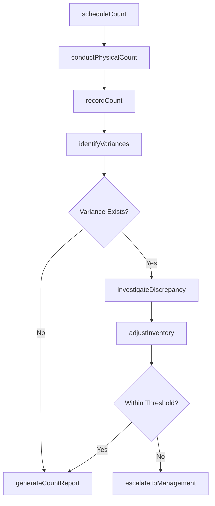
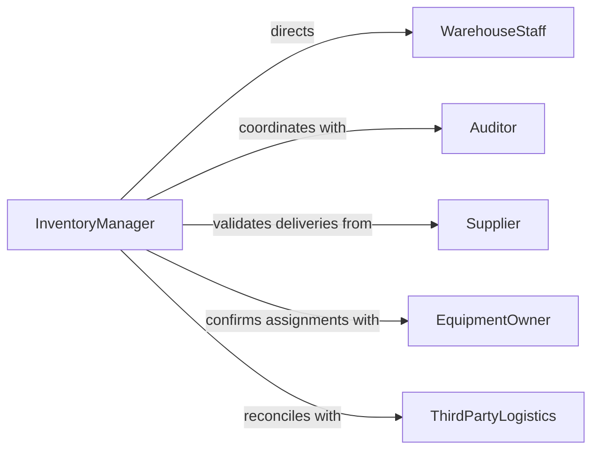

# Inventory Materials Equipment

> Business-as-Code definition for materials and equipment inventory management. Models physical counting, tracking, and reconciliation of materials and equipment across organizational locations.

## Overview

Materials and equipment inventory management involves periodic counting, condition assessment, and reconciliation of physical assets against records. This definition exposes actions for cycle counting, variance investigation, and inventory accuracy improvement across warehouses, facilities, and field locations.

## Actors

| Actor | Description |
|-------|-------------|
| WarehouseStaff | Conducts physical counts and maintains inventory |
| Auditor | Verifies inventory accuracy and controls |
| Supplier | Provides replenishment stock and delivery confirmation |
| EquipmentOwner | Department or individual accountable for equipment |
| ThirdPartyLogistics | Manages inventory at external storage locations |
| ProcurementTeam | Initiates orders based on inventory levels |

## Roles

| Role | Description |
|------|-------------|
| InventoryManager | Oversees inventory accuracy and cycle counting |
| CycleCounter | Performs physical counts of materials and equipment |
| VarianceAnalyst | Investigates discrepancies between physical and system records |
| AssetController | Maintains equipment records and assignments |

## Entities

| Entity | Description |
|--------|-------------|
| InventoryItem | Material or equipment tracked in system |
| PhysicalCount | Record of actual quantity from physical inspection |
| Variance | Discrepancy between physical count and system record |
| CycleCountSchedule | Plan for periodic inventory verification |
| Location | Storage area or facility where inventory is held |
| InventoryAdjustment | Correction to system record based on physical count |

## Actions

| Action | Description |
|--------|-------------|
| scheduleCount | Plan cycle counting activities by location or item |
| conductPhysicalCount | Perform actual counting of materials and equipment |
| recordCount | Document physical count results in system |
| identifyVariances | Compare physical counts to system records |
| investigateDiscrepancy | Analyze root cause of inventory variances |
| adjustInventory | Correct system records based on physical counts |
| generateCountReport | Produce inventory accuracy metrics and findings |

## Events

| Event | Description |
|-------|-------------|
| countScheduled | Cycle counting activities have been planned |
| physicalCountConducted | Actual counting has been completed |
| countRecorded | Count results have been documented |
| variancesIdentified | Discrepancies have been detected |
| discrepancyInvestigated | Root cause analysis has been completed |
| inventoryAdjusted | System records have been corrected |
| countReportGenerated | Accuracy metrics have been produced |

## Searches

| Search | Description |
|--------|-------------|
| findScheduledCounts | Retrieve planned counting activities by date or location |
| getCountResults | Search physical count records by item or period |
| getVariances | List inventory discrepancies by magnitude or type |
| getAccuracyMetrics | Find inventory accuracy rates by location or category |

## Workflow



## Actor Relationships



## Usage

### Calling Actions

```typescript
import { inventoryMaterialsEquipment } from '@headlessly/inventory-materials-equipment'

const inventory = inventoryMaterialsEquipment()

// Schedule cycle counting for warehouse section
const schedule = await inventory.scheduleCount({
  location: 'Warehouse-01-Section-B',
  countType: 'cycle',
  items: ['SKU-4521', 'SKU-8834', 'SKU-2241'],
  scheduledDate: '2026-02-12',
  assignedCounter: 'CC-04'
})

// Conduct physical count
const count = await inventory.conductPhysicalCount({
  scheduleId: schedule.id,
  counterId: 'CC-04',
  startTime: '2026-02-12T08:00:00'
})

// Record count results
await inventory.recordCount({
  countId: count.id,
  results: [
    { itemId: 'SKU-4521', physicalQuantity: 247, location: 'B-14' },
    { itemId: 'SKU-8834', physicalQuantity: 89, location: 'B-18' },
    { itemId: 'SKU-2241', physicalQuantity: 0, location: 'B-22' }
  ],
  completionTime: '2026-02-12T10:30:00'
})

// Identify and investigate variances
const variances = await inventory.identifyVariances({
  countId: count.id,
  thresholdPercentage: 0.05
})

if (variances.length > 0) {
  for (const variance of variances) {
    await inventory.investigateDiscrepancy({
      varianceId: variance.id,
      investigation: {
        rootCause: 'unreported damage disposal',
        evidence: 'Found disposal records not entered in system',
        correctionNeeded: true
      }
    })
  }
}
```

### Event-Driven Automation

```typescript
// Auto-adjust inventory for approved variances
inventory.discrepancyInvestigated(async ({ varianceId, investigation }) => {
  if (investigation.correctionNeeded && investigation.approved) {
    await inventory.adjustInventory({
      varianceId,
      adjustmentType: 'physical_count',
      approver: investigation.approvedBy
    })
  }
})

// Alert management on significant variances
inventory.variancesIdentified(async ({ countId, variances }) => {
  const significantVariances = variances.filter(v => Math.abs(v.variancePercent) > 10)

  if (significantVariances.length > 0) {
    await notify({
      to: 'inventory-management',
      priority: 'high',
      subject: `Significant Inventory Variances Detected`,
      body: `${significantVariances.length} items with variance > 10%`
    })
  }
})
```
