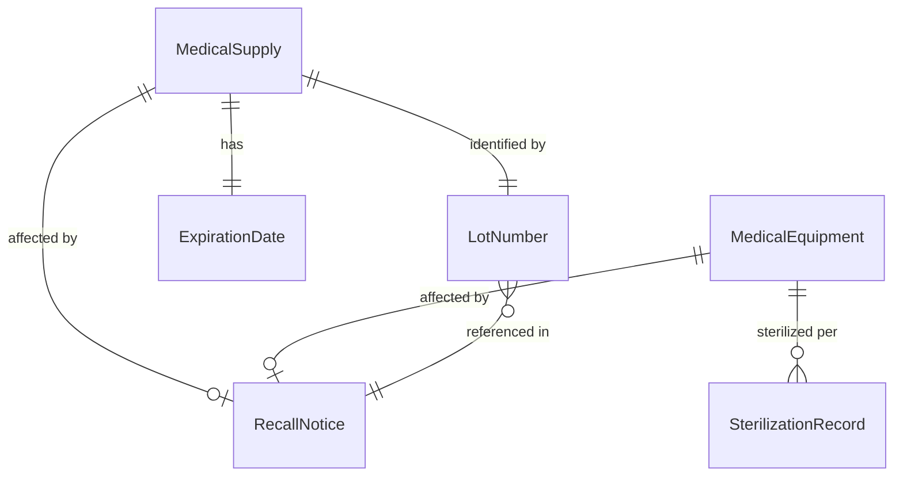
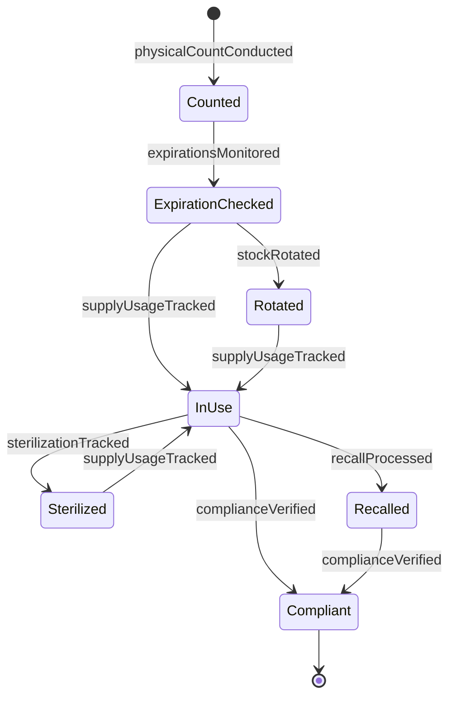
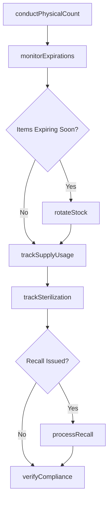
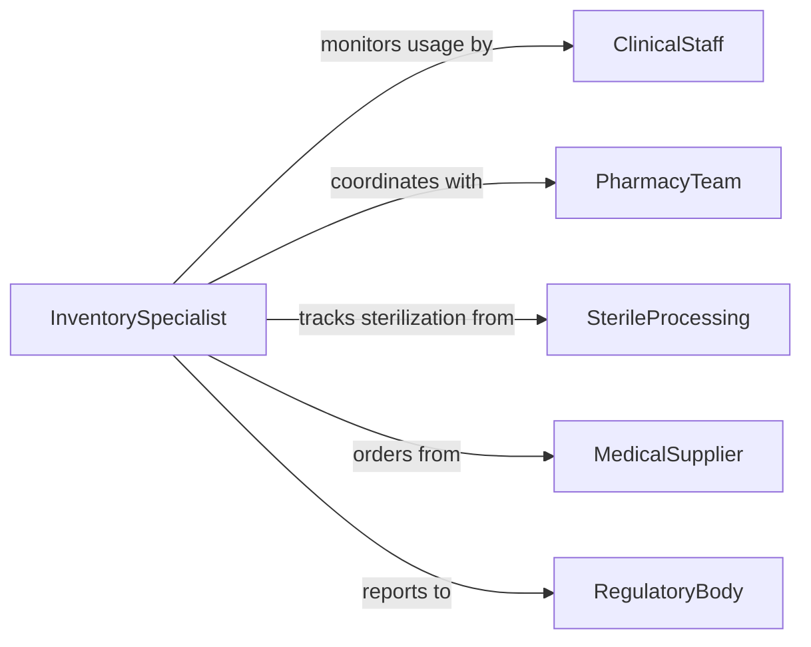

# Inventory Medical Supplies Equipment

> Business-as-Code definition for medical supplies and equipment inventory management. Models tracking, counting, and compliance monitoring of healthcare materials and devices.

## Overview

Medical supplies and equipment inventory management involves tracking usage, conducting physical counts, and ensuring regulatory compliance for healthcare materials and devices. This definition exposes actions for expiration monitoring, sterility tracking, and recall management across clinical and storage locations.

## Actors

| Actor | Description |
|-------|-------------|
| ClinicalStaff | Uses medical supplies and equipment in patient care |
| PharmacyTeam | Manages pharmaceutical inventory and distribution |
| SterileProcessing | Maintains and tracks sterilization of equipment |
| MedicalSupplier | Provides replenishment stock and delivery |
| RegulatoryBody | Enforces compliance standards for medical inventory |
| BiomedicalTechnician | Maintains and calibrates medical equipment |

## Roles

| Role | Description |
|------|-------------|
| InventorySpecialist | Manages medical supply tracking and counts |
| ExpirationManager | Monitors and rotates expiring materials |
| EquipmentCoordinator | Tracks medical device location and maintenance |
| ComplianceOfficer | Ensures regulatory adherence in inventory practices |

## Entities

| Entity | Description |
|--------|-------------|
| MedicalSupply | Consumable healthcare material tracked in inventory |
| MedicalEquipment | Reusable device or instrument for patient care |
| ExpirationDate | Date after which supply is no longer safe to use |
| LotNumber | Manufacturer batch identifier for traceability |
| SterilizationRecord | Documentation of equipment sterilization cycle |
| RecallNotice | Alert for defective or compromised products |

## Actions

| Action | Description |
|--------|-------------|
| trackSupplyUsage | Record consumption of medical supplies by patient or procedure |
| conductPhysicalCount | Perform actual counting of supplies and equipment |
| monitorExpirations | Identify supplies approaching expiration dates |
| rotatStock | Move older inventory to front for first-out usage |
| trackSterilization | Document equipment sterilization cycles |
| processRecall | Remove affected items from inventory per recall notice |
| verifyCompliance | Ensure inventory practices meet regulatory standards |

## Events

| Event | Description |
|-------|-------------|
| supplyUsageTracked | Consumption has been recorded |
| physicalCountConducted | Actual counting has been completed |
| expirationsMonitored | Expiration dates have been reviewed |
| stockRotated | Inventory has been reorganized by age |
| sterilizationTracked | Sterilization cycle has been documented |
| recallProcessed | Recalled items have been removed |
| complianceVerified | Regulatory adherence has been confirmed |

## Searches

| Search | Description |
|--------|-------------|
| findExpiringSupplies | List supplies expiring within specified timeframe |
| getUsageByProcedure | Search consumption patterns by procedure type |
| getEquipmentLocation | Find current location of medical devices |
| getRecallAffectedItems | List inventory matching recall criteria |

## Entity Relationships



## State Diagram



## Workflow



## Actor Relationships



## Usage

### Calling Actions

```typescript
import { inventoryMedicalSuppliesEquipment } from '@headlessly/inventory-medical-supplies-equipment'

const medicalInventory = inventoryMedicalSuppliesEquipment()

// Track supply usage during procedure
await medicalInventory.trackSupplyUsage({
  procedureId: 'PROC-2026-4521',
  patientId: 'P-89234',
  department: 'Surgery',
  supplies: [
    { itemId: 'SUTURE-4-0-SILK', lotNumber: 'L2025-4482', quantity: 3 },
    { itemId: 'SURGICAL-GLOVE-M', lotNumber: 'L2025-9034', quantity: 4 },
    { itemId: 'GAUZE-4X4-STERILE', lotNumber: 'L2026-1145', quantity: 20 }
  ],
  usageDate: '2026-02-11'
})

// Conduct periodic count of high-value supplies
const count = await medicalInventory.conductPhysicalCount({
  location: 'Operating Room Supply Closet 3',
  countType: 'high_value',
  items: ['IMPLANT-HIP-TITANIUM', 'CARDIAC-STENT-DRUG-ELUTE'],
  countDate: '2026-02-12'
})

// Monitor expiring supplies
const expiringItems = await medicalInventory.monitorExpirations({
  locations: ['Pharmacy', 'Emergency Department', 'ICU Supply'],
  daysUntilExpiration: 30
})

// Track equipment sterilization
await medicalInventory.trackSterilization({
  equipmentId: 'SURGICAL-INSTRUMENT-SET-12',
  sterilizationCycle: 'CYCLE-2026-02-11-08',
  method: 'autoclave',
  temperature: 134,
  duration: 18,
  operator: 'SPD-04',
  verificationDate: '2026-02-11T09:30:00'
})

// Process recall notice
await medicalInventory.processRecall({
  recallNotice: 'FDA-2026-RC-8834',
  affectedProduct: 'IV Tubing Set Model XR-500',
  lotNumbers: ['L2025-8821', 'L2025-8822', 'L2025-8823'],
  action: 'quarantine_and_return',
  urgency: 'immediate'
})
```

### Event-Driven Automation

```typescript
// Auto-rotate expiring supplies to high-visibility locations
medicalInventory.expirationsMonitored(async ({ expiringItems }) => {
  for (const item of expiringItems) {
    if (item.daysUntilExpiration <= 14) {
      await medicalInventory.rotateStock({
        itemId: item.id,
        fromLocation: item.currentLocation,
        toLocation: `${item.department}-Front-Stock`,
        reason: 'expiration_approaching'
      })
    }
  }
})

// Alert clinical staff when recall affects current inventory
medicalInventory.recallProcessed(async ({ recallNotice, affectedItems }) => {
  await notify({
    to: 'clinical-leadership',
    priority: 'critical',
    subject: `RECALL: ${affectedItems.length} items quarantined`,
    body: `Recall notice ${recallNotice} has been processed. Affected inventory removed from use.`
  })
})
```
