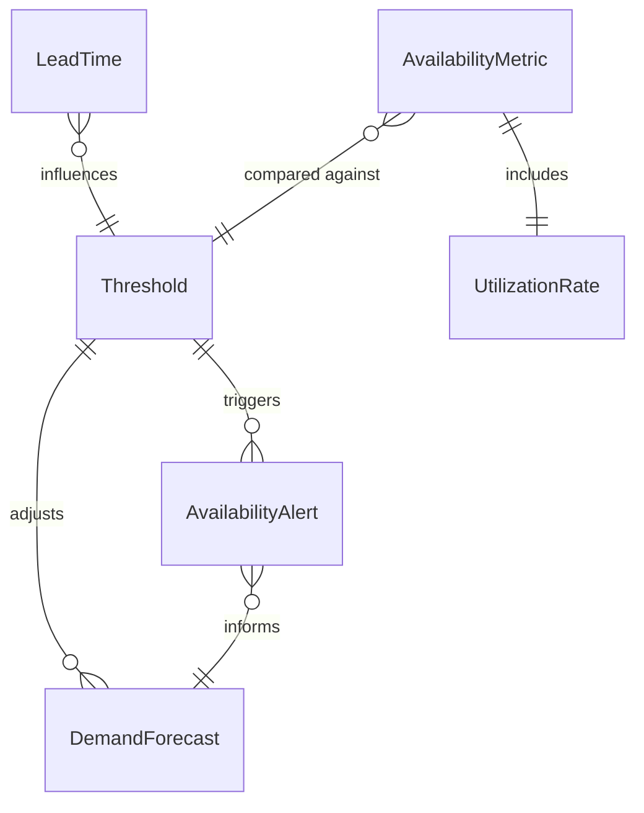
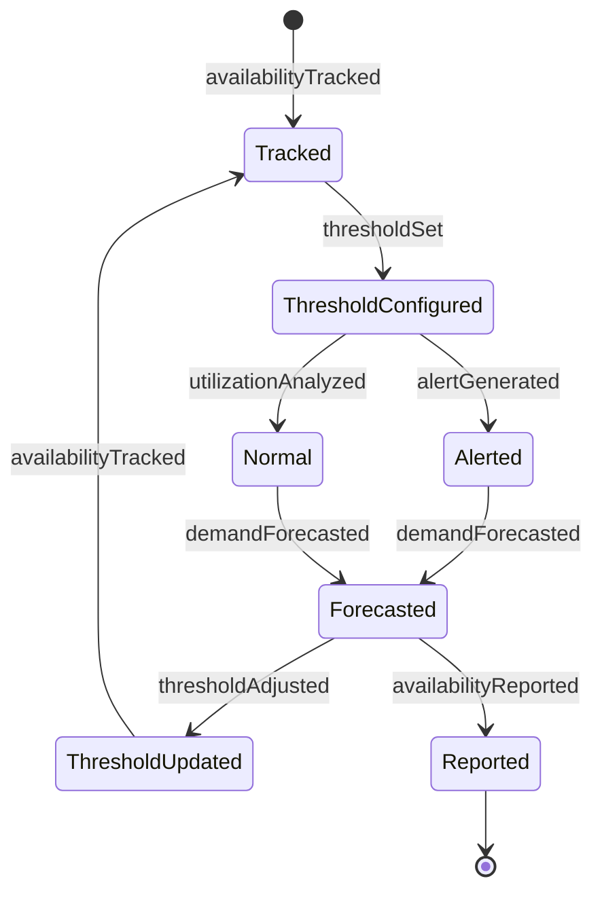
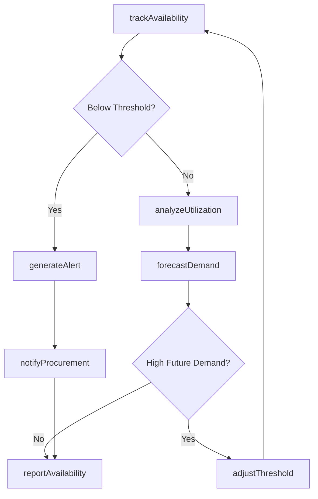
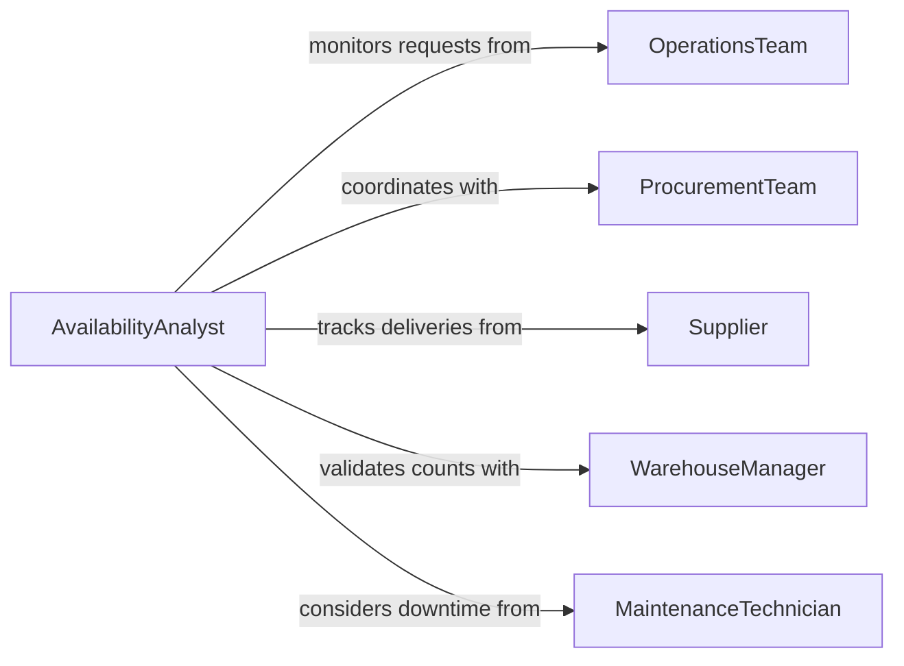

# Monitor Availability Equipment Supplies

> Business-as-Code definition for equipment and supply availability monitoring. Models real-time tracking, threshold alerts, and demand forecasting for critical resources.

## Overview

Equipment and supply availability monitoring involves real-time tracking of stock levels, utilization rates, and demand patterns to ensure operational continuity. This definition exposes actions for threshold management, availability forecasting, and proactive replenishment across locations and resource types.

## Actors

| Actor | Description |
|-------|-------------|
| OperationsTeam | Relies on equipment and supply availability |
| Supplier | Provides replenishment stock and lead time information |
| ProcurementTeam | Executes purchasing based on availability alerts |
| WarehouseManager | Maintains physical inventory at storage locations |
| MaintenanceTechnician | Services equipment affecting availability |
| DemandPlanner | Forecasts future resource requirements |

## Roles

| Role | Description |
|------|-------------|
| AvailabilityAnalyst | Monitors real-time stock and utilization metrics |
| ThresholdManager | Sets and adjusts minimum availability levels |
| ForecastSpecialist | Predicts future demand and supply needs |
| AlertCoordinator | Manages notifications for availability issues |

## Entities

| Entity | Description |
|--------|-------------|
| AvailabilityMetric | Current stock level or equipment status |
| Threshold | Minimum acceptable availability level |
| AvailabilityAlert | Notification when resources fall below threshold |
| DemandForecast | Prediction of future resource requirements |
| UtilizationRate | Percentage of time equipment or supplies are in use |
| LeadTime | Duration required to replenish supplies |

## Actions

| Action | Description |
|--------|-------------|
| trackAvailability | Monitor current stock levels and equipment status |
| setThreshold | Define minimum acceptable availability levels |
| generateAlert | Create notification when availability drops below threshold |
| forecastDemand | Predict future resource requirements |
| analyzeUtilization | Calculate usage rates and patterns |
| adjustThreshold | Modify minimum levels based on changing conditions |
| reportAvailability | Produce availability status summaries |

## Events

| Event | Description |
|-------|-------------|
| availabilityTracked | Current levels have been recorded |
| thresholdSet | Minimum level has been established |
| alertGenerated | Availability has dropped below threshold |
| demandForecasted | Future requirements have been predicted |
| utilizationAnalyzed | Usage patterns have been calculated |
| thresholdAdjusted | Minimum level has been modified |
| availabilityReported | Status summary has been produced |

## Searches

| Search | Description |
|--------|-------------|
| findLowStock | List items below threshold by location |
| getUtilizationRates | Retrieve usage metrics by equipment or supply |
| getForecasts | Find demand predictions by period or resource |
| getActiveAlerts | Search current availability warnings |

## Entity Relationships



## State Diagram



## Workflow



## Actor Relationships



## Usage

### Calling Actions

```typescript
import { monitorAvailabilityEquipmentSupplies } from '@headlessly/monitor-availability-equipment-supplies'

const availability = monitorAvailabilityEquipmentSupplies()

// Track current availability across locations
await availability.trackAvailability({
  location: 'Distribution Center North',
  items: [
    { id: 'FORKLIFT-FL-04', type: 'equipment', status: 'available', condition: 'operational' },
    { id: 'PALLET-JACK-12', type: 'equipment', status: 'in_use', condition: 'operational' },
    { id: 'PACKING-TAPE-2INCH', type: 'supply', quantity: 145, unit: 'rolls' },
    { id: 'CORRUGATE-BOX-M', type: 'supply', quantity: 2340, unit: 'units' }
  ],
  timestamp: '2026-02-11T14:30:00'
})

// Set availability thresholds
await availability.setThreshold({
  itemId: 'PACKING-TAPE-2INCH',
  location: 'Distribution Center North',
  minimumQuantity: 200,
  optimalQuantity: 500,
  alertRecipients: ['procurement@company.com', 'warehouse-mgr@company.com']
})

// Forecast demand based on historical patterns
const forecast = await availability.forecastDemand({
  items: ['PACKING-TAPE-2INCH', 'CORRUGATE-BOX-M'],
  historicalPeriod: '90 days',
  forecastPeriod: '30 days',
  factors: ['seasonality', 'promotions', 'trends']
})

// Analyze utilization of equipment
const utilization = await availability.analyzeUtilization({
  equipmentIds: ['FORKLIFT-FL-04', 'PALLET-JACK-12'],
  period: 'last_30_days',
  metrics: ['activeHours', 'idleHours', 'maintenanceHours']
})

// Generate availability report
await availability.reportAvailability({
  locations: ['Distribution Center North', 'Distribution Center South'],
  itemCategories: ['equipment', 'packaging_supplies'],
  period: 'week',
  recipients: ['operations-director', 'supply-chain-manager']
})
```

### Event-Driven Automation

```typescript
// Auto-create purchase requisition when alert is generated
availability.alertGenerated(async ({ itemId, currentQuantity, threshold, location }) => {
  const reorderQuantity = threshold.optimalQuantity - currentQuantity

  await createPurchaseRequisition({
    itemId,
    quantity: reorderQuantity,
    urgency: currentQuantity === 0 ? 'emergency' : 'standard',
    deliveryLocation: location,
    reason: 'availability_threshold_alert'
  })
})

// Adjust thresholds based on demand forecasts
availability.demandForecasted(async ({ itemId, forecast }) => {
  if (forecast.projectedIncrease > 0.25) {
    await availability.adjustThreshold({
      itemId,
      adjustmentFactor: 1.3,
      reason: 'high_forecasted_demand',
      effectiveDate: forecast.periodStart
    })
  }
})
```
