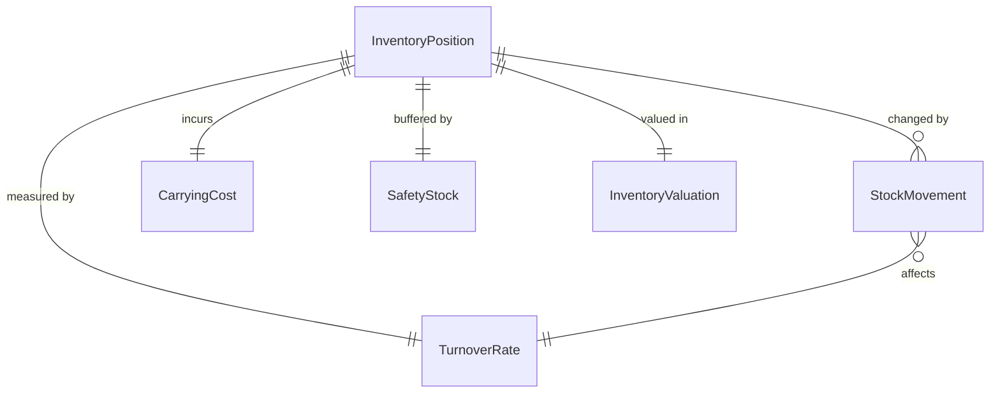
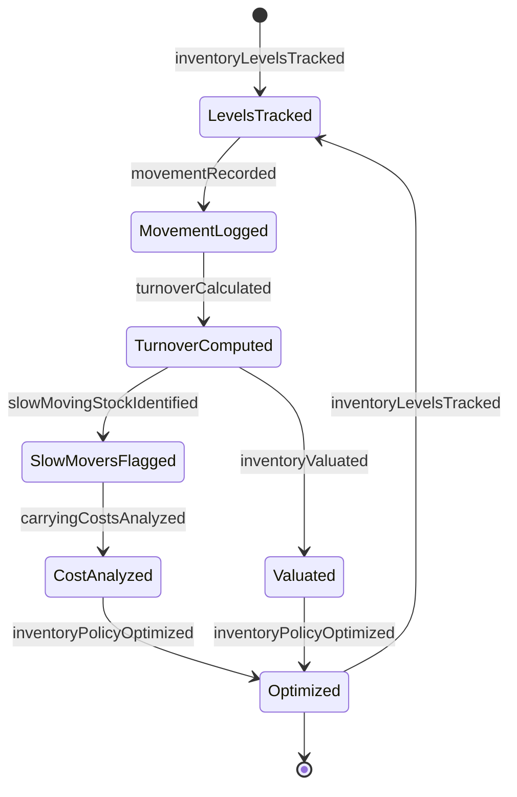
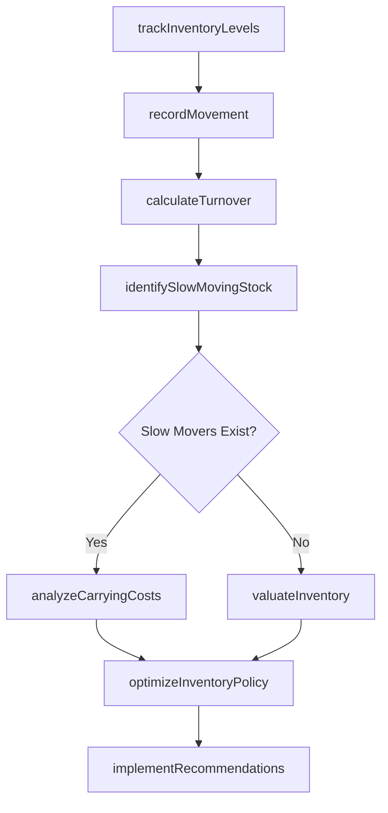
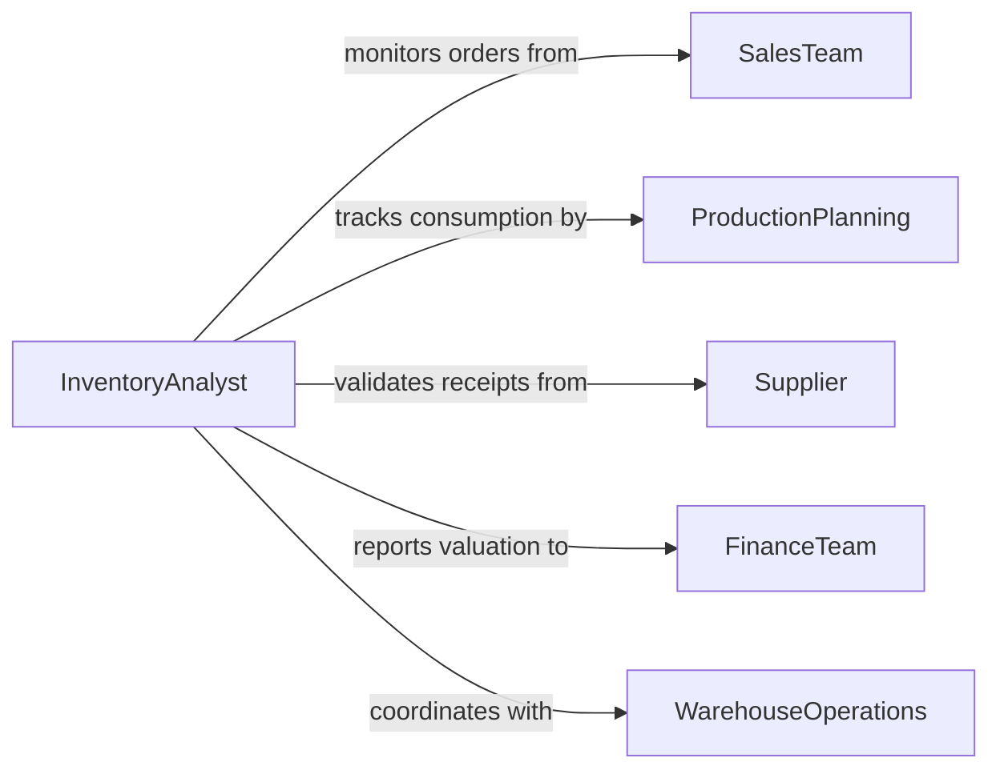

# Monitor Inventories Products Materials

> Business-as-Code definition for product and material inventory monitoring. Models continuous tracking, valuation, and optimization of inventory across supply chain and storage locations.

## Overview

Product and material inventory monitoring involves continuous tracking of stock levels, inventory value, turnover rates, and movement patterns across the supply chain. This definition exposes actions for inventory analysis, carrying cost calculation, and optimization recommendations to balance service levels with financial efficiency.

## Actors

| Actor | Description |
|-------|-------------|
| SalesTeam | Consumes inventory to fulfill customer orders |
| ProductionPlanning | Uses raw materials for manufacturing |
| Supplier | Provides inventory replenishment |
| FinanceTeam | Tracks inventory valuation and carrying costs |
| WarehouseOperations | Manages physical storage and movements |
| CustomerService | Checks inventory availability for order promising |

## Roles

| Role | Description |
|------|-------------|
| InventoryAnalyst | Monitors stock levels and turnover metrics |
| DemandPlanner | Forecasts future inventory requirements |
| CostAccountant | Calculates inventory valuation and carrying costs |
| OptimizationSpecialist | Recommends inventory policy improvements |

## Entities

| Entity | Description |
|--------|-------------|
| InventoryPosition | Current stock level by product and location |
| StockMovement | Transaction record of inventory changes |
| TurnoverRate | Frequency of inventory replenishment cycles |
| CarryingCost | Expense of holding inventory including storage and capital |
| SafetyStock | Buffer inventory to prevent stockouts |
| InventoryValuation | Financial value of on-hand inventory |

## Actions

| Action | Description |
|--------|-------------|
| trackInventoryLevels | Monitor current stock quantities by product and location |
| recordMovement | Document inventory transactions and transfers |
| calculateTurnover | Compute inventory turnover rates and cycle time |
| valuateInventory | Determine financial value of inventory holdings |
| analyzeCarryingCosts | Calculate expenses of maintaining inventory |
| identifySlowMovingStock | Flag products with low turnover rates |
| optimizeInventoryPolicy | Recommend reorder points and quantities |

## Events

| Event | Description |
|-------|-------------|
| inventoryLevelsTracked | Stock quantities have been recorded |
| movementRecorded | Inventory transaction has been documented |
| turnoverCalculated | Turnover metrics have been computed |
| inventoryValuated | Financial value has been determined |
| carryingCostsAnalyzed | Holding expenses have been calculated |
| slowMovingStockIdentified | Low-turnover products have been flagged |
| inventoryPolicyOptimized | Recommendations have been generated |

## Searches

| Search | Description |
|--------|-------------|
| findInventoryByProduct | Retrieve stock levels across all locations |
| getMovementHistory | Search transaction records by product or period |
| getTurnoverMetrics | Find turnover rates by product category |
| getSlowMovingItems | List products below target turnover threshold |

## Entity Relationships



## State Diagram



## Workflow



## Actor Relationships



## Usage

### Calling Actions

```typescript
import { monitorInventoriesProductsMaterials } from '@headlessly/monitor-inventories-products-materials'

const inventory = monitorInventoriesProductsMaterials()

// Track inventory levels across distribution network
await inventory.trackInventoryLevels({
  timestamp: '2026-02-11T16:00:00',
  locations: [
    {
      locationId: 'DC-EAST',
      products: [
        { sku: 'PROD-A-1001', quantity: 2450, unit: 'units' },
        { sku: 'PROD-B-2034', quantity: 890, unit: 'units' },
        { sku: 'PROD-C-4521', quantity: 145, unit: 'units' }
      ]
    },
    {
      locationId: 'DC-WEST',
      products: [
        { sku: 'PROD-A-1001', quantity: 3120, unit: 'units' },
        { sku: 'PROD-B-2034', quantity: 1240, unit: 'units' }
      ]
    }
  ]
})

// Record inventory movement
await inventory.recordMovement({
  transactionType: 'sale',
  sku: 'PROD-A-1001',
  quantity: 150,
  fromLocation: 'DC-EAST',
  toLocation: 'CUSTOMER',
  orderId: 'ORD-2026-8834',
  timestamp: '2026-02-11T14:22:00'
})

// Calculate turnover rates
const turnover = await inventory.calculateTurnover({
  products: ['PROD-A-1001', 'PROD-B-2034', 'PROD-C-4521'],
  period: 'last_90_days',
  method: 'COGS_divided_by_average_inventory'
})

// Identify slow-moving stock
const slowMovers = await inventory.identifySlowMovingStock({
  minimumTurnoverRate: 4.0,
  period: 'last_90_days',
  locations: ['DC-EAST', 'DC-WEST']
})

// Valuate inventory
const valuation = await inventory.valuateInventory({
  valuationMethod: 'FIFO',
  locations: ['DC-EAST', 'DC-WEST'],
  asOfDate: '2026-02-11'
})

// Optimize inventory policy
await inventory.optimizeInventoryPolicy({
  products: slowMovers.map(sm => sm.sku),
  objectives: ['minimize_carrying_cost', 'maintain_service_level'],
  targetServiceLevel: 0.95,
  constraints: { maxCarryingCostPercentage: 0.15 }
})
```

### Event-Driven Automation

```typescript
// Auto-flag slow-moving inventory for review
inventory.slowMovingStockIdentified(async ({ products, period }) => {
  for (const product of products) {
    await createTask({
      type: 'InventoryReview',
      priority: 'medium',
      sku: product.sku,
      turnoverRate: product.turnoverRate,
      carryingCost: product.carryingCost,
      action: 'Evaluate markdown, liquidation, or discontinuation'
    })
  }
})

// Alert finance team on inventory valuation changes
inventory.inventoryValuated(async ({ valuation, previousValuation }) => {
  const changePercentage = (valuation.total - previousValuation.total) / previousValuation.total

  if (Math.abs(changePercentage) > 0.10) {
    await notify({
      to: 'finance-team',
      subject: `Significant Inventory Valuation Change: ${(changePercentage * 100).toFixed(1)}%`,
      body: `Inventory value changed from ${previousValuation.total} to ${valuation.total}`
    })
  }
})
```
