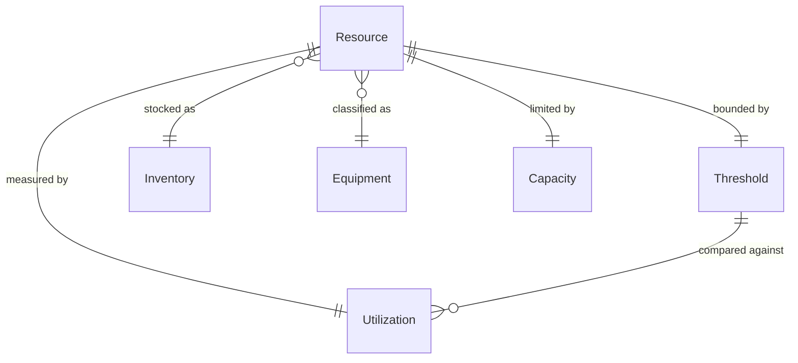
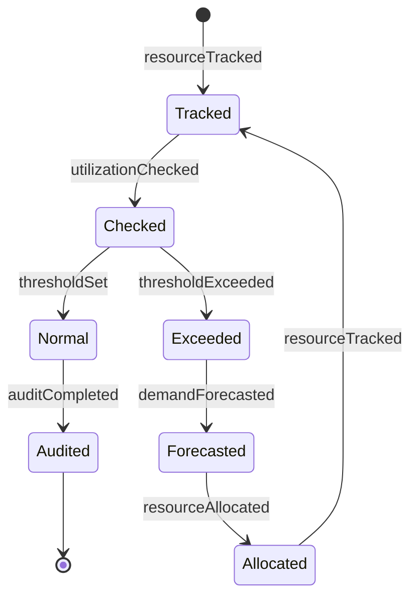
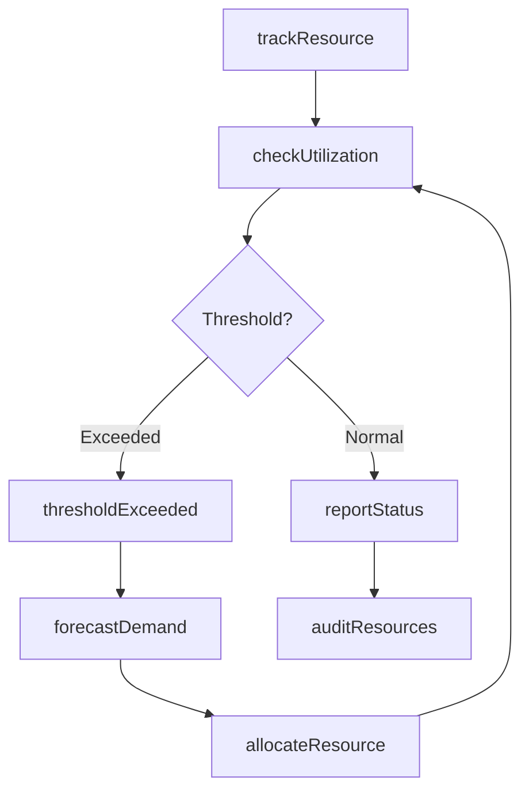
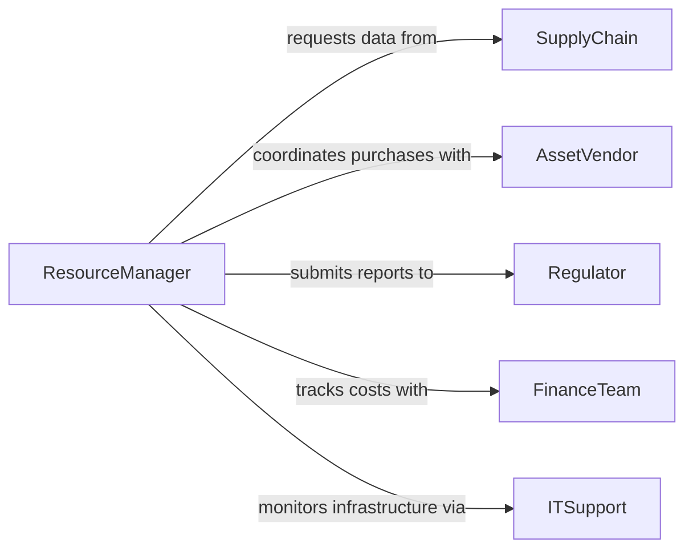

# Monitor Resources

> Business-as-Code definition for tracking and managing organizational resources. Models resource utilization monitoring, capacity planning, and inventory oversight.

## Overview

Resource monitoring involves tracking physical assets, inventory levels, equipment utilization, and human capital allocation. This definition provides actions for real-time monitoring, events for threshold-based alerts, and searches for resource availability queries.

## Actors

| Actor | Description |
|-------|-------------|
| SupplyChain | Provides inventory replenishment and logistics |
| AssetVendor | Supplies equipment and maintains service contracts |
| Regulator | Enforces resource compliance and reporting standards |
| Auditor | Reviews resource allocation and usage accuracy |
| FinanceTeam | Tracks resource costs and budget utilization |
| ITSupport | Monitors technology infrastructure and licenses |

## Roles

| Role | Description |
|------|-------------|
| ResourceManager | Oversees resource allocation and availability |
| InventoryController | Manages stock levels and reordering |
| CapacityPlanner | Forecasts resource needs and bottlenecks |
| AssetCoordinator | Tracks equipment location and condition |

## Entities

| Entity | Description |
|--------|-------------|
| Resource | Any trackable asset, inventory item, or capacity |
| Inventory | Stock of consumable or sellable items |
| Equipment | Fixed assets and machinery |
| Capacity | Available throughput or production capability |
| Utilization | Current usage rate of a resource |
| Threshold | Minimum or maximum acceptable resource level |

## Actions

| Action | Description |
|--------|-------------|
| trackResource | Record current state and location of resource |
| checkUtilization | Measure current usage rate against capacity |
| setThreshold | Define acceptable min/max levels for resource |
| forecastDemand | Project future resource requirements |
| allocateResource | Assign resource to project or department |
| reportStatus | Generate resource availability summary |
| auditResources | Verify physical count matches records |

## Events

| Event | Description |
|-------|-------------|
| resourceTracked | Resource status has been updated |
| utilizationChecked | Utilization measurement complete |
| thresholdSet | Resource threshold has been configured |
| demandForecasted | Future resource needs projected |
| resourceAllocated | Resource assigned to user or project |
| thresholdExceeded | Resource level outside acceptable range |
| auditCompleted | Physical verification finished |

## Searches

| Search | Description |
|--------|-------------|
| findResources | List resources by type, location, or status |
| getUtilization | Retrieve current usage rates by resource |
| getThresholds | Find configured min/max levels |
| getAvailability | Check unallocated capacity by date range |

## Entity Relationships



## State Diagram



## Workflow



## Actor Relationships



## Usage

### Calling Actions

```typescript
import { monitorResources } from '@headlessly/monitor-resources'

const resources = monitorResources()

// Track current inventory levels
await resources.trackResource({
  resourceId: 'INV-1234',
  type: 'raw-material',
  quantity: 450,
  location: 'Warehouse A'
})

// Check utilization of production equipment
const utilization = await resources.checkUtilization({
  resourceId: 'MACHINE-001',
  period: 'last-7-days'
})

// Set low inventory threshold
await resources.setThreshold({
  resourceId: 'INV-1234',
  min: 200,
  max: 1000,
  alertContacts: ['inventory@company.com']
})
```

### Event-Driven Automation

```typescript
// Auto-reorder when inventory is low
resources.thresholdExceeded(async ({ resourceId, currentLevel, threshold }) => {
  if (currentLevel < threshold.min) {
    await createPurchaseOrder({
      item: resourceId,
      quantity: threshold.max - currentLevel
    })
  }
})

// Alert on high equipment utilization
resources.utilizationChecked(async ({ resourceId, rate }) => {
  if (rate > 0.85) {
    await notify({
      to: 'operations-team',
      message: `Equipment ${resourceId} at ${rate * 100}% capacity`
    })
  }
})
```
