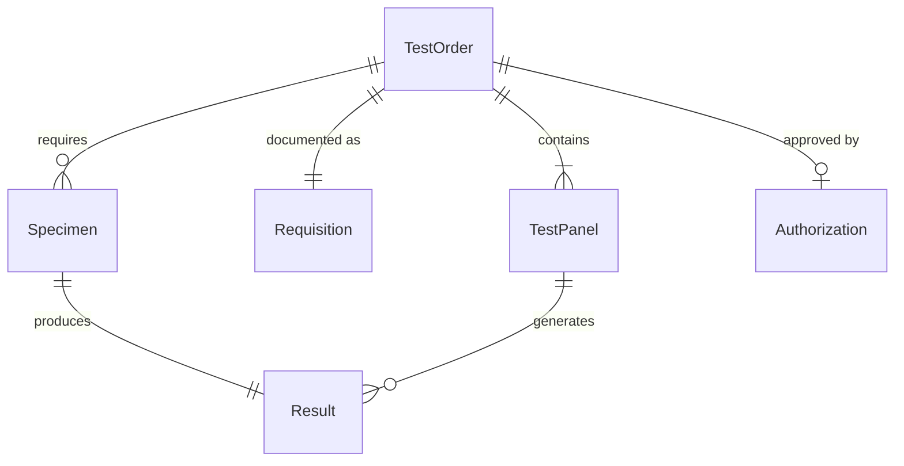
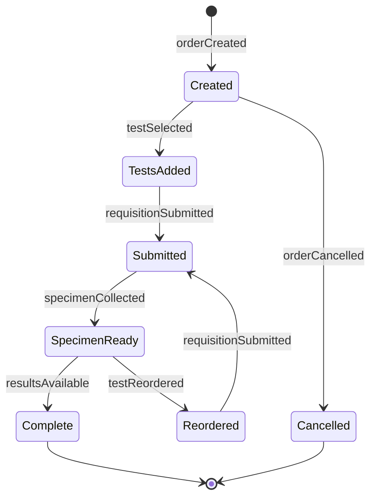
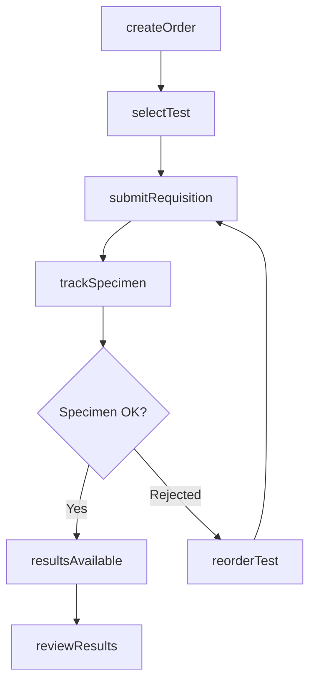
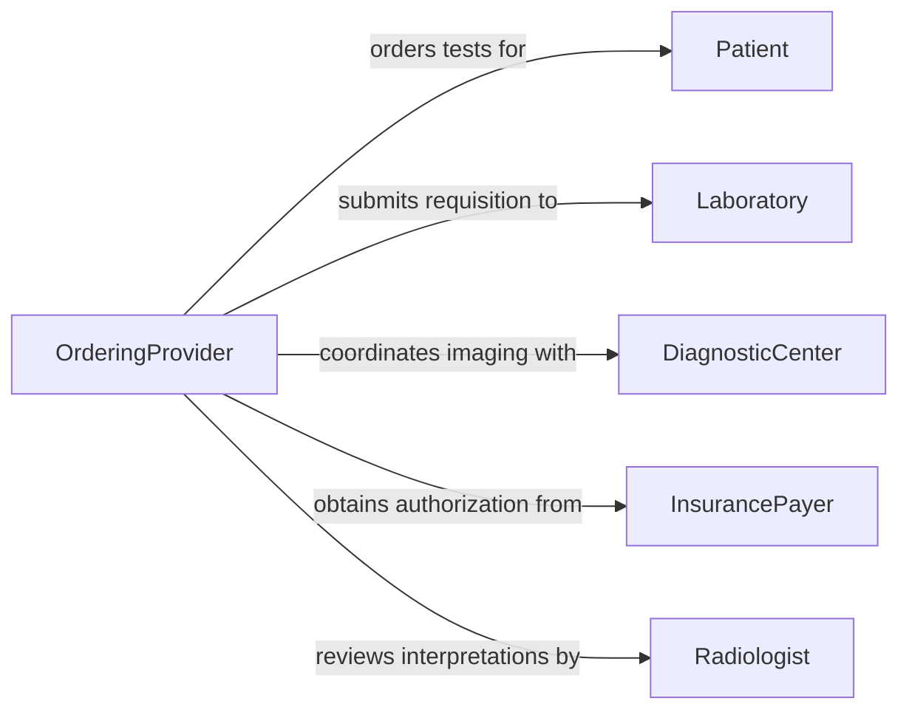

# Order Medical Diagnostic Clinical Tests

> Business-as-Code definition for ordering laboratory and diagnostic procedures. Models test requisition, specimen tracking, and results delivery workflows.

## Overview

Ordering medical diagnostic tests involves selecting appropriate procedures based on clinical indication, coordinating specimen collection, and routing orders to qualified laboratories. This definition exposes actions for test ordering, events for status tracking, and searches for test availability and results.

## Actors

| Actor | Description |
|-------|-------------|
| Patient | Undergoes diagnostic testing and receives results |
| Laboratory | Performs tests and reports findings |
| DiagnosticCenter | Provides imaging and specialized procedures |
| InsurancePayer | Reviews medical necessity and authorizes payment |
| Phlebotomist | Collects blood and other specimens |
| Radiologist | Interprets imaging studies |

## Roles

| Role | Description |
|------|-------------|
| OrderingProvider | Clinician who requests diagnostic tests |
| LabCoordinator | Manages test workflows and specimen routing |
| Reviewer | Assesses test results and clinical significance |
| Scheduler | Books appointments for procedures |

## Entities

| Entity | Description |
|--------|-------------|
| TestOrder | A request for one or more diagnostic procedures |
| TestPanel | A group of related tests ordered together |
| Specimen | Biological sample collected for testing |
| Result | Findings and interpretations from completed test |
| Requisition | Formal order document sent to laboratory |
| Authorization | Insurance approval for test procedure |

## Actions

| Action | Description |
|--------|-------------|
| createOrder | Initiate a new diagnostic test request |
| selectTest | Choose specific tests or panels to order |
| submitRequisition | Send order to performing laboratory |
| trackSpecimen | Monitor specimen collection and transit |
| reviewResults | Assess completed test findings |
| cancelOrder | Void test order before completion |
| reorderTest | Request repeat or confirmation testing |

## Events

| Event | Description |
|-------|-------------|
| orderCreated | New diagnostic test order initiated |
| testSelected | Specific procedures added to order |
| requisitionSubmitted | Order sent to laboratory |
| specimenCollected | Sample obtained from patient |
| resultsAvailable | Test completed and findings ready |
| orderCancelled | Test request voided |
| testReordered | Repeat testing requested |

## Searches

| Search | Description |
|--------|-------------|
| findOrders | List test orders by patient, date, or status |
| getResults | Retrieve completed findings by order or test type |
| getPendingTests | Find orders awaiting specimen or results |
| getTestCatalog | Search available tests and requirements |

## Entity Relationships



## State Diagram



## Workflow



## Actor Relationships



## Usage

### Calling Actions

```typescript
import { orderMedicalDiagnosticClinicalTests } from '@headlessly/order-medical-diagnostic-clinical-tests'

const tests = orderMedicalDiagnosticClinicalTests()

// Create comprehensive metabolic panel order
const order = await tests.createOrder({
  patientId: 'PAT-789',
  clinicalIndication: 'Annual wellness exam',
  priority: 'routine'
})

// Select specific tests
await tests.selectTest({
  orderId: order.id,
  tests: ['CBC', 'CMP', 'Lipid Panel', 'HbA1c']
})

// Submit to preferred laboratory
await tests.submitRequisition({
  orderId: order.id,
  laboratoryId: 'LAB-001',
  collectionDate: '2026-02-10'
})
```

### Event-Driven Automation

```typescript
// Notify patient when results are ready
tests.resultsAvailable(async ({ orderId, patientId }) => {
  const patient = await getPatient(patientId)
  await sendNotification({
    to: patient.email,
    subject: 'Lab Results Available',
    message: 'Your test results are ready for review in the patient portal'
  })
})

// Alert provider on critical values
tests.resultsAvailable(async ({ orderId, results }) => {
  const critical = results.filter(r => r.flag === 'critical')
  if (critical.length > 0) {
    await alertProvider({
      orderId,
      message: `Critical lab values detected: ${critical.map(r => r.name).join(', ')}`
    })
  }
})
```
