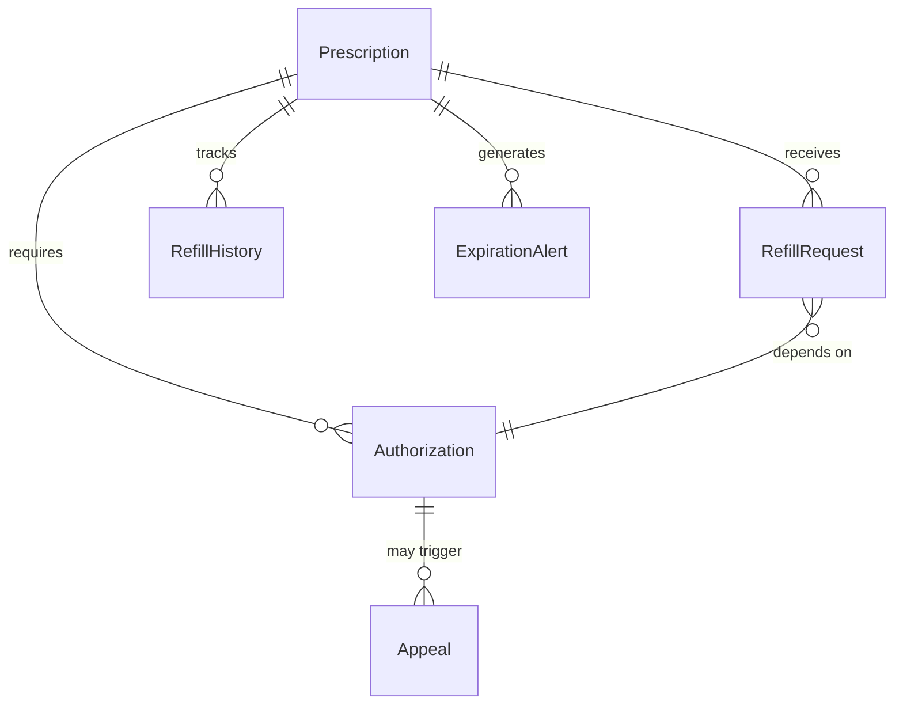
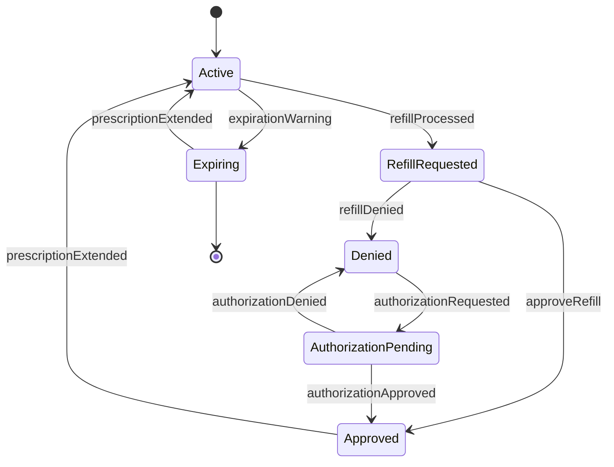
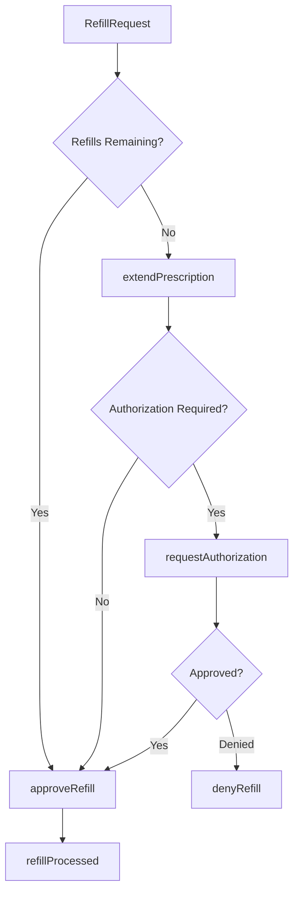
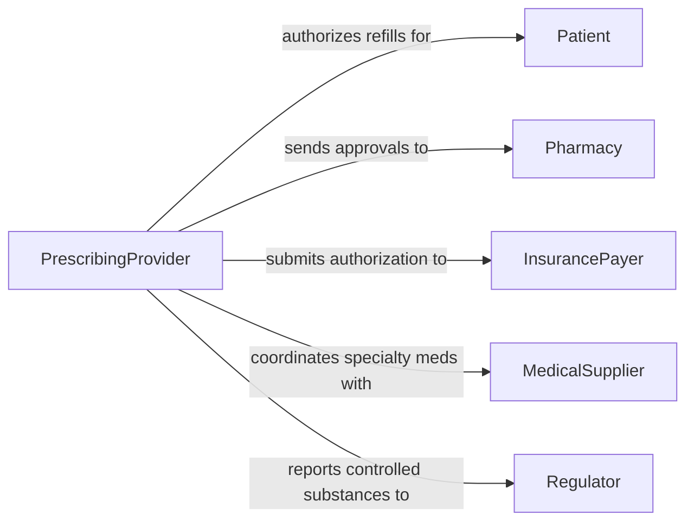

# Control Prescription Refills Authorizations

> Business-as-Code definition for managing prescription renewal and authorization workflows. Models refill requests, prior authorization processing, and medication continuity oversight.

## Overview

Controlling prescription refills involves processing patient renewal requests, managing refill limits, and coordinating prior authorizations with insurance payers. This definition provides actions for refill approval, events for expiration alerts, and searches for authorization status.

## Actors

| Actor | Description |
|-------|-------------|
| Patient | Requests medication refills and authorization renewals |
| Pharmacy | Dispenses medications and submits refill requests |
| InsurancePayer | Reviews medical necessity and approves coverage |
| PriorAuthVendor | Processes authorization submissions and appeals |
| MedicalSupplier | Provides specialty medications and devices |
| Regulator | Enforces controlled substance monitoring requirements |

## Roles

| Role | Description |
|------|-------------|
| PrescribingProvider | Authorizes refills and clinical appropriateness |
| PharmacyCoordinator | Manages refill workflows and patient outreach |
| AuthorizationSpecialist | Submits and tracks prior authorization requests |
| ClinicalReviewer | Assesses ongoing medication necessity |

## Entities

| Entity | Description |
|--------|-------------|
| Prescription | Original medication order with refill allowance |
| RefillRequest | Patient or pharmacy request for renewal |
| Authorization | Insurance approval for medication coverage |
| RefillHistory | Record of previous dispensing dates and quantities |
| Appeal | Request for reconsideration of denied authorization |
| ExpirationAlert | Notice of approaching prescription end date |

## Actions

| Action | Description |
|--------|-------------|
| processRefill | Review and approve medication renewal request |
| denyRefill | Reject refill due to clinical or safety concerns |
| requestAuthorization | Submit prior authorization to payer |
| trackAuthorization | Monitor status of pending approval |
| approveRefill | Grant authorization for medication renewal |
| extendPrescription | Add additional refills to existing order |
| setRefillLimit | Define maximum number of renewals allowed |

## Events

| Event | Description |
|-------|-------------|
| refillProcessed | Medication renewal approved and sent to pharmacy |
| refillDenied | Renewal request rejected |
| authorizationRequested | Prior authorization submitted to payer |
| authorizationApproved | Insurance approval received |
| authorizationDenied | Coverage rejected by payer |
| prescriptionExtended | Additional refills granted |
| expirationWarning | Prescription approaching end of refill allowance |

## Searches

| Search | Description |
|--------|-------------|
| findRefills | List refill requests by patient, medication, or status |
| getAuthorizations | Retrieve pending or approved authorizations |
| getHistory | View previous refill dates and dispensed quantities |
| getExpiringPrescriptions | Find prescriptions nearing refill limit |

## Entity Relationships



## State Diagram



## Workflow



## Actor Relationships



## Usage

### Calling Actions

```typescript
import { controlPrescriptionRefillsAuthorizations } from '@headlessly/control-prescription-refills-authorizations'

const refills = controlPrescriptionRefillsAuthorizations()

// Approve routine refill request
await refills.approveRefill({
  prescriptionId: 'RX-456',
  requestId: 'REF-789',
  dispenseQuantity: 30,
  pharmacyId: 'PHARM-001'
})

// Submit prior authorization for specialty medication
const auth = await refills.requestAuthorization({
  prescriptionId: 'RX-890',
  medication: 'Adalimumab 40mg',
  diagnosis: 'Rheumatoid arthritis',
  clinicalJustification: 'Failed methotrexate therapy',
  payerId: 'INS-123'
})

// Track authorization status
const status = await refills.trackAuthorization({
  authorizationId: auth.id
})
```

### Event-Driven Automation

```typescript
// Alert patient when prescription is expiring
refills.expirationWarning(async ({ prescriptionId, patientId, daysRemaining }) => {
  if (daysRemaining <= 7) {
    const patient = await getPatient(patientId)
    await sendNotification({
      to: patient.phone,
      message: `Your prescription expires in ${daysRemaining} days. Contact your provider to renew.`
    })
  }
})

// Auto-extend chronic medications
refills.refillProcessed(async ({ prescriptionId, medication }) => {
  const chronic = ['Lisinopril', 'Metformin', 'Levothyroxine']
  if (chronic.includes(medication.name)) {
    await refills.extendPrescription({
      prescriptionId,
      additionalRefills: 6
    })
  }
})
```
