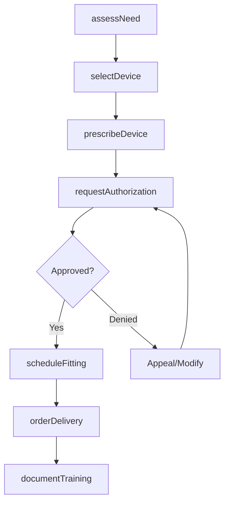
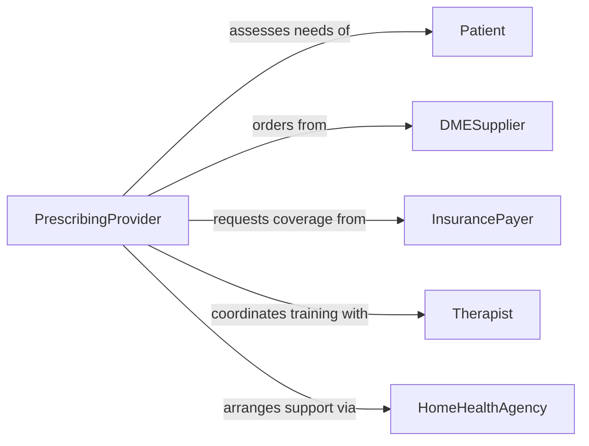

# Prescribe Assistive Medical Devices Related

> Business-as-Code definition for ordering durable medical equipment and assistive devices. Models device prescription, fitting coordination, and insurance authorization workflows.

## Overview

Prescribing assistive medical devices involves assessing patient needs, selecting appropriate equipment, and coordinating device delivery and training. This definition exposes actions for device ordering, events for authorization tracking, and searches for device catalogs and patient fittings.

## Actors

| Actor | Description |
|-------|-------------|
| Patient | Receives assistive device and training on usage |
| DMESupplier | Provides durable medical equipment and delivery |
| InsurancePayer | Reviews medical necessity and approves coverage |
| Therapist | Trains patient on device use and adjustments |
| Manufacturer | Produces specialized or custom devices |
| HomeHealthAgency | Coordinates device setup and ongoing support |

## Roles

| Role | Description |
|------|-------------|
| PrescribingProvider | Orders assistive devices based on clinical need |
| DeviceSpecialist | Assists with device selection and fitting |
| AuthorizationCoordinator | Manages insurance approvals and documentation |
| CaseManager | Coordinates multi-disciplinary device support |

## Entities

| Entity | Description |
|--------|-------------|
| DevicePrescription | Order for assistive equipment with specifications |
| Device | Physical equipment or assistive technology |
| Fitting | Process of customizing device to patient |
| Authorization | Insurance approval for device coverage |
| Training | Instruction on device use and maintenance |
| Adjustment | Modification to improve device function or comfort |

## Actions

| Action | Description |
|--------|-------------|
| assessNeed | Evaluate patient functional limitations and goals |
| selectDevice | Choose appropriate assistive equipment |
| prescribeDevice | Create formal order with specifications |
| requestAuthorization | Submit coverage request to insurance |
| scheduleFitting | Arrange device customization appointment |
| orderDelivery | Coordinate equipment delivery to patient |
| documentTraining | Record patient education and competency |

## Events

| Event | Description |
|-------|-------------|
| needAssessed | Patient evaluation completed |
| deviceSelected | Equipment choice finalized |
| devicePrescribed | Formal order created |
| authorizationRequested | Coverage request submitted |
| authorizationApproved | Insurance approved device |
| fittingScheduled | Customization appointment set |
| deviceDelivered | Equipment provided to patient |

## Searches

| Search | Description |
|--------|-------------|
| findDevices | Search equipment catalog by type or indication |
| getPrescriptions | List device orders by patient or status |
| getAuthorizations | Retrieve pending or approved coverage requests |
| getFittings | Find scheduled or completed customization sessions |

## Workflow



## Actor Relationships



## Usage

### Calling Actions

```typescript
import { prescribeAssistiveMedicalDevicesRelated } from '@headlessly/prescribe-assistive-medical-devices-related'

const devices = prescribeAssistiveMedicalDevicesRelated()

// Assess patient need for mobility aid
const assessment = await devices.assessNeed({
  patientId: 'PAT-456',
  functionalLimitation: 'Difficulty ambulating > 50 feet',
  goals: 'Independent mobility within home and community'
})

// Prescribe power wheelchair
const prescription = await devices.prescribeDevice({
  patientId: 'PAT-456',
  deviceType: 'Power Wheelchair',
  specifications: {
    seatWidth: '18 inches',
    weightCapacity: '300 lbs',
    features: ['Tilt-in-space', 'Elevating legrests']
  }
})

// Request insurance authorization
await devices.requestAuthorization({
  prescriptionId: prescription.id,
  diagnosis: 'Multiple sclerosis with mobility impairment',
  clinicalJustification: 'Patient unable to safely use manual wheelchair',
  payerId: 'INS-789'
})
```

### Event-Driven Automation

```typescript
// Schedule fitting when authorization approved
devices.authorizationApproved(async ({ prescriptionId, patientId }) => {
  await devices.scheduleFitting({
    prescriptionId,
    patientId,
    appointmentType: 'Device fitting and training',
    duration: 90
  })
})

// Coordinate home setup for complex devices
devices.deviceDelivered(async ({ prescriptionId, deviceType }) => {
  const complexDevices = ['Hospital Bed', 'Hoyer Lift', 'CPAP Machine']
  if (complexDevices.includes(deviceType)) {
    await scheduleHomeHealth({
      prescriptionId,
      service: 'Device setup and patient training',
      priority: 'high'
    })
  }
})
```
