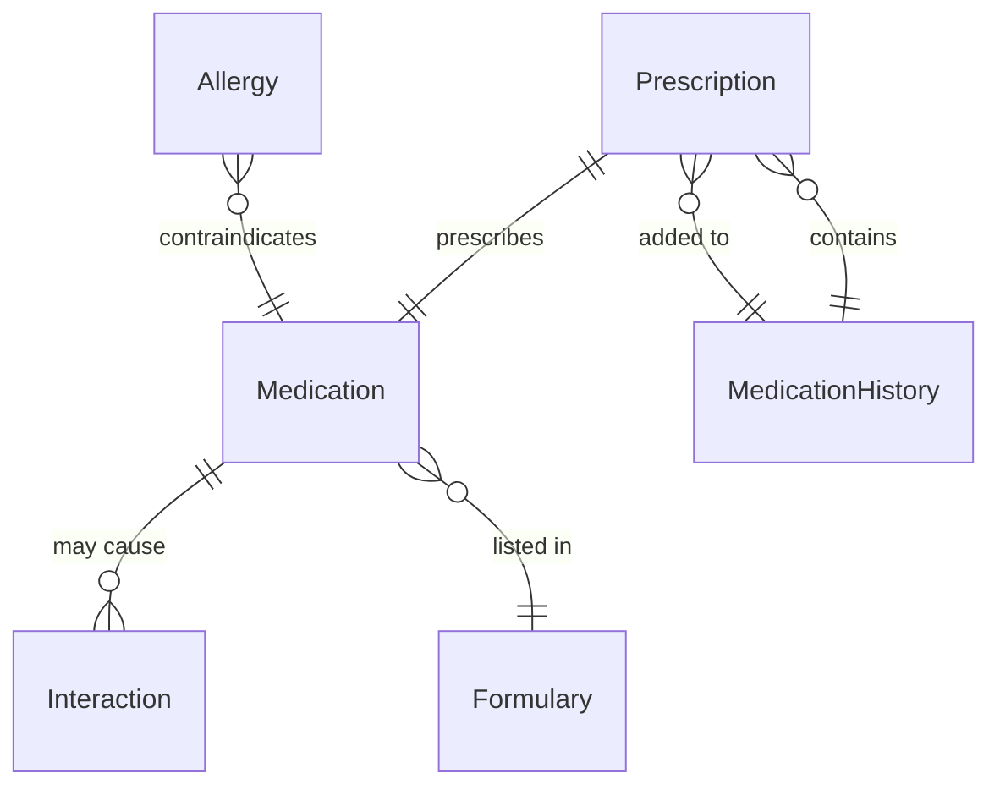
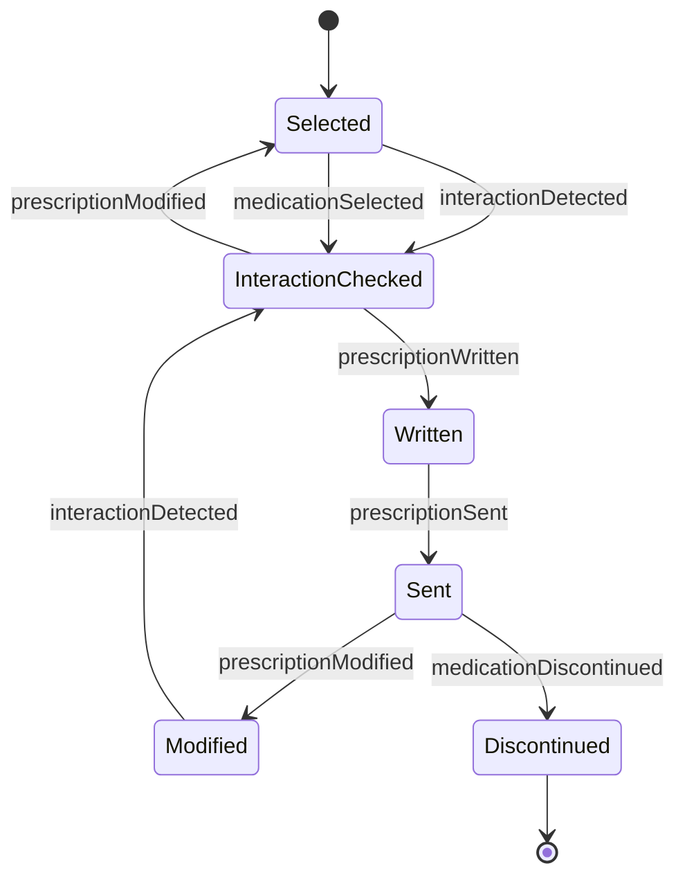
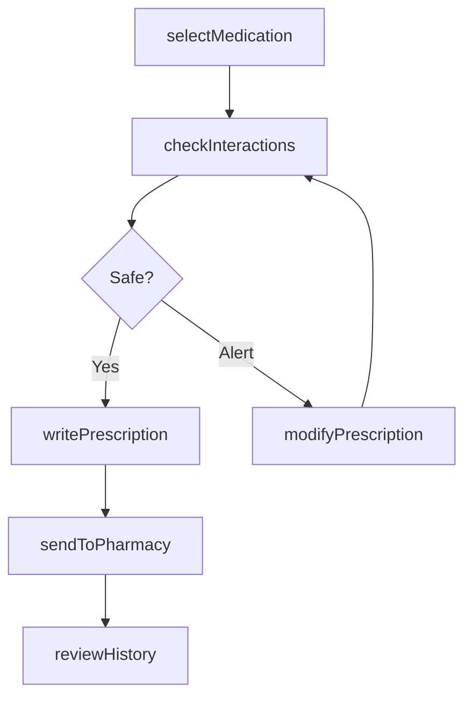
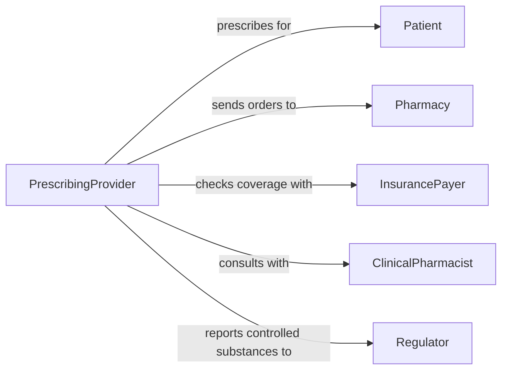

# Prescribe Medications

> Business-as-Code definition for ordering pharmaceutical treatments. Models prescription creation, drug interaction checking, and formulary management workflows.

## Overview

Prescribing medications involves selecting appropriate drugs based on diagnosis, verifying safety through interaction screening, and transmitting orders to dispensing pharmacies. This definition provides actions for prescription writing, events for safety alerts, and searches for drug information and patient medication history.

## Actors

| Actor | Description |
|-------|-------------|
| Patient | Receives medication therapy and reports outcomes |
| Pharmacy | Dispenses medications and provides counseling |
| InsurancePayer | Reviews formulary coverage and authorizes payment |
| DrugManufacturer | Produces medications and provides prescribing information |
| Regulator | Monitors controlled substance prescribing patterns |
| PBM | Manages pharmacy benefits and formulary decisions |

## Roles

| Role | Description |
|------|-------------|
| PrescribingProvider | Clinician who orders medications |
| PharmacistReviewer | Assesses prescription appropriateness and safety |
| MedicationReconciler | Maintains accurate list of patient medications |
| ClinicalPharmacist | Provides drug therapy consultation |

## Entities

| Entity | Description |
|--------|-------------|
| Prescription | Medication order with drug, dose, and instructions |
| Medication | Pharmaceutical agent with active ingredients |
| Interaction | Potential adverse effect from drug combinations |
| Allergy | Patient sensitivity or adverse drug reaction |
| Formulary | List of covered medications and restrictions |
| MedicationHistory | Record of past and current drug therapies |

## Actions

| Action | Description |
|--------|-------------|
| selectMedication | Choose appropriate drug for clinical indication |
| checkInteractions | Screen for drug-drug, drug-allergy, and duplicate therapy |
| writePrescription | Create order with dosing and instructions |
| sendToPharmacy | Transmit prescription electronically or print |
| modifyPrescription | Adjust dose, frequency, or duration |
| discontinueMedication | Stop active prescription |
| reviewHistory | Assess current and past medication list |

## Events

| Event | Description |
|-------|-------------|
| medicationSelected | Drug chosen for prescription |
| interactionDetected | Potential adverse effect identified |
| prescriptionWritten | Order created and signed |
| prescriptionSent | Order transmitted to pharmacy |
| prescriptionModified | Existing order changed |
| medicationDiscontinued | Active prescription stopped |
| allergyRecorded | New drug sensitivity documented |

## Searches

| Search | Description |
|--------|-------------|
| findMedications | Search drug database by name, class, or indication |
| getHistory | Retrieve patient medication list |
| getInteractions | Check potential adverse effects for drug combination |
| getFormulary | Find covered medications and restrictions |

## Entity Relationships



## State Diagram



## Workflow



## Actor Relationships



## Usage

### Calling Actions

```typescript
import { prescribeMedications } from '@headlessly/prescribe-medications'

const medications = prescribeMedications()

// Select antibiotic for infection
const drug = await medications.selectMedication({
  indication: 'Community-acquired pneumonia',
  patientAge: 45,
  renalFunction: 'normal'
})

// Check for interactions
const safety = await medications.checkInteractions({
  newMedication: 'Azithromycin 500mg',
  patientId: 'PAT-123'
})

// Write prescription
const rx = await medications.writePrescription({
  medication: 'Azithromycin 500mg',
  dose: '500mg on day 1, then 250mg daily',
  duration: '5 days',
  quantity: 6,
  refills: 0,
  instructions: 'Take with food'
})

// Send to patient's preferred pharmacy
await medications.sendToPharmacy({
  prescriptionId: rx.id,
  pharmacyId: 'PHARM-456'
})
```

### Event-Driven Automation

```typescript
// Alert on serious drug interactions
medications.interactionDetected(async ({ interaction, severity, patientId }) => {
  if (severity === 'contraindicated') {
    await notify({
      to: 'prescriber',
      priority: 'urgent',
      message: `Contraindicated drug interaction detected: ${interaction.description}`
    })
  }
})

// Check formulary coverage
medications.medicationSelected(async ({ medication, patientId }) => {
  const coverage = await checkFormulary(patientId, medication)
  if (!coverage.covered) {
    await suggestAlternatives({
      original: medication,
      alternatives: coverage.alternatives
    })
  }
})
```
