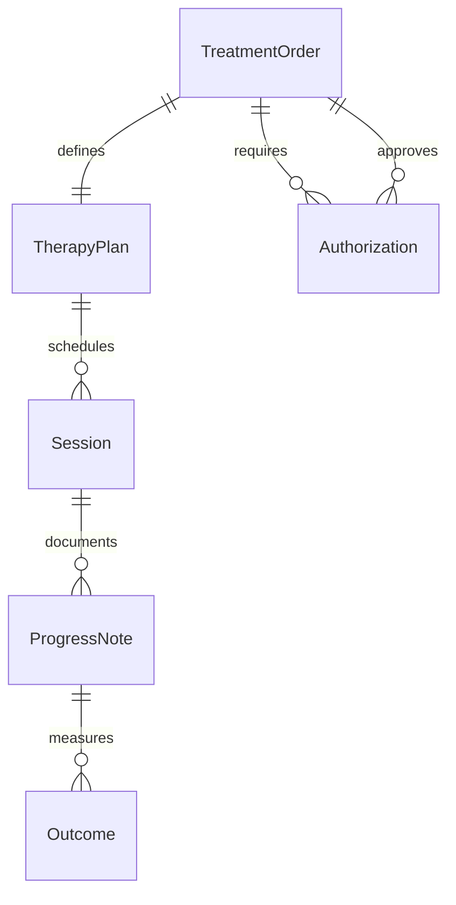
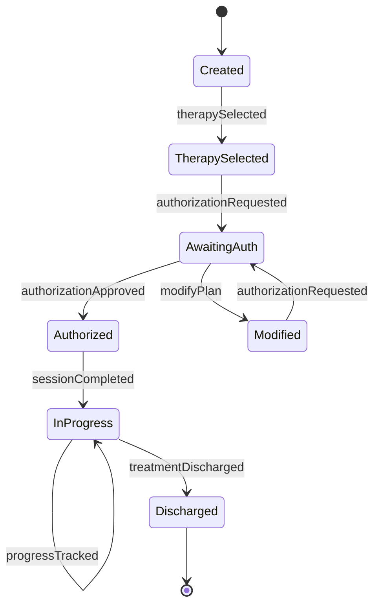
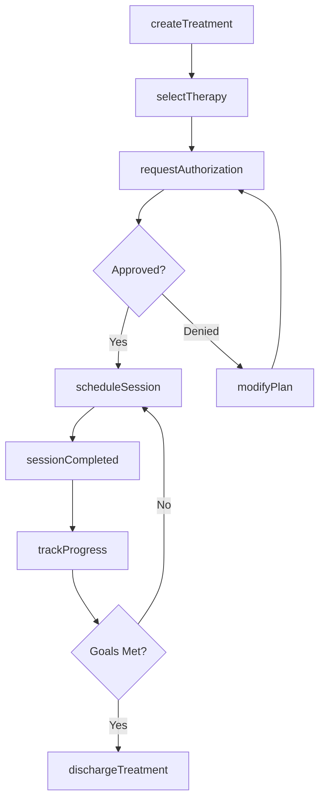
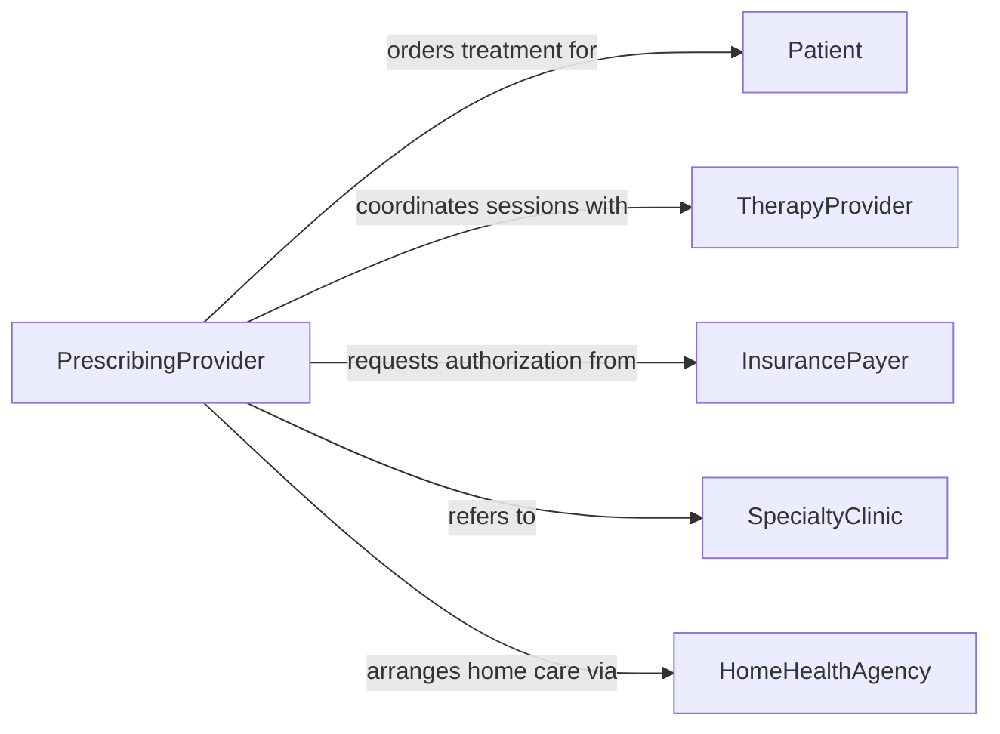

# Prescribe Treatments Therapies

> Business-as-Code definition for ordering clinical interventions and therapeutic services. Models treatment plan creation, therapy authorization, and outcomes tracking workflows.

## Overview

Prescribing treatments and therapies involves selecting evidence-based interventions, coordinating multi-disciplinary care, and monitoring patient response. This definition exposes actions for treatment ordering, events for progress tracking, and searches for therapy options and patient outcomes.

## Actors

| Actor | Description |
|-------|-------------|
| Patient | Participates in treatment and reports progress |
| TherapyProvider | Delivers physical, occupational, or speech therapy |
| InsurancePayer | Reviews medical necessity and authorizes sessions |
| SpecialtyClinic | Provides specialized treatment modalities |
| HomeHealthAgency | Coordinates in-home therapy services |
| CaseManager | Oversees care coordination and authorization |

## Roles

| Role | Description |
|------|-------------|
| PrescribingProvider | Orders treatments based on clinical indication |
| TherapyCoordinator | Schedules sessions and tracks utilization |
| ClinicalReviewer | Assesses treatment appropriateness and progress |
| OutcomesAnalyst | Monitors patient response and functional gains |

## Entities

| Entity | Description |
|--------|-------------|
| TreatmentOrder | Prescription for therapeutic intervention |
| TherapyPlan | Detailed goals and session frequency |
| Session | Individual treatment encounter |
| Authorization | Insurance approval for therapy sessions |
| ProgressNote | Documentation of patient response to treatment |
| Outcome | Functional improvement or clinical measure |

## Actions

| Action | Description |
|--------|-------------|
| createTreatment | Initiate new therapeutic intervention order |
| selectTherapy | Choose specific treatment modality and frequency |
| requestAuthorization | Submit insurance approval for sessions |
| scheduleSession | Book therapy appointments |
| trackProgress | Monitor patient response and functional gains |
| modifyPlan | Adjust treatment frequency or goals |
| dischargeTreatment | Complete therapy and document outcomes |

## Events

| Event | Description |
|-------|-------------|
| treatmentCreated | New therapeutic order initiated |
| therapySelected | Specific modality and frequency chosen |
| authorizationRequested | Insurance approval submitted |
| authorizationApproved | Sessions authorized by payer |
| sessionCompleted | Treatment encounter finished |
| progressTracked | Patient response documented |
| treatmentDischarged | Therapy completed or discontinued |

## Searches

| Search | Description |
|--------|-------------|
| findTreatments | List therapy orders by patient or modality |
| getAuthorizations | Retrieve approved session counts and dates |
| getProgress | View functional gains and clinical measures |
| getSessions | Find scheduled or completed appointments |

## Entity Relationships



## State Diagram



## Workflow



## Actor Relationships



## Usage

### Calling Actions

```typescript
import { prescribeTreatmentsTherapies } from '@headlessly/prescribe-treatments-therapies'

const treatments = prescribeTreatmentsTherapies()

// Create physical therapy order
const treatment = await treatments.createTreatment({
  patientId: 'PAT-789',
  diagnosis: 'Total knee replacement',
  clinicalIndication: 'Post-operative rehabilitation'
})

// Select therapy modality and frequency
await treatments.selectTherapy({
  treatmentId: treatment.id,
  modality: 'Physical Therapy',
  frequency: '3 times per week',
  duration: '6 weeks',
  goals: [
    'Increase knee flexion to 120 degrees',
    'Independent ambulation without assistive device',
    'Return to work activities'
  ]
})

// Request insurance authorization
await treatments.requestAuthorization({
  treatmentId: treatment.id,
  sessionsRequested: 18,
  payerId: 'INS-456'
})
```

### Event-Driven Automation

```typescript
// Schedule initial evaluation when authorized
treatments.authorizationApproved(async ({ treatmentId, patientId }) => {
  await treatments.scheduleSession({
    treatmentId,
    sessionType: 'Initial Evaluation',
    duration: 60,
    priority: 'high'
  })
})

// Alert provider when goals achieved
treatments.progressTracked(async ({ treatmentId, outcomes }) => {
  const goalsAchieved = outcomes.filter(o => o.status === 'met').length
  const totalGoals = outcomes.length

  if (goalsAchieved === totalGoals) {
    await notify({
      to: 'prescribing-provider',
      message: `All therapy goals achieved for treatment ${treatmentId}. Consider discharge.`
    })
  }
})
```
