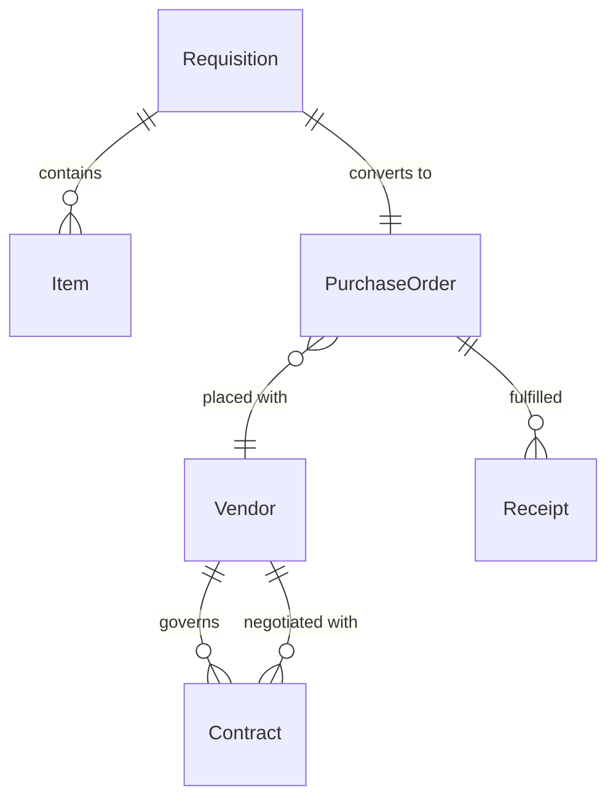
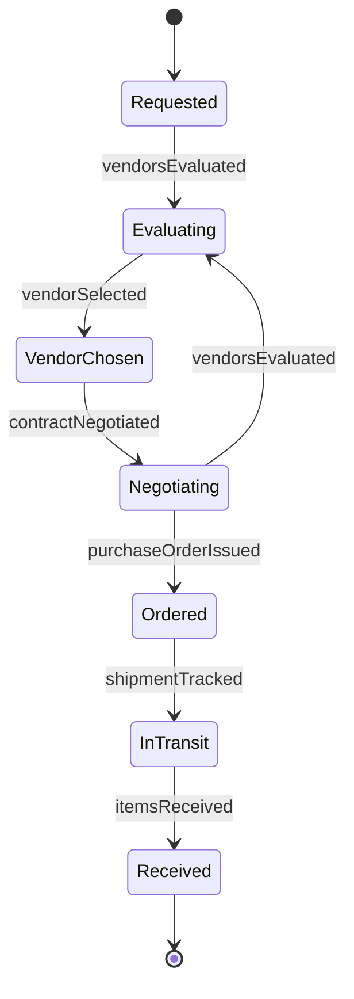
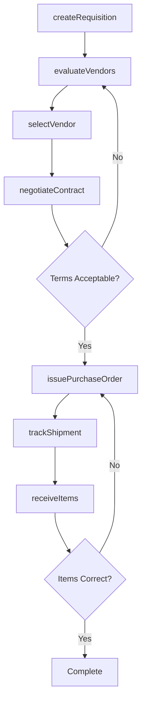
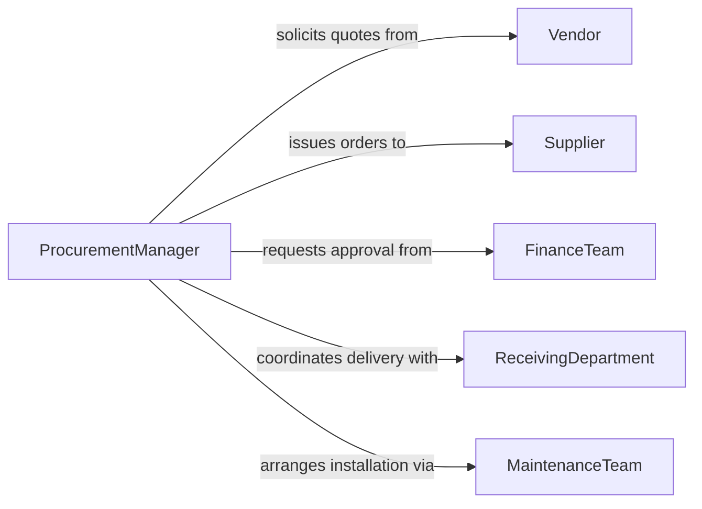

# Acquire Supplies Equipment

> Business-as-Code definition for procurement of operational resources and capital assets. Models requisition, vendor selection, and receiving workflows.

## Overview

Acquiring supplies and equipment involves identifying needs, evaluating vendors, negotiating contracts, and coordinating delivery. This definition provides actions for procurement requests, events for approval tracking, and searches for vendor catalogs and pricing.

## Actors

| Actor | Description |
|-------|-------------|
| Supplier | Provides goods and equipment per contract terms |
| Vendor | Offers products and services for evaluation |
| FinanceTeam | Approves budgets and processes payments |
| ReceivingDepartment | Accepts deliveries and verifies shipments |
| MaintenanceTeam | Installs and services acquired equipment |
| Auditor | Reviews procurement compliance and spend |

## Roles

| Role | Description |
|------|-------------|
| ProcurementManager | Oversees acquisition process and vendor relationships |
| Requisitioner | Submits requests for supplies or equipment |
| BuyerAgent | Negotiates pricing and contract terms |
| AssetCoordinator | Tracks equipment inventory and lifecycle |

## Entities

| Entity | Description |
|--------|-------------|
| Requisition | Formal request for supplies or equipment |
| PurchaseOrder | Authorized order sent to supplier |
| Item | Specific product or equipment to acquire |
| Vendor | Supplier qualified to provide goods or services |
| Contract | Agreement defining pricing and terms |
| Receipt | Confirmation of delivery and acceptance |

## Actions

| Action | Description |
|--------|-------------|
| createRequisition | Initiate request for supplies or equipment |
| evaluateVendors | Compare suppliers on price, quality, and terms |
| selectVendor | Choose supplier for purchase |
| negotiateContract | Establish pricing and delivery terms |
| issuePurchaseOrder | Send authorized order to vendor |
| trackShipment | Monitor delivery status |
| receiveItems | Accept and verify delivered goods |

## Events

| Event | Description |
|-------|-------------|
| requisitionCreated | New purchase request submitted |
| vendorsEvaluated | Supplier comparison completed |
| vendorSelected | Supplier chosen for order |
| contractNegotiated | Pricing and terms finalized |
| purchaseOrderIssued | Order sent to vendor |
| shipmentTracked | Delivery status updated |
| itemsReceived | Goods accepted and verified |

## Searches

| Search | Description |
|--------|-------------|
| findRequisitions | List purchase requests by status or requester |
| getVendors | Search qualified suppliers by category or rating |
| getContracts | Retrieve active agreements and pricing |
| getOrders | Find purchase orders by vendor or date |

## Entity Relationships



## State Diagram



## Workflow



## Actor Relationships



## Usage

### Calling Actions

```typescript
import { acquireSuppliesEquipment } from '@headlessly/acquire-supplies-equipment'

const procurement = acquireSuppliesEquipment()

// Create requisition for office supplies
const req = await procurement.createRequisition({
  department: 'Marketing',
  items: [
    { name: 'Toner Cartridge XYZ', quantity: 10 },
    { name: 'Copy Paper A4', quantity: 50 }
  ],
  budget: 1500,
  priority: 'normal'
})

// Evaluate vendors for best pricing
const evaluation = await procurement.evaluateVendors({
  requisitionId: req.id,
  criteria: ['price', 'delivery-time', 'quality']
})

// Issue purchase order to selected vendor
await procurement.issuePurchaseOrder({
  requisitionId: req.id,
  vendorId: 'VEN-123',
  deliveryDate: '2026-02-20'
})
```

### Event-Driven Automation

```typescript
// Auto-approve small purchases
procurement.requisitionCreated(async ({ requisitionId, totalCost }) => {
  if (totalCost < 500) {
    await procurement.issuePurchaseOrder({
      requisitionId,
      autoApproved: true
    })
  }
})

// Alert on delivery delays
procurement.shipmentTracked(async ({ orderId, expectedDate, currentStatus }) => {
  const delay = calculateDelay(expectedDate, currentStatus)
  if (delay > 3) {
    await notify({
      to: 'procurement-team',
      message: `Order ${orderId} delayed by ${delay} days`
    })
  }
})
```
