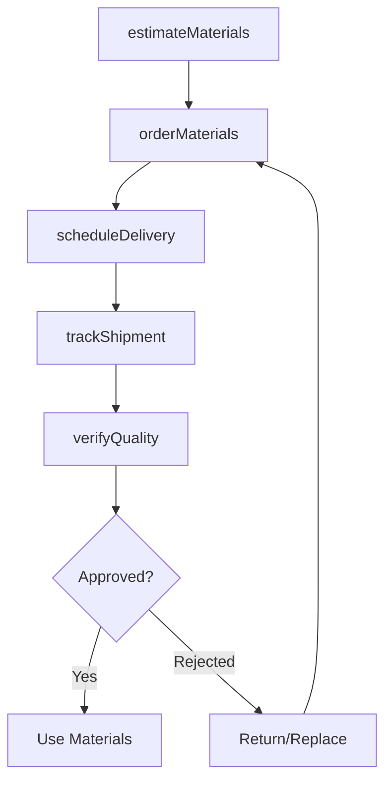
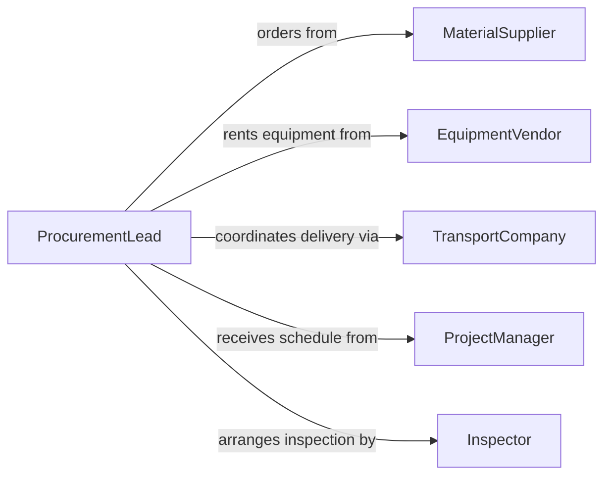

# Order Construction Extraction Materials Equipment

> Business-as-Code definition for procurement of construction and extraction industry resources. Models material ordering, equipment rental, and job site delivery coordination.

## Overview

Ordering construction and extraction materials involves forecasting job requirements, coordinating delivery schedules with project timelines, and managing specialized equipment rentals. This definition exposes actions for material ordering, events for delivery tracking, and searches for supplier availability and pricing.

## Actors

| Actor | Description |
|-------|-------------|
| MaterialSupplier | Provides concrete, steel, lumber, and aggregates |
| EquipmentVendor | Rents heavy machinery and specialized tools |
| Distributor | Stocks and delivers construction materials |
| TransportCompany | Handles logistics and job site delivery |
| Inspector | Verifies material quality and specifications |
| ProjectManager | Coordinates material needs with schedule |

## Roles

| Role | Description |
|------|-------------|
| ProcurementLead | Manages vendor relationships and contracts |
| SiteForeman | Requests materials based on job progress |
| EquipmentCoordinator | Arranges machinery rentals and maintenance |
| LogisticsPlanner | Schedules deliveries to match construction phases |

## Entities

| Entity | Description |
|--------|-------------|
| MaterialOrder | Request for construction supplies |
| Equipment | Heavy machinery or specialized tools |
| Delivery | Scheduled shipment to job site |
| Rental | Time-based equipment lease agreement |
| Specification | Material grade, dimensions, or performance criteria |
| JobSite | Construction or extraction location |

## Actions

| Action | Description |
|--------|-------------|
| estimateMaterials | Calculate quantities needed for project phase |
| orderMaterials | Place order for construction supplies |
| rentEquipment | Secure heavy machinery for job duration |
| scheduleDelivery | Coordinate shipment with project timeline |
| verifyQuality | Inspect materials against specifications |
| trackShipment | Monitor delivery status and location |
| returnEquipment | Complete rental and arrange pickup |

## Events

| Event | Description |
|-------|-------------|
| materialsEstimated | Quantities calculated for project phase |
| materialsOrdered | Order placed with supplier |
| equipmentRented | Machinery secured for job |
| deliveryScheduled | Shipment date and time confirmed |
| qualityVerified | Materials inspected and approved |
| shipmentTracked | Delivery status updated |
| equipmentReturned | Rental completed and equipment picked up |

## Searches

| Search | Description |
|--------|-------------|
| findMaterials | Search suppliers by material type and quantity |
| getEquipment | Find available machinery by type and date range |
| getDeliveries | List scheduled or completed shipments |
| getRentals | Retrieve active or past equipment leases |

## Workflow



## Actor Relationships



## Usage

### Calling Actions

```typescript
import { orderConstructionExtractionMaterialsEquipment } from '@headlessly/order-construction-extraction-materials-equipment'

const construction = orderConstructionExtractionMaterialsEquipment()

// Estimate concrete for foundation pour
const estimate = await construction.estimateMaterials({
  projectId: 'PROJ-456',
  phase: 'Foundation',
  materials: [
    { type: 'Concrete 3000 PSI', area: 5000, thickness: 6 }
  ]
})

// Order ready-mix concrete
await construction.orderMaterials({
  supplierId: 'SUP-789',
  materials: [
    { type: 'Concrete 3000 PSI', quantity: 85, unit: 'cubic yards' }
  ],
  deliveryDate: '2026-02-15'
})

// Rent excavator for site work
await construction.rentEquipment({
  equipmentType: 'Hydraulic Excavator 320',
  startDate: '2026-02-10',
  duration: 14,
  deliveryLocation: 'Site A, 123 Construction Rd'
})
```

### Event-Driven Automation

```typescript
// Alert foreman when delivery is imminent
construction.shipmentTracked(async ({ orderId, eta, jobSite }) => {
  if (eta < 60) { // minutes
    await notify({
      to: 'site-foreman',
      message: `Material delivery arriving in ${eta} minutes at ${jobSite}`
    })
  }
})

// Schedule return when rental period ending
construction.equipmentRented(async ({ rentalId, endDate }) => {
  const reminder = addDays(endDate, -2)
  await scheduleNotification({
    date: reminder,
    message: `Equipment rental ${rentalId} ends in 2 days. Arrange pickup.`
  })
})
```
