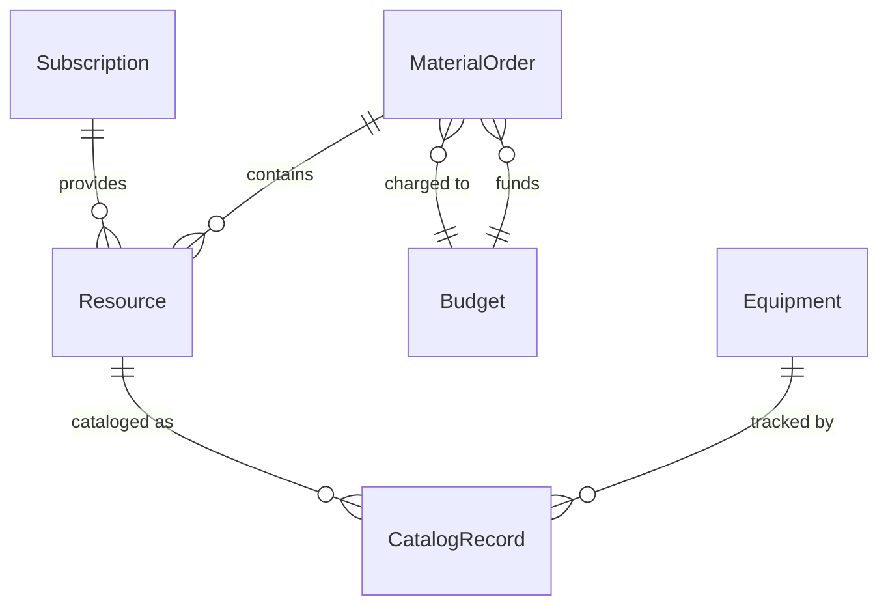
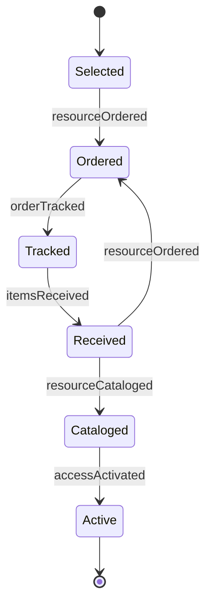
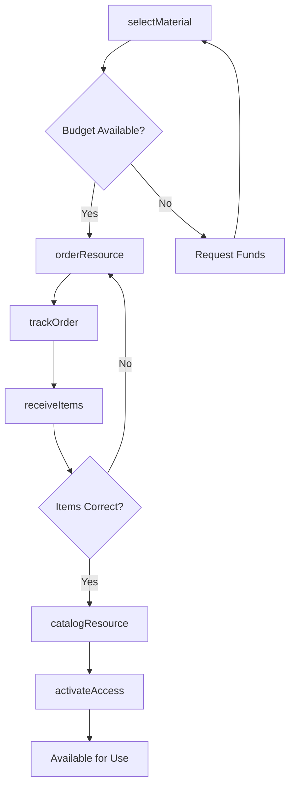
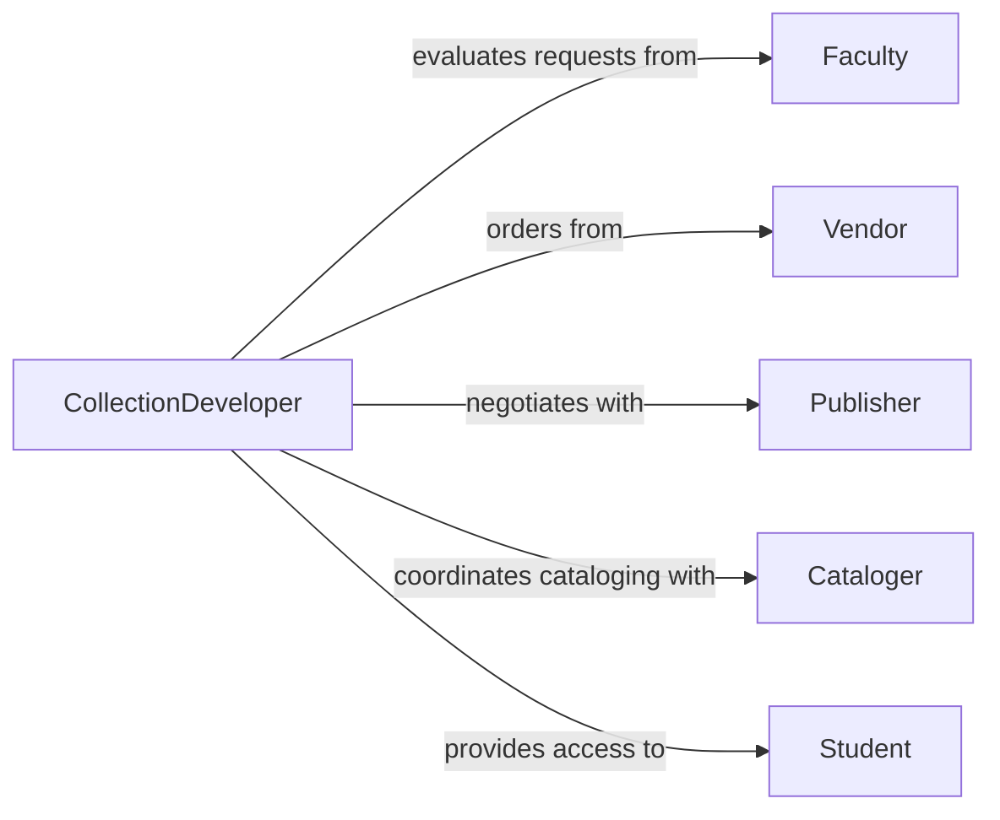

# Order Instructional Library Materials Equipment

> Business-as-Code definition for procurement of educational resources and library collections. Models material selection, acquisition workflows, and cataloging coordination.

## Overview

Ordering instructional and library materials involves evaluating educational needs, selecting appropriate resources, and coordinating cataloging and circulation setup. This definition provides actions for resource ordering, events for acquisition tracking, and searches for vendor catalogs and collection development.

## Actors

| Actor | Description |
|-------|-------------|
| Publisher | Produces books, journals, and educational content |
| Vendor | Distributes library materials and educational resources |
| Cataloger | Processes and catalogs new acquisitions |
| Faculty | Requests instructional materials for curriculum |
| Student | Uses library resources and instructional materials |
| TechnologyProvider | Supplies digital platforms and educational software |

## Roles

| Role | Description |
|------|-------------|
| Acquisitions | Manages purchasing and vendor relationships |
| CollectionDeveloper | Selects materials aligned with curriculum and needs |
| Cataloger | Creates bibliographic records and classification |
| MediaSpecialist | Coordinates educational technology and equipment |

## Entities

| Entity | Description |
|--------|-------------|
| MaterialOrder | Request for books, media, or equipment |
| Resource | Book, journal, database, or educational material |
| Subscription | Ongoing access to periodicals or digital content |
| Equipment | Instructional technology and library systems |
| CatalogRecord | Bibliographic metadata for collection item |
| Budget | Funds allocated for acquisitions |

## Actions

| Action | Description |
|--------|-------------|
| selectMaterial | Choose resources based on curriculum and needs |
| orderResource | Place order with vendor or publisher |
| subscribeDatabase | Establish ongoing access to digital content |
| trackOrder | Monitor shipment and delivery status |
| receiveItems | Accept delivery and verify contents |
| catalogResource | Create bibliographic records and classification |
| activateAccess | Enable circulation or digital access |

## Events

| Event | Description |
|-------|-------------|
| materialSelected | Resource chosen for acquisition |
| resourceOrdered | Order placed with vendor |
| databaseSubscribed | Digital content access established |
| orderTracked | Shipment status updated |
| itemsReceived | Materials delivered and verified |
| resourceCataloged | Bibliographic records created |
| accessActivated | Resource available for use |

## Searches

| Search | Description |
|--------|-------------|
| findMaterials | Search vendor catalogs by subject or format |
| getOrders | List pending or completed acquisitions |
| getSubscriptions | Retrieve active database and journal access |
| getBudget | Check available funds by category or department |

## Entity Relationships



## State Diagram



## Workflow



## Actor Relationships



## Usage

### Calling Actions

```typescript
import { orderInstructionalLibraryMaterialsEquipment } from '@headlessly/order-instructional-library-materials-equipment'

const library = orderInstructionalLibraryMaterialsEquipment()

// Select new titles for collection
const selection = await library.selectMaterial({
  department: 'Computer Science',
  budget: 5000,
  criteria: ['recent publications', 'faculty requests', 'course reserves']
})

// Order books from vendor
await library.orderResource({
  vendorId: 'VEN-456',
  items: [
    { isbn: '978-0-13-468599-1', title: 'Clean Architecture', quantity: 3 },
    { isbn: '978-0-13-464955-0', title: 'Refactoring', quantity: 2 }
  ]
})

// Subscribe to academic database
await library.subscribeDatabase({
  database: 'IEEE Xplore Digital Library',
  term: 'Annual',
  users: 5000,
  startDate: '2026-03-01'
})
```

### Event-Driven Automation

```typescript
// Auto-catalog standard items
library.itemsReceived(async ({ orderId, items }) => {
  const standardItems = items.filter(i => i.isbn && i.catalogingSource === 'LC')
  for (const item of standardItems) {
    await library.catalogResource({
      item: item.id,
      source: 'Library of Congress',
      classification: 'auto'
    })
  }
})

// Alert on budget utilization
library.resourceOrdered(async ({ departmentBudget, totalSpent }) => {
  const utilization = totalSpent / departmentBudget
  if (utilization > 0.8) {
    await notify({
      to: 'acquisitions-team',
      message: `Department budget ${utilization * 100}% utilized`
    })
  }
})
```
