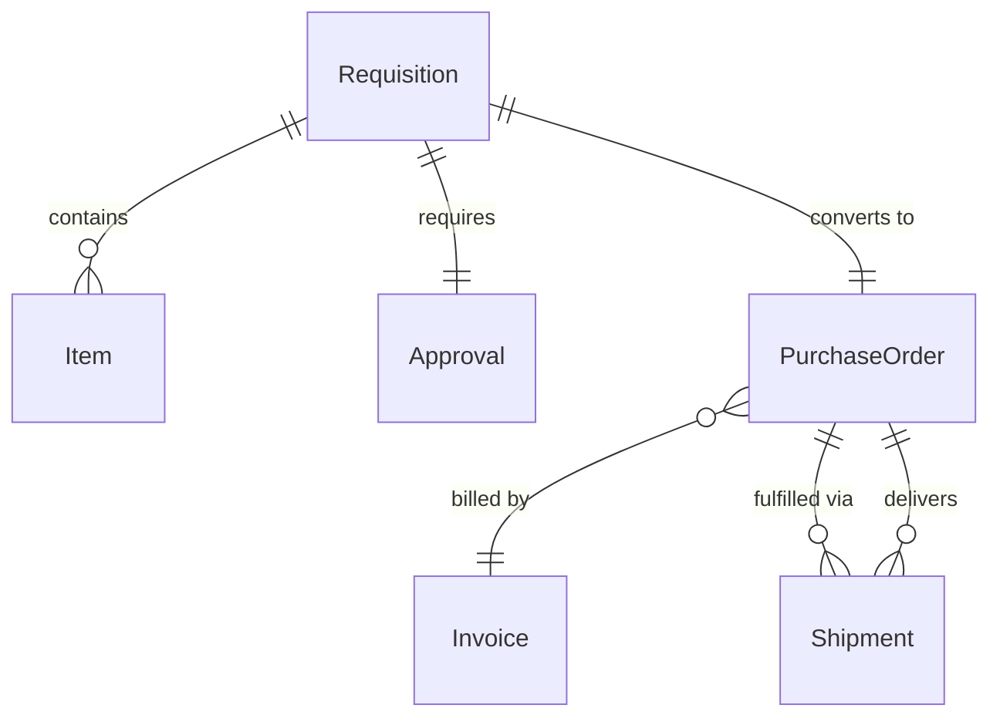
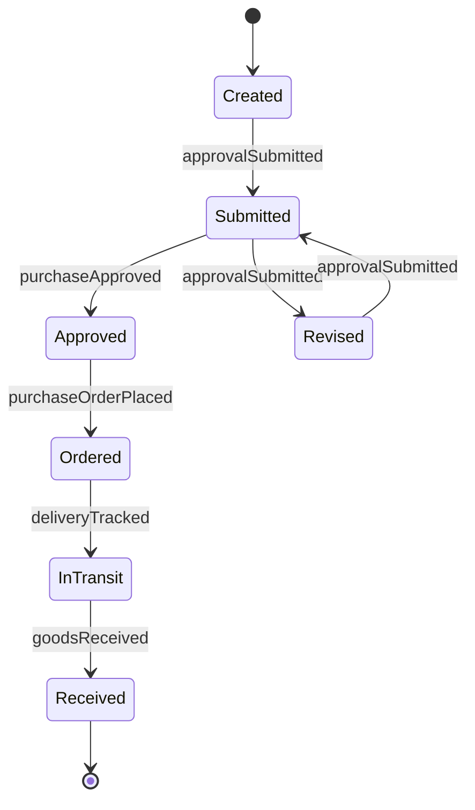
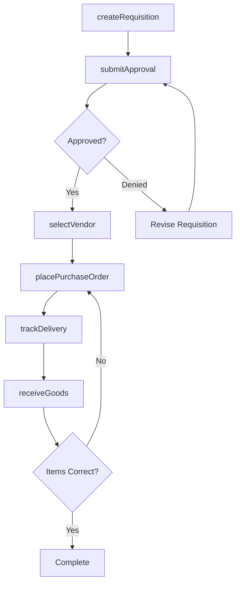
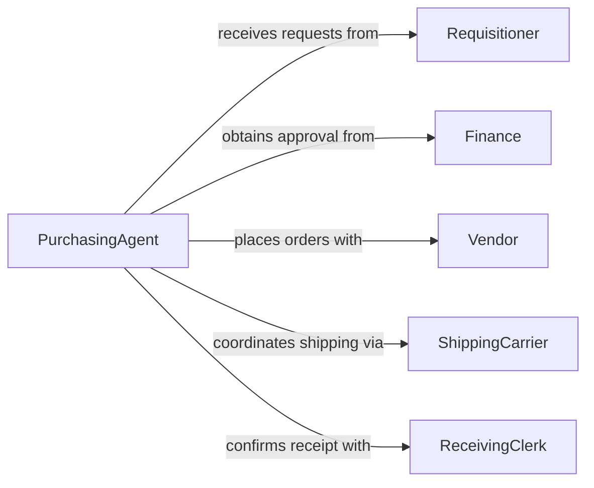

# Order Materials Supplies Equipment

> Business-as-Code definition for general procurement of operational resources. Models requisition approval, vendor selection, and order fulfillment workflows.

## Overview

Ordering materials, supplies, and equipment involves identifying needs, obtaining approvals, selecting vendors, and tracking deliveries. This definition exposes actions for requisition management, events for approval tracking, and searches for inventory and vendor pricing.

## Actors

| Actor | Description |
|-------|-------------|
| Vendor | Supplies goods and equipment per purchase orders |
| Distributor | Stocks and delivers consumable supplies |
| Manufacturer | Produces equipment and specialty items |
| ShippingCarrier | Transports goods from supplier to facility |
| Finance | Approves budgets and processes invoices |
| ReceivingClerk | Accepts deliveries and updates inventory |

## Roles

| Role | Description |
|------|-------------|
| Requisitioner | Submits requests for materials and supplies |
| PurchasingAgent | Reviews requests and places orders |
| Approver | Authorizes spending within budget limits |
| InventoryManager | Maintains stock levels and reorder points |

## Entities

| Entity | Description |
|--------|-------------|
| Requisition | Formal request for materials or equipment |
| PurchaseOrder | Authorized order sent to vendor |
| Item | Specific product or supply being ordered |
| Approval | Authorization to proceed with purchase |
| Shipment | Delivery from vendor to receiving location |
| Invoice | Bill from vendor for goods provided |

## Actions

| Action | Description |
|--------|-------------|
| createRequisition | Initiate request for materials or equipment |
| submitApproval | Route request to authorized approver |
| approvePurchase | Authorize requisition within budget |
| selectVendor | Choose supplier based on price and availability |
| placePurchaseOrder | Send order to selected vendor |
| trackDelivery | Monitor shipment status and location |
| receiveGoods | Accept delivery and update inventory |

## Events

| Event | Description |
|-------|-------------|
| requisitionCreated | New purchase request submitted |
| approvalSubmitted | Request routed for authorization |
| purchaseApproved | Requisition authorized |
| vendorSelected | Supplier chosen for order |
| purchaseOrderPlaced | Order sent to vendor |
| deliveryTracked | Shipment status updated |
| goodsReceived | Items accepted and inventoried |

## Searches

| Search | Description |
|--------|-------------|
| findRequisitions | List requests by department, status, or date |
| getVendors | Search suppliers by category and rating |
| getOrders | Retrieve purchase orders by vendor or status |
| getInventory | Check current stock levels and reorder needs |

## Entity Relationships



## State Diagram



## Workflow



## Actor Relationships



## Usage

### Calling Actions

```typescript
import { orderMaterialsSuppliesEquipment } from '@headlessly/order-materials-supplies-equipment'

const procurement = orderMaterialsSuppliesEquipment()

// Create requisition for office supplies
const req = await procurement.createRequisition({
  department: 'Operations',
  items: [
    { sku: 'PEN-001', description: 'Blue Pens', quantity: 100 },
    { sku: 'PAPER-A4', description: 'Copy Paper', quantity: 20 }
  ],
  estimatedCost: 450,
  priority: 'normal'
})

// Submit for manager approval
await procurement.submitApproval({
  requisitionId: req.id,
  approverId: 'MGR-123'
})

// Place order with preferred vendor
await procurement.placePurchaseOrder({
  requisitionId: req.id,
  vendorId: 'VEN-456',
  deliveryDate: '2026-02-18'
})
```

### Event-Driven Automation

```typescript
// Auto-approve small purchases
procurement.approvalSubmitted(async ({ requisitionId, estimatedCost }) => {
  if (estimatedCost < 500) {
    await procurement.approvePurchase({
      requisitionId,
      autoApproved: true,
      reason: 'Below approval threshold'
    })
  }
})

// Update inventory on receipt
procurement.goodsReceived(async ({ purchaseOrderId, items }) => {
  for (const item of items) {
    await updateInventory({
      sku: item.sku,
      quantityAdded: item.quantity,
      location: item.receivingLocation
    })
  }
})
```
