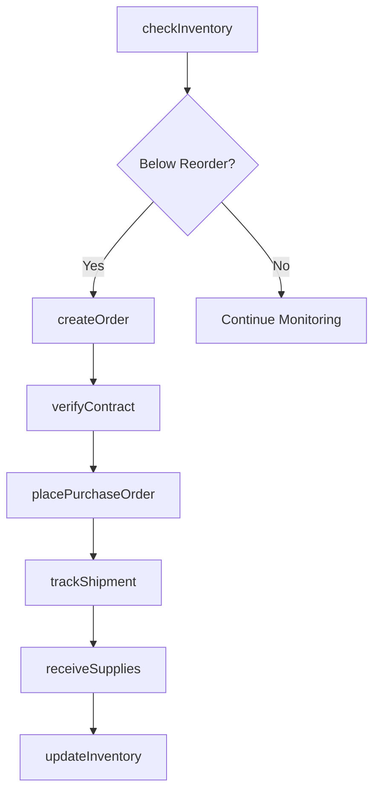
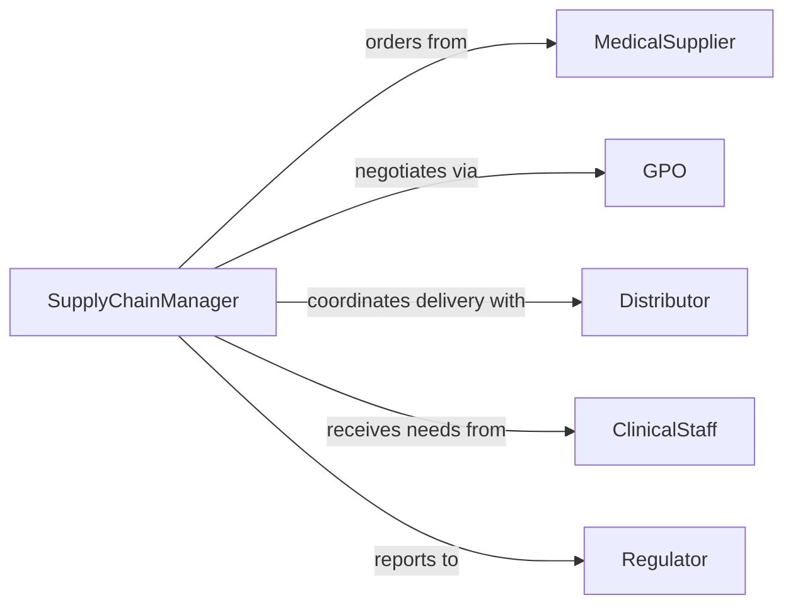

# Order Medical Supplies Equipment

> Business-as-Code definition for procurement of clinical supplies and medical devices. Models inventory management, vendor contracts, and regulatory compliance tracking.

## Overview

Ordering medical supplies and equipment involves managing clinical inventory, coordinating with contracted vendors, ensuring regulatory compliance, and tracking lot numbers for patient safety. This definition provides actions for supply ordering, events for inventory alerts, and searches for vendor pricing and product specifications.

## Actors

| Actor | Description |
|-------|-------------|
| MedicalSupplier | Provides clinical consumables and devices |
| Manufacturer | Produces medical equipment and devices |
| GPO | Group purchasing organization negotiating contracts |
| Distributor | Delivers supplies and manages logistics |
| Regulator | Enforces FDA device reporting and tracking |
| ClinicalStaff | Uses supplies and reports inventory needs |

## Roles

| Role | Description |
|------|-------------|
| SupplyChainManager | Oversees medical supply procurement |
| ClinicalBuyer | Selects products based on clinical needs |
| InventorySpecialist | Manages stock levels and reordering |
| ComplianceOfficer | Ensures regulatory and safety compliance |

## Entities

| Entity | Description |
|--------|-------------|
| SupplyOrder | Request for medical consumables or equipment |
| MedicalItem | Clinical supply or device with specifications |
| Contract | GPO or direct pricing agreement |
| Inventory | Current stock levels and locations |
| LotNumber | Manufacturer batch for traceability |
| ReorderPoint | Threshold triggering automatic replenishment |

## Actions

| Action | Description |
|--------|-------------|
| checkInventory | Review current stock levels by location |
| createOrder | Initiate purchase of medical supplies |
| verifyContract | Confirm pricing and terms with vendor |
| placePurchaseOrder | Send order to contracted supplier |
| trackShipment | Monitor delivery status |
| receiveSupplies | Accept delivery and verify lot numbers |
| updateInventory | Record stock additions and locations |

## Events

| Event | Description |
|-------|-------------|
| inventoryChecked | Stock levels reviewed |
| orderCreated | New supply purchase initiated |
| contractVerified | Pricing and terms confirmed |
| purchaseOrderPlaced | Order sent to supplier |
| shipmentTracked | Delivery status updated |
| suppliesReceived | Items accepted and lot numbers recorded |
| inventoryUpdated | Stock levels and locations refreshed |

## Searches

| Search | Description |
|--------|-------------|
| findSupplies | Search medical supply catalog by category |
| getInventory | Retrieve current stock by item or location |
| getContracts | Find active vendor agreements and pricing |
| getLotNumbers | Track batch numbers for recalls or safety alerts |

## Workflow



## Actor Relationships



## Usage

### Calling Actions

```typescript
import { orderMedicalSuppliesEquipment } from '@headlessly/order-medical-supplies-equipment'

const medical = orderMedicalSuppliesEquipment()

// Check inventory for surgical supplies
const inventory = await medical.checkInventory({
  department: 'Operating Room',
  categories: ['Sutures', 'Gloves', 'Drapes']
})

// Create order for low stock items
const order = await medical.createOrder({
  items: [
    { sku: 'SUT-001', description: 'Absorbable Suture 3-0', quantity: 500 },
    { sku: 'GLV-002', description: 'Sterile Gloves Size 7', quantity: 1000 }
  ]
})

// Place purchase order with GPO pricing
await medical.placePurchaseOrder({
  orderId: order.id,
  vendorId: 'VEN-789',
  contractId: 'GPO-456',
  deliveryLocation: 'Main Hospital Receiving'
})
```

### Event-Driven Automation

```typescript
// Auto-reorder critical supplies
medical.inventoryChecked(async ({ item, currentLevel, reorderPoint }) => {
  if (currentLevel < reorderPoint && item.category === 'critical') {
    await medical.createOrder({
      items: [{ sku: item.sku, quantity: item.parLevel }],
      priority: 'urgent'
    })
  }
})

// Alert on recalled lot numbers
medical.suppliesReceived(async ({ items }) => {
  for (const item of items) {
    const recall = await checkRecallDatabase(item.lotNumber)
    if (recall) {
      await alert({
        severity: 'critical',
        message: `Recalled lot ${item.lotNumber} received. Quarantine immediately.`
      })
    }
  }
})
```
