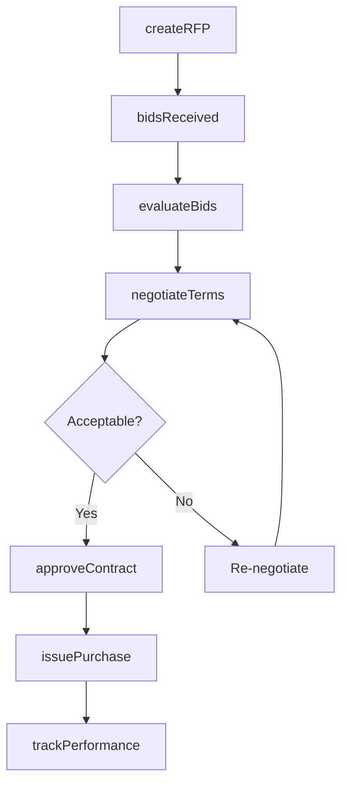
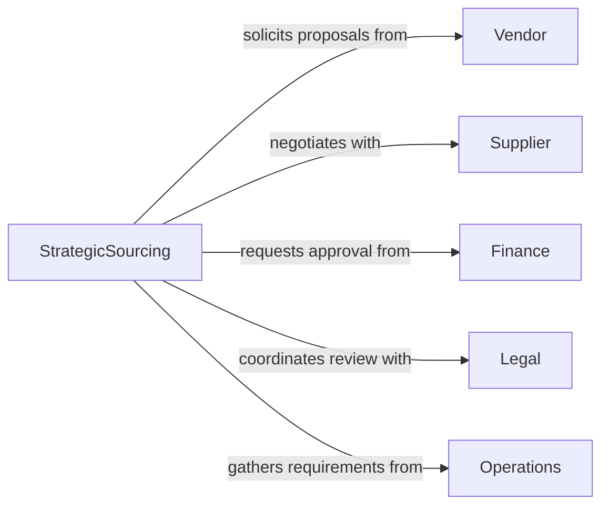

# Purchase Materials Equipment Resources

> Business-as-Code definition for strategic sourcing and capital expenditure management. Models RFP processes, vendor evaluation, and total cost of ownership analysis.

## Overview

Purchasing materials, equipment, and resources involves strategic sourcing decisions, competitive bidding, contract negotiation, and lifecycle cost analysis. This definition exposes actions for vendor evaluation, events for approval workflows, and searches for supplier performance and spend analytics.

## Actors

| Actor | Description |
|-------|-------------|
| Vendor | Competes for contracts and supplies goods |
| Supplier | Provides materials under established agreements |
| Finance | Approves capital expenditures and budgets |
| Legal | Reviews contracts and terms |
| Operations | Defines specifications and requirements |
| AssetManagement | Tracks equipment lifecycle and depreciation |

## Roles

| Role | Description |
|------|-------------|
| StrategicSourcing | Develops sourcing strategies and vendor relationships |
| BuyingCommittee | Evaluates proposals and selects suppliers |
| ContractManager | Negotiates terms and manages agreements |
| CategoryManager | Oversees spend for specific product categories |

## Entities

| Entity | Description |
|--------|-------------|
| RFP | Request for proposal from potential vendors |
| Bid | Vendor response with pricing and terms |
| Contract | Negotiated agreement for goods or services |
| CapitalRequest | Request for major equipment or asset purchase |
| TCO | Total cost of ownership analysis |
| SpendAnalysis | Historical purchasing data and trends |

## Actions

| Action | Description |
|--------|-------------|
| createRFP | Issue request for vendor proposals |
| evaluateBids | Compare vendor responses on criteria |
| negotiateTerms | Discuss pricing, delivery, and warranties |
| approveContract | Authorize supplier agreement |
| issuePurchase | Execute order under contract |
| trackPerformance | Monitor vendor quality and delivery |
| analyzeTCO | Calculate total ownership costs |

## Events

| Event | Description |
|-------|-------------|
| rfpCreated | Request for proposal issued |
| bidsReceived | Vendor proposals submitted |
| bidsEvaluated | Supplier comparison completed |
| termsNegotiated | Final pricing and terms agreed |
| contractApproved | Agreement authorized and signed |
| purchaseIssued | Order placed with vendor |
| performanceTracked | Supplier metrics updated |

## Searches

| Search | Description |
|--------|-------------|
| findVendors | Search qualified suppliers by category |
| getBids | Retrieve proposals for active RFPs |
| getContracts | List active agreements by vendor or category |
| getSpend | Analyze purchasing history and trends |

## Workflow



## Actor Relationships



## Usage

### Calling Actions

```typescript
import { purchaseMaterialsEquipmentResources } from '@headlessly/purchase-materials-equipment-resources'

const sourcing = purchaseMaterialsEquipmentResources()

// Issue RFP for manufacturing equipment
const rfp = await sourcing.createRFP({
  category: 'CNC Machining Center',
  specifications: {
    axes: 5,
    tolerance: '0.001 inch',
    toolChanger: 'Automatic 40-tool'
  },
  budget: 500000,
  responseDeadline: '2026-03-15'
})

// Evaluate submitted bids
const evaluation = await sourcing.evaluateBids({
  rfpId: rfp.id,
  criteria: [
    { name: 'Price', weight: 0.4 },
    { name: 'Delivery Time', weight: 0.2 },
    { name: 'Warranty', weight: 0.2 },
    { name: 'Service Network', weight: 0.2 }
  ]
})

// Negotiate with top-ranked vendor
await sourcing.negotiateTerms({
  rfpId: rfp.id,
  vendorId: evaluation.topVendor,
  counterOffer: {
    price: 475000,
    deliveryWeeks: 12,
    warrantyYears: 3
  }
})
```

### Event-Driven Automation

```typescript
// Calculate TCO when bids received
sourcing.bidsReceived(async ({ rfpId, bids }) => {
  for (const bid of bids) {
    const tco = await sourcing.analyzeTCO({
      purchasePrice: bid.price,
      installationCost: bid.installation,
      annualMaintenance: bid.maintenanceContract,
      energyCost: estimateEnergyCost(bid.specifications),
      usefulLife: 10
    })
    bid.totalCost = tco
  }
})

// Alert on poor vendor performance
sourcing.performanceTracked(async ({ vendorId, metrics }) => {
  if (metrics.onTimeDelivery < 0.85 || metrics.qualityScore < 3.5) {
    await notify({
      to: 'category-manager',
      message: `Vendor ${vendorId} performance below threshold. Consider alternative sourcing.`
    })
  }
})
```
