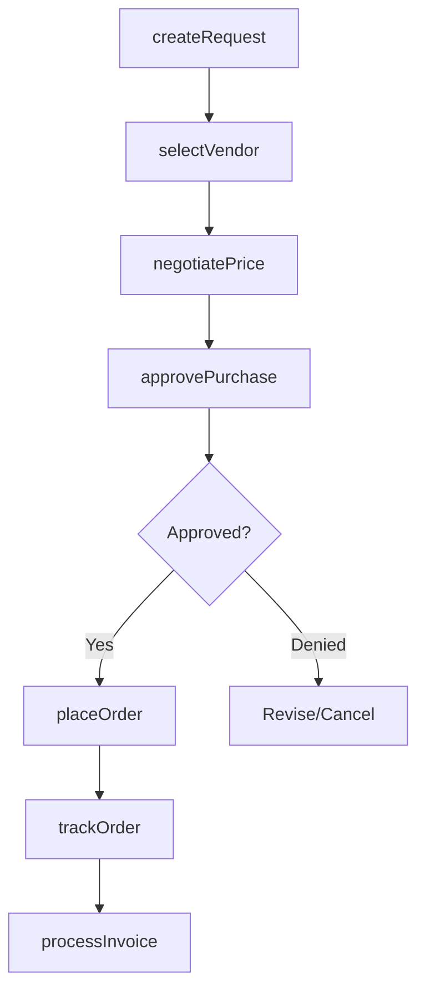
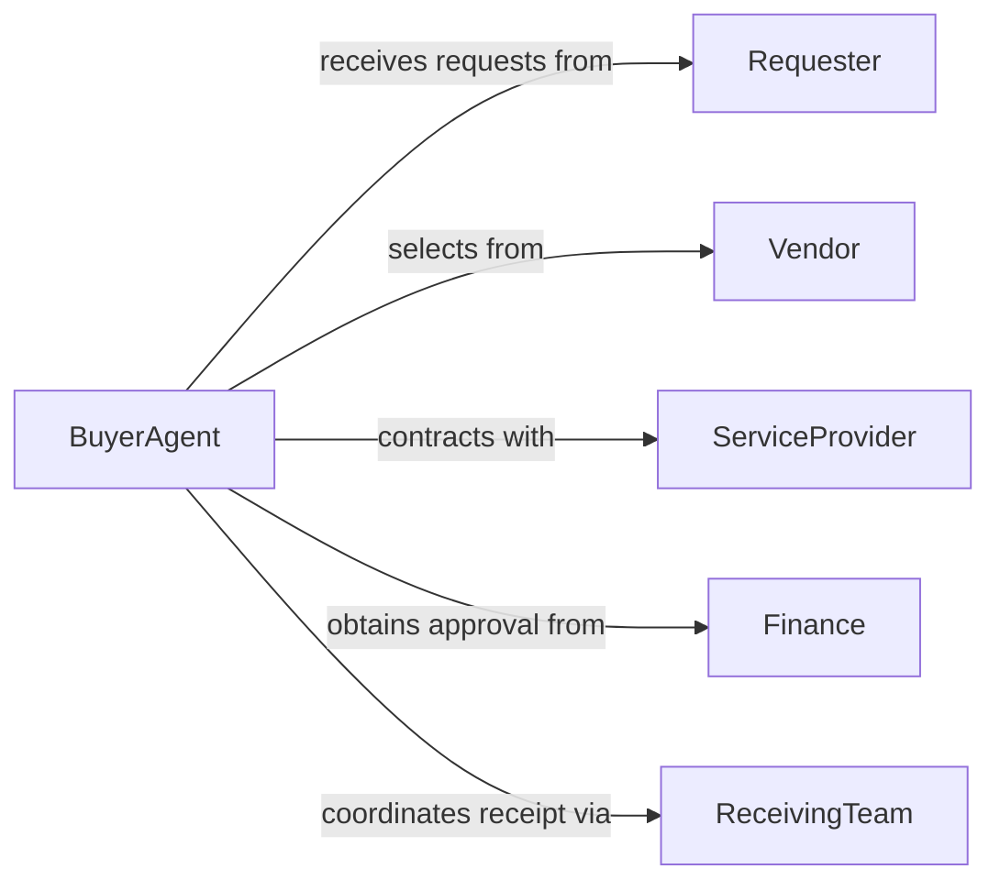

# Purchase Products Services

> Business-as-Code definition for transactional procurement across product and service categories. Models order placement, vendor management, and spend tracking workflows.

## Overview

Purchasing products and services involves selecting vendors, negotiating pricing, placing orders, and tracking spend across categories. This definition provides actions for purchase execution, events for approval workflows, and searches for vendor catalogs and spend analytics.

## Actors

| Actor | Description |
|-------|-------------|
| Vendor | Supplies products or delivers services |
| ServiceProvider | Performs contracted work or professional services |
| Finance | Approves budgets and processes payments |
| Requester | Identifies needs and initiates purchase requests |
| ReceivingTeam | Accepts deliveries and verifies quality |
| AccountsPayable | Processes invoices and vendor payments |

## Roles

| Role | Description |
|------|-------------|
| BuyerAgent | Executes purchases and manages vendor relationships |
| CategoryLead | Oversees spend for specific product or service type |
| Approver | Authorizes purchases within delegation limits |
| ContractOwner | Manages supplier agreements and renewals |

## Entities

| Entity | Description |
|--------|-------------|
| PurchaseRequest | Need for product or service identified |
| PurchaseOrder | Authorized order sent to vendor |
| Product | Tangible good being purchased |
| Service | Intangible work or expertise being procured |
| Contract | Agreement defining pricing and terms |
| Invoice | Bill from vendor for goods or services |

## Actions

| Action | Description |
|--------|-------------|
| createRequest | Initiate purchase need |
| selectVendor | Choose supplier based on requirements |
| negotiatePrice | Discuss pricing and terms |
| approvePurchase | Authorize spending within budget |
| placeOrder | Execute purchase with vendor |
| trackOrder | Monitor delivery or service completion |
| processInvoice | Match bill to purchase order and approve payment |

## Events

| Event | Description |
|-------|-------------|
| requestCreated | Purchase need identified |
| vendorSelected | Supplier chosen |
| priceNegotiated | Final pricing agreed |
| purchaseApproved | Spending authorized |
| orderPlaced | Purchase executed |
| orderTracked | Status updated |
| invoiceProcessed | Payment approved and scheduled |

## Searches

| Search | Description |
|--------|-------------|
| findVendors | Search suppliers by category and rating |
| getRequests | List purchase needs by status or requester |
| getOrders | Retrieve active or historical purchases |
| getSpend | Analyze spending by category, vendor, or period |

## Workflow



## Actor Relationships



## Usage

### Calling Actions

```typescript
import { purchaseProductsServices } from '@headlessly/purchase-products-services'

const purchasing = purchaseProductsServices()

// Create purchase request
const request = await purchasing.createRequest({
  category: 'IT Services',
  description: 'Cloud infrastructure consulting',
  estimatedCost: 25000,
  department: 'Engineering',
  urgency: 'normal'
})

// Select vendor from approved list
await purchasing.selectVendor({
  requestId: request.id,
  vendorId: 'VEN-789',
  rationale: 'Preferred vendor with existing MSA'
})

// Place order after approval
await purchasing.placeOrder({
  requestId: request.id,
  startDate: '2026-03-01',
  duration: '3 months',
  deliverables: ['Architecture assessment', 'Migration plan']
})
```

### Event-Driven Automation

```typescript
// Route high-value purchases for executive approval
purchasing.requestCreated(async ({ requestId, estimatedCost }) => {
  if (estimatedCost > 50000) {
    await purchasing.approvePurchase({
      requestId,
      requiredApprovers: ['CFO', 'COO']
    })
  }
})

// Track spend against budget
purchasing.invoiceProcessed(async ({ category, amount }) => {
  const budget = await getBudget(category)
  const spent = budget.totalSpent + amount

  if (spent / budget.allocated > 0.9) {
    await notify({
      to: 'category-lead',
      message: `${category} budget 90% utilized`
    })
  }
})
```
