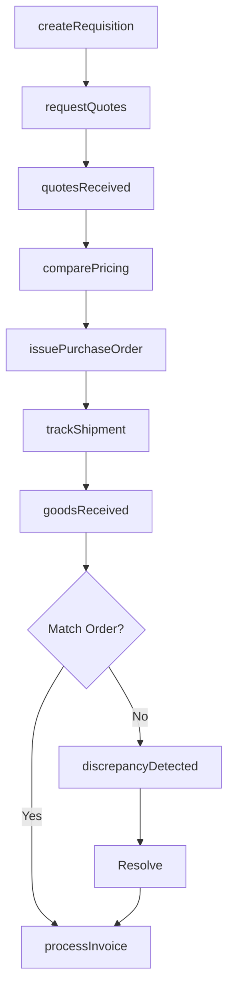
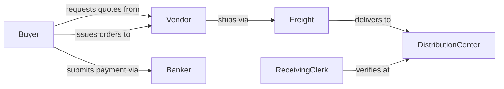

# Purchase Stocks Merchandise Supplies

> Business-as-Code definition for purchasing inventory stocks, merchandise, and operational supplies. Models procurement workflows from requisition through receipt and payment.

## Overview

Stock and supply purchasing involves identifying needs, selecting vendors, negotiating terms, issuing purchase orders, and managing receipt and payment. This definition provides actions for each procurement stage, events for approval workflows, and searches for vendor and order management.

## Actors

| Actor | Description |
|-------|-------------|
| Vendor | Supplies merchandise, materials, or operational goods |
| DistributionCenter | Receives and warehouses incoming stock |
| Freight | Transports purchased goods from vendor to facility |
| Banker | Processes payment transactions for purchases |
| Auditor | Reviews purchase records for compliance and accuracy |
| TaxAuthority | Assesses sales tax on taxable purchases |

## Roles

| Role | Description |
|------|-------------|
| ProcurementManager | Oversees purchasing strategy and vendor relationships |
| Buyer | Executes purchase transactions and negotiations |
| Requisitioner | Requests goods needed for operations |
| ReceivingClerk | Verifies incoming shipments against orders |

## Entities

| Entity | Description |
|--------|-------------|
| PurchaseOrder | A formal order placed with a vendor |
| Requisition | An internal request for goods to be purchased |
| VendorQuote | A price proposal from a supplier |
| Receipt | A record of goods received from vendor |
| Invoice | A payment request from vendor for goods delivered |
| PaymentTerms | Conditions for payment timing and discounts |

## Actions

| Action | Description |
|--------|-------------|
| createRequisition | Submit a request for goods to be purchased |
| requestQuotes | Solicit pricing from multiple vendors |
| comparePricing | Analyze vendor quotes to select best option |
| issuePurchaseOrder | Send formal order to selected vendor |
| trackShipment | Monitor delivery status of ordered goods |
| receiveGoods | Record receipt and inspect delivered items |
| processInvoice | Submit vendor invoice for payment |

## Events

| Event | Description |
|-------|-------------|
| requisitionCreated | A purchase request has been submitted |
| quotesReceived | Vendor pricing proposals are available |
| purchaseOrderIssued | A formal order has been sent to vendor |
| shipmentDispatched | Vendor has shipped ordered goods |
| goodsReceived | Items have arrived and been inspected |
| discrepancyDetected | Received goods do not match order |
| invoiceProcessed | Payment has been submitted to vendor |

## Searches

| Search | Description |
|--------|-------------|
| findRequisitions | List purchase requests by status or department |
| getVendorQuotes | Retrieve pricing proposals for a requisition |
| getPurchaseOrders | Find orders by vendor, date, or status |
| getReceipts | List goods received by date or order |

## Workflow



## Actor Relationships



## Usage

### Calling Actions

```typescript
import { purchaseStocksMerchandiseSupplies } from '@headlessly/purchase-stocks-merchandise-supplies'

const purchasing = purchaseStocksMerchandiseSupplies()

// Create a requisition for office supplies
const requisition = await purchasing.createRequisition({
  items: [
    { sku: 'PAPER-8.5X11', quantity: 50, unit: 'reams' },
    { sku: 'INK-BLK-XL', quantity: 20, unit: 'cartridges' }
  ],
  department: 'Operations',
  urgency: 'standard'
})

// Request quotes from multiple vendors
await purchasing.requestQuotes({
  requisitionId: requisition.id,
  vendorIds: ['VND-001', 'VND-002', 'VND-003']
})

// Issue purchase order to selected vendor
const order = await purchasing.issuePurchaseOrder({
  requisitionId: requisition.id,
  vendorId: 'VND-002',
  terms: { net: 30, discount: '2/10' }
})
```

### Event-Driven Automation

```typescript
// Auto-notify when goods arrive
purchasing.goodsReceived(async ({ orderId, items }) => {
  await notify({
    to: requisitionOwner(orderId),
    message: `Your order has arrived: ${items.length} items received`
  })
})

// Alert on shipment delays
purchasing.trackShipment(async ({ orderId, expectedDate }) => {
  if (isOverdue(expectedDate)) {
    await escalate({
      to: 'procurement-manager',
      subject: `Delayed shipment for PO ${orderId}`
    })
  }
})
```
