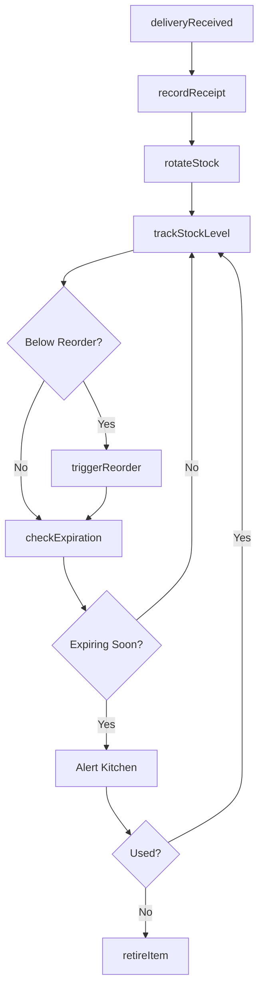
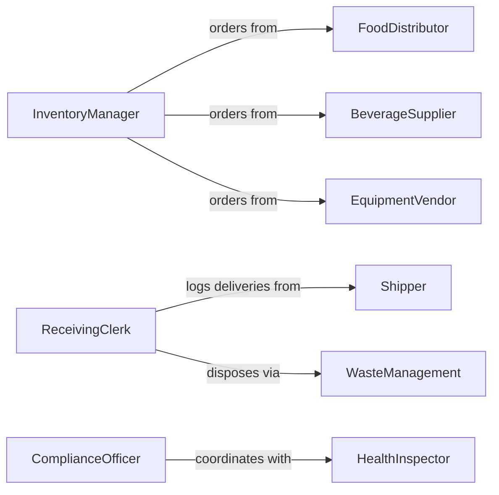

# Maintain Food Beverage Equipment Inventories

> Business-as-Code definition for managing inventories of food, beverages, and kitchen equipment. Models tracking, replenishment, rotation, and compliance for foodservice operations.

## Overview

Food and beverage inventory management ensures adequate stock levels, proper rotation to minimize waste, and compliance with health and safety regulations. This definition provides actions for stock tracking, automatic reordering, expiration monitoring, and equipment maintenance scheduling.

## Actors

| Actor | Description |
|-------|-------------|
| FoodDistributor | Supplies fresh and packaged food items |
| BeverageSupplier | Provides drinks, syrups, and beverage ingredients |
| EquipmentVendor | Supplies kitchen appliances and utensils |
| HealthInspector | Verifies food safety and storage compliance |
| WasteManagement | Removes expired or unusable food items |
| Shipper | Transports perishable goods under temperature control |

## Roles

| Role | Description |
|------|-------------|
| InventoryManager | Oversees stock levels and ordering cycles |
| LineChef | Requests ingredients for daily food preparation |
| ReceivingClerk | Inspects and logs incoming food deliveries |
| ComplianceOfficer | Ensures adherence to food safety standards |

## Entities

| Entity | Description |
|--------|-------------|
| FoodItem | A perishable or packaged ingredient |
| BeverageItem | A drink product or ingredient |
| Equipment | A kitchen appliance or utensil |
| StockLevel | Current quantity on hand for an item |
| ExpirationDate | The date when a perishable item is no longer safe |
| ReorderPoint | The stock level triggering automatic replenishment |

## Actions

| Action | Description |
|--------|-------------|
| trackStockLevel | Monitor current inventory quantities |
| recordReceipt | Log incoming deliveries and update stock |
| checkExpiration | Identify items nearing expiration dates |
| rotateStock | Move older items to front for first use |
| triggerReorder | Automatically order items below reorder point |
| retireItem | Remove expired or damaged items from inventory |
| scheduleEquipmentMaintenance | Plan servicing for kitchen equipment |

## Events

| Event | Description |
|-------|-------------|
| stockUpdated | Inventory levels have changed |
| deliveryReceived | New food or beverage items have arrived |
| expirationApproaching | Items are nearing expiration date |
| stockRotated | Older items have been moved to front |
| reorderTriggered | Automatic purchase order has been generated |
| itemRetired | Expired or damaged items have been discarded |
| maintenanceScheduled | Equipment service has been planned |

## Searches

| Search | Description |
|--------|-------------|
| findLowStock | List items below reorder point |
| getExpiringItems | Retrieve items expiring within specified days |
| getEquipmentDue | Find equipment needing maintenance |
| getStockByCategory | List inventory grouped by food category |

## Workflow



## Actor Relationships



## Usage

### Calling Actions

```typescript
import { maintainFoodBeverageEquipmentInventories } from '@headlessly/maintain-food-beverage-equipment-inventories'

const inventory = maintainFoodBeverageEquipmentInventories()

// Record a delivery of fresh produce
await inventory.recordReceipt({
  deliveryId: 'DLV-20260205-001',
  items: [
    { sku: 'PRODUCE-LETTUCE', quantity: 20, unit: 'heads', expires: '2026-02-12' },
    { sku: 'PRODUCE-TOMATO', quantity: 15, unit: 'pounds', expires: '2026-02-10' }
  ]
})

// Check for items nearing expiration
const expiring = await inventory.checkExpiration({
  withinDays: 3
})

// Schedule maintenance for refrigeration equipment
await inventory.scheduleEquipmentMaintenance({
  equipmentId: 'REFRIG-WALK-IN-01',
  maintenanceDate: '2026-02-15',
  type: 'preventive'
})
```

### Event-Driven Automation

```typescript
// Auto-reorder when stock is low
inventory.stockUpdated(async ({ itemId, quantity, reorderPoint }) => {
  if (quantity <= reorderPoint) {
    await inventory.triggerReorder({ itemId })
  }
})

// Alert kitchen staff on expiring items
inventory.expirationApproaching(async ({ items }) => {
  await notify({
    to: 'kitchen-staff',
    message: `${items.length} items expiring in next 2 days - prioritize use`
  })
})
```
