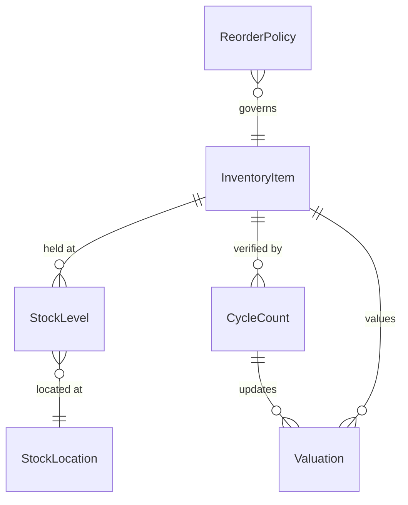
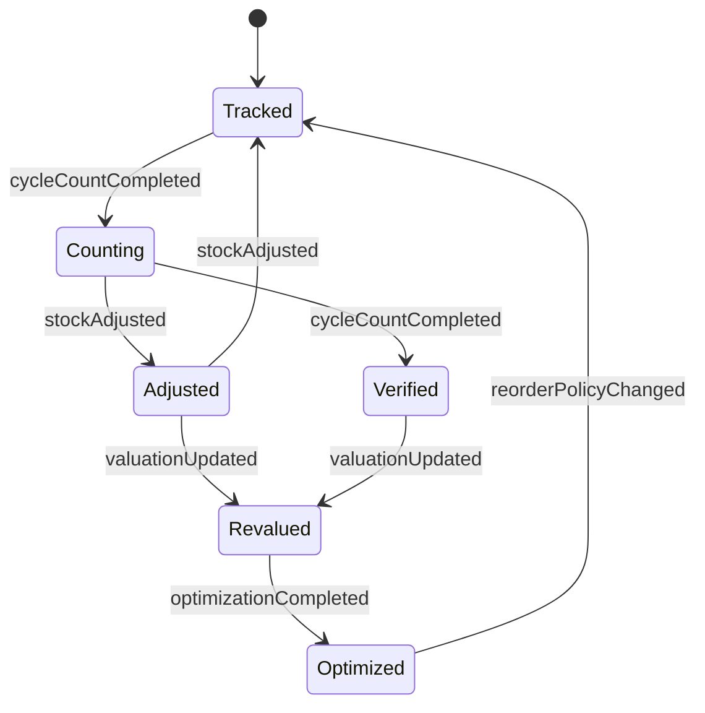
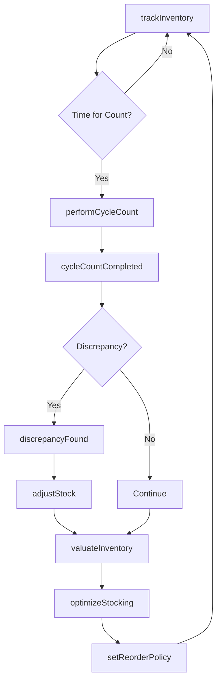
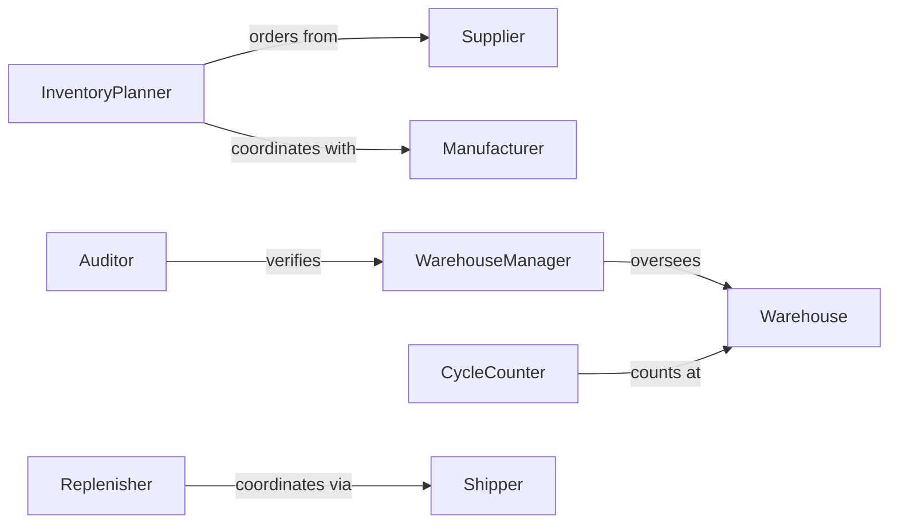

# Maintain Inventories Materials Equipment Products

> Business-as-Code definition for comprehensive inventory management across materials, equipment, and finished products. Models tracking, valuation, cycle counting, and optimization workflows.

## Overview

Inventory maintenance encompasses accurate tracking of stock levels, cycle counting for verification, valuation for financial reporting, and optimization to balance carrying costs with service levels. This definition provides actions for all inventory control activities, events for automated replenishment, and searches for analytics and reporting.

## Actors

| Actor | Description |
|-------|-------------|
| Supplier | Provides raw materials and components |
| Manufacturer | Produces finished goods from materials |
| Warehouse | Stores and manages physical inventory |
| Shipper | Transports inventory between locations |
| Auditor | Verifies inventory accuracy and valuation |
| Customer | Consumes finished products from stock |

## Roles

| Role | Description |
|------|-------------|
| InventoryPlanner | Forecasts demand and sets stocking policies |
| WarehouseManager | Oversees physical storage and handling |
| CycleCounter | Performs regular physical counts |
| Replenisher | Executes reorder decisions |

## Entities

| Entity | Description |
|--------|-------------|
| InventoryItem | A tracked material, equipment piece, or product |
| StockLocation | A physical or logical storage location |
| StockLevel | Current quantity on hand by location |
| CycleCount | A physical count record for verification |
| Valuation | The financial value of inventory holdings |
| ReorderPolicy | Rules determining when and how much to order |

## Actions

| Action | Description |
|--------|-------------|
| trackInventory | Monitor current stock levels across locations |
| performCycleCount | Execute physical count of selected items |
| adjustStock | Correct inventory levels based on count results |
| transferStock | Move items between locations |
| valuateInventory | Calculate total inventory value for reporting |
| setReorderPolicy | Define replenishment rules for an item |
| optimizeStocking | Analyze and adjust inventory parameters |

## Events

| Event | Description |
|-------|-------------|
| stockAdjusted | Inventory levels have been corrected |
| cycleCountCompleted | Physical count has been recorded |
| discrepancyFound | Count does not match system record |
| stockTransferred | Items have moved between locations |
| valuationUpdated | Inventory value has been recalculated |
| reorderPolicyChanged | Stocking rules have been modified |
| optimizationCompleted | Inventory parameters have been adjusted |

## Searches

| Search | Description |
|--------|-------------|
| findInventoryByLocation | List items stocked at specified location |
| getStockMovements | Retrieve transaction history for an item |
| getDiscrepancies | Find items with count variances |
| getValuation | Calculate inventory value by category or location |

## Entity Relationships



## State Diagram



## Workflow



## Actor Relationships



## Usage

### Calling Actions

```typescript
import { maintainInventoriesMaterialsEquipmentProducts } from '@headlessly/maintain-inventories-materials-equipment-products'

const inventory = maintainInventoriesMaterialsEquipmentProducts()

// Track current inventory levels
const levels = await inventory.trackInventory({
  locationId: 'WH-EAST',
  category: 'raw-materials'
})

// Perform a cycle count
const count = await inventory.performCycleCount({
  items: ['SKU-101', 'SKU-102', 'SKU-103'],
  locationId: 'WH-EAST',
  countedBy: 'counter-001'
})

// Adjust stock based on count results
await inventory.adjustStock({
  itemId: 'SKU-101',
  locationId: 'WH-EAST',
  newQuantity: 450,
  reason: 'cycle-count-correction'
})
```

### Event-Driven Automation

```typescript
// Auto-investigate large discrepancies
inventory.discrepancyFound(async ({ itemId, expected, actual, variance }) => {
  if (Math.abs(variance) > 100) {
    await createTask({
      assignee: 'warehouse-manager',
      title: `Investigate ${itemId} discrepancy: ${variance} units`
    })
  }
})

// Revalue inventory after adjustments
inventory.stockAdjusted(async ({ itemId }) => {
  await inventory.valuateInventory({
    items: [itemId],
    method: 'weighted-average'
  })
})
```
