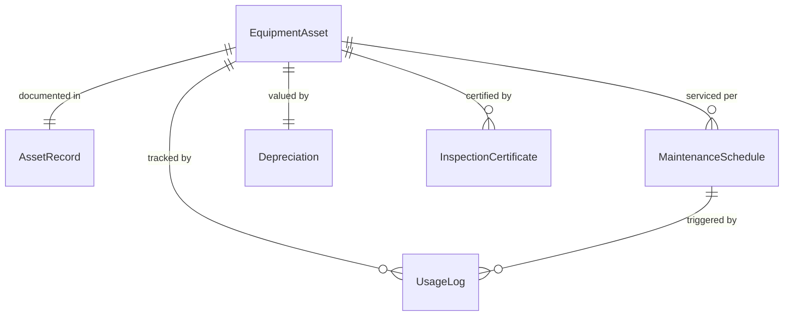
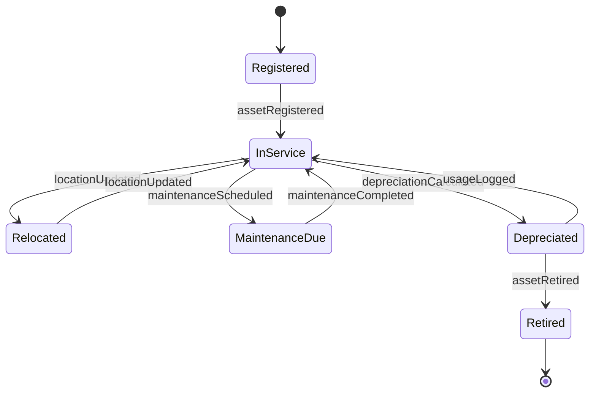
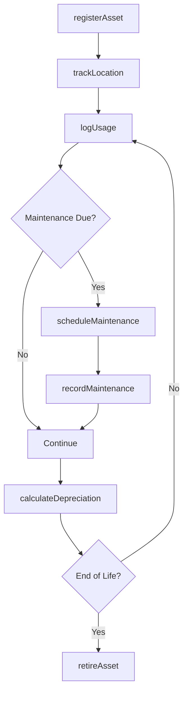
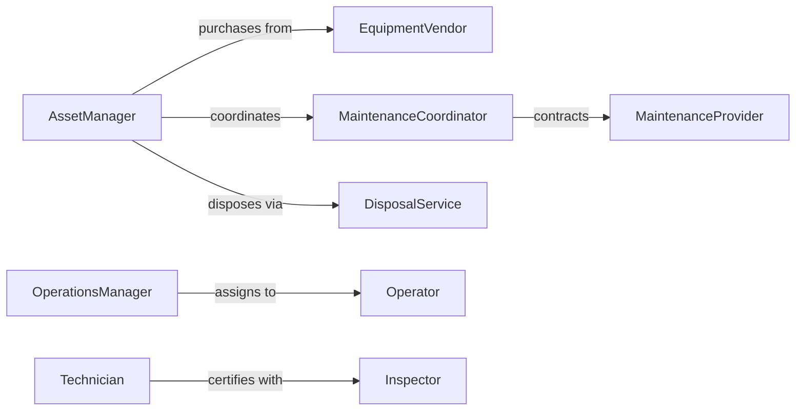

# Maintain Inventory Equipment

> Business-as-Code definition for managing equipment inventory. Models asset tracking, maintenance scheduling, utilization monitoring, and lifecycle management for tools and machinery.

## Overview

Equipment inventory management tracks physical assets from acquisition through retirement, ensuring proper maintenance, optimal utilization, and accurate financial records. This definition provides actions for asset tracking, usage monitoring, maintenance planning, and depreciation calculation.

## Actors

| Actor | Description |
|-------|-------------|
| EquipmentVendor | Supplies machinery, tools, and equipment |
| MaintenanceProvider | Performs repairs and preventive service |
| Operator | Uses equipment for production or operations |
| FinanceTeam | Tracks asset value and depreciation |
| Inspector | Certifies equipment safety and compliance |
| DisposalService | Removes retired or obsolete equipment |

## Roles

| Role | Description |
|------|-------------|
| AssetManager | Oversees equipment acquisition and lifecycle |
| MaintenanceCoordinator | Schedules and tracks equipment servicing |
| OperationsManager | Assigns equipment to projects and tasks |
| Technician | Performs equipment repairs and maintenance |

## Entities

| Entity | Description |
|--------|-------------|
| EquipmentAsset | A physical item tracked as inventory |
| AssetRecord | Complete history and specifications of equipment |
| MaintenanceSchedule | Planned service intervals for equipment |
| UsageLog | Record of hours or cycles of equipment operation |
| Depreciation | Calculated loss of equipment value over time |
| InspectionCertificate | Documentation of safety compliance |

## Actions

| Action | Description |
|--------|-------------|
| registerAsset | Add new equipment to inventory |
| trackLocation | Monitor current location and assignment |
| logUsage | Record hours or cycles of operation |
| scheduleMaintenance | Plan preventive or corrective service |
| recordMaintenance | Document completed service work |
| calculateDepreciation | Update asset value based on usage and age |
| retireAsset | Remove equipment from active inventory |

## Events

| Event | Description |
|-------|-------------|
| assetRegistered | New equipment has been added to inventory |
| locationUpdated | Equipment has been moved or reassigned |
| usageLogged | Operation hours or cycles have been recorded |
| maintenanceScheduled | Service work has been planned |
| maintenanceCompleted | Service work has been finished |
| depreciationCalculated | Asset value has been updated |
| assetRetired | Equipment has been removed from service |

## Searches

| Search | Description |
|--------|-------------|
| findEquipmentByLocation | List assets at specified site or facility |
| getMaintenanceDue | Retrieve equipment needing service |
| getUsageByAsset | Get operation hours for specific equipment |
| getAssetValue | Calculate current depreciated value |

## Entity Relationships



## State Diagram



## Workflow



## Actor Relationships



## Usage

### Calling Actions

```typescript
import { maintainInventoryEquipment } from '@headlessly/maintain-inventory-equipment'

const equipment = maintainInventoryEquipment()

// Register a new asset
const asset = await equipment.registerAsset({
  serialNumber: 'FRK-2024-001',
  type: 'forklift',
  manufacturer: 'Crown',
  model: 'RC5500',
  purchaseDate: '2024-01-15',
  purchasePrice: 35000,
  location: 'WH-EAST'
})

// Log equipment usage
await equipment.logUsage({
  assetId: asset.id,
  hours: 8.5,
  date: '2026-02-05',
  operatorId: 'OPR-042'
})

// Schedule preventive maintenance
await equipment.scheduleMaintenance({
  assetId: asset.id,
  type: 'preventive',
  serviceDate: '2026-02-20',
  tasks: ['oil-change', 'hydraulic-inspection', 'tire-check']
})
```

### Event-Driven Automation

```typescript
// Auto-schedule maintenance based on usage
equipment.usageLogged(async ({ assetId, totalHours }) => {
  const schedule = await getMaintenanceSchedule(assetId)
  if (totalHours >= schedule.nextServiceHours) {
    await equipment.scheduleMaintenance({
      assetId,
      type: 'preventive',
      reason: 'usage-interval-reached'
    })
  }
})

// Alert on high-value asset location changes
equipment.locationUpdated(async ({ assetId, newLocation, value }) => {
  if (value > 50000) {
    await notify({
      to: 'asset-manager',
      message: `High-value asset ${assetId} moved to ${newLocation}`
    })
  }
})
```
