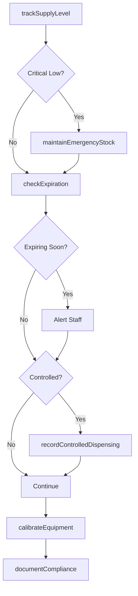
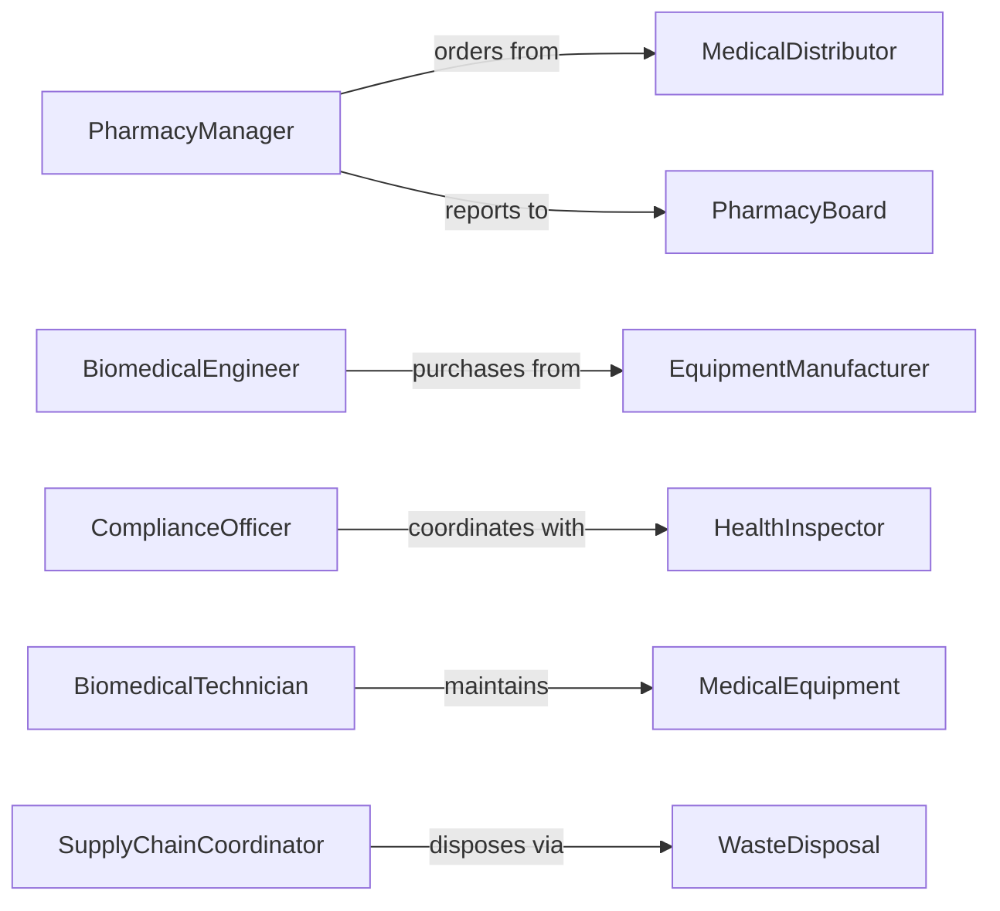

# Maintain Inventory Medical Supplies Equipment

> Business-as-Code definition for managing medical supplies and equipment inventory. Models tracking, expiration monitoring, regulatory compliance, and emergency stock management for healthcare facilities.

## Overview

Medical inventory management ensures critical supplies and equipment are available when needed while maintaining compliance with regulatory standards and minimizing waste from expiration. This definition provides actions for tracking controlled substances, monitoring expiration dates, managing emergency stock levels, and documenting regulatory compliance.

## Actors

| Actor | Description |
|-------|-------------|
| MedicalDistributor | Supplies pharmaceuticals and medical consumables |
| EquipmentManufacturer | Provides diagnostic and treatment devices |
| PharmacyBoard | Regulates handling of controlled substances |
| HealthInspector | Verifies storage and handling compliance |
| BiomedicalTechnician | Maintains and calibrates medical equipment |
| WasteDisposal | Handles expired or contaminated materials |

## Roles

| Role | Description |
|------|-------------|
| PharmacyManager | Oversees drug inventory and controlled substances |
| BiomedicalEngineer | Manages medical equipment lifecycle |
| SupplyChainCoordinator | Ensures adequate stock of all medical supplies |
| ComplianceOfficer | Maintains regulatory documentation |

## Entities

| Entity | Description |
|--------|-------------|
| MedicalSupply | A consumable item used in patient care |
| MedicalEquipment | A diagnostic or treatment device |
| LotNumber | A batch identifier for tracking recalls |
| ExpirationDate | The date when a supply is no longer usable |
| ControlledSubstance | A regulated drug requiring special tracking |
| CalibrationRecord | Documentation of equipment accuracy verification |

## Actions

| Action | Description |
|--------|-------------|
| trackSupplyLevel | Monitor current quantities of medical supplies |
| recordControlledDispensing | Log usage of regulated substances |
| checkExpiration | Identify supplies nearing expiration |
| quarantineRecall | Isolate items subject to manufacturer recall |
| calibrateEquipment | Verify and adjust equipment accuracy |
| maintainEmergencyStock | Ensure critical supplies meet minimum levels |
| documentCompliance | Record regulatory requirements fulfillment |

## Events

| Event | Description |
|-------|-------------|
| supplyReplenished | Medical supplies have been restocked |
| controlledDispensed | Regulated substance has been used |
| expirationWarning | Supplies are nearing expiration date |
| recallIssued | Manufacturer has recalled specific lot numbers |
| equipmentCalibrated | Device accuracy has been verified |
| criticalStockLow | Emergency supplies below minimum level |
| complianceDocumented | Regulatory record has been filed |

## Searches

| Search | Description |
|--------|-------------|
| findExpiringSoon | List supplies expiring within specified days |
| getControlledLog | Retrieve usage history of regulated substances |
| getRecallItems | Find inventory matching recall lot numbers |
| getCalibrationDue | List equipment needing calibration |

## Workflow



## Actor Relationships



## Usage

### Calling Actions

```typescript
import { maintainInventoryMedicalSuppliesEquipment } from '@headlessly/maintain-inventory-medical-supplies-equipment'

const medical = maintainInventoryMedicalSuppliesEquipment()

// Track controlled substance dispensing
await medical.recordControlledDispensing({
  substanceId: 'DRUG-MORPH-10MG',
  quantity: 2,
  patientId: 'PAT-20260205-001',
  prescriberId: 'DR-SMITH',
  dispensedBy: 'NURSE-JONES',
  timestamp: '2026-02-05T14:30:00Z'
})

// Check for expiring supplies
const expiring = await medical.checkExpiration({
  withinDays: 30,
  category: 'sterile-supplies'
})

// Calibrate diagnostic equipment
await medical.calibrateEquipment({
  equipmentId: 'XRAY-ER-01',
  calibrationDate: '2026-02-05',
  technicianId: 'BIOMED-003',
  results: 'within-tolerance'
})
```

### Event-Driven Automation

```typescript
// Auto-order critical supplies
medical.criticalStockLow(async ({ supplyId, currentLevel, minimumLevel }) => {
  await purchaseOrder({
    items: [{ supplyId, quantity: minimumLevel * 2 }],
    priority: 'urgent'
  })
})

// Alert on product recalls
medical.recallIssued(async ({ lotNumbers, reason }) => {
  const affectedItems = await medical.getRecallItems({ lotNumbers })
  await notify({
    to: 'pharmacy-staff',
    message: `URGENT: ${affectedItems.length} items affected by recall - quarantine immediately`
  })
  for (const item of affectedItems) {
    await medical.quarantineRecall({ itemId: item.id })
  }
})
```
