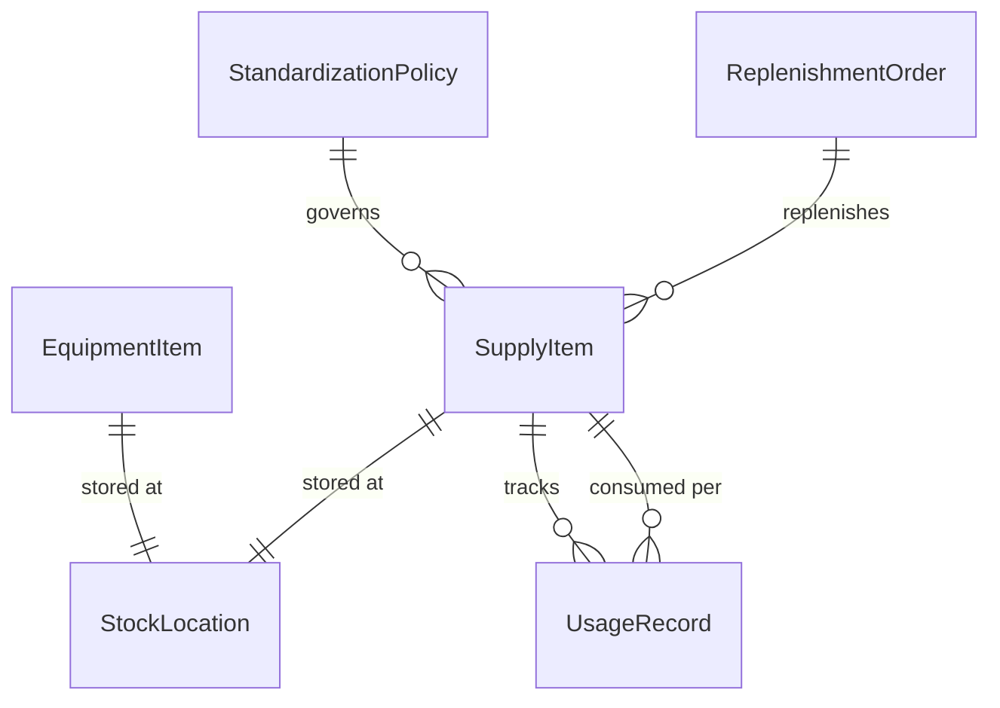
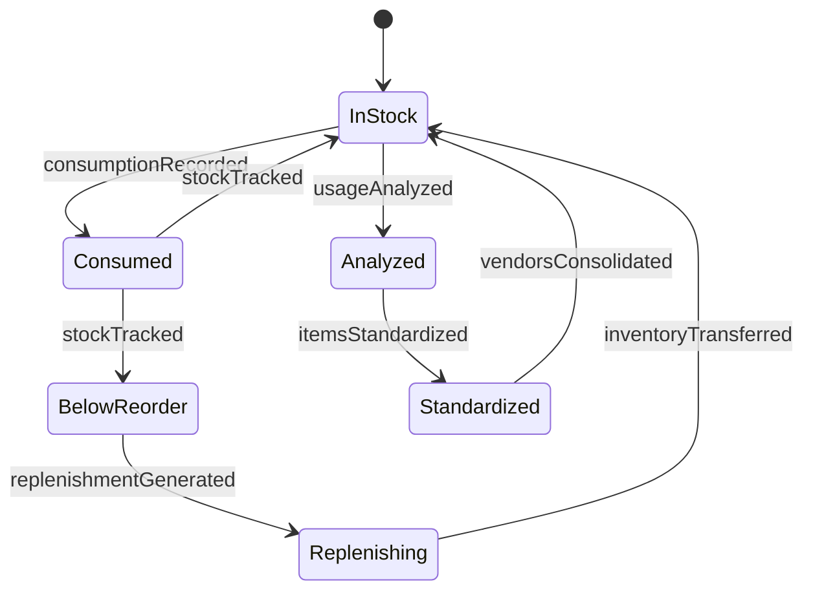
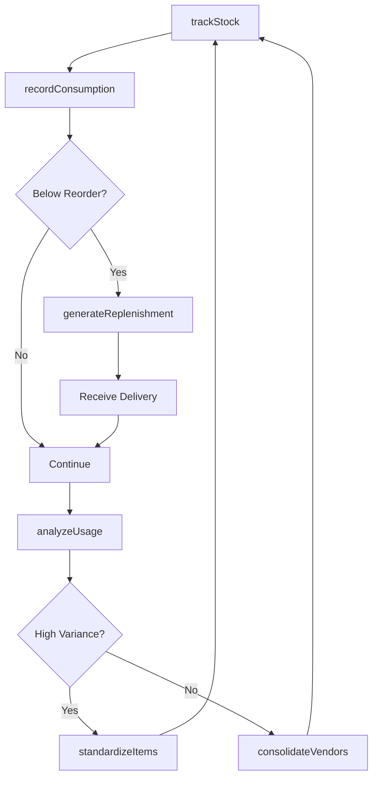
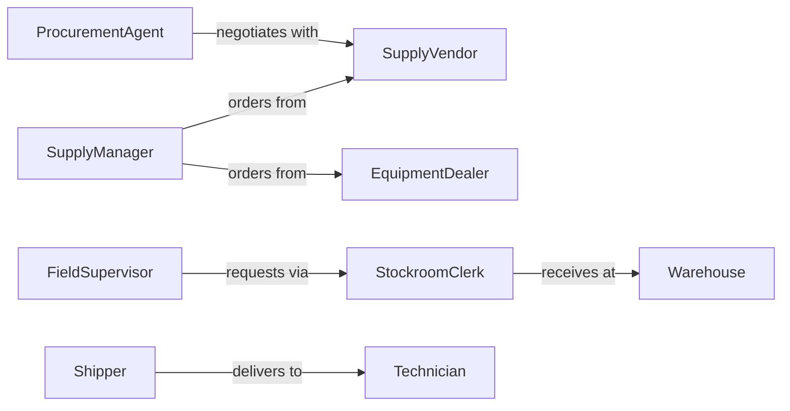

# Maintain Supply Equipment Inventories

> Business-as-Code definition for managing operational supplies and equipment inventory. Models tracking, replenishment, usage monitoring, and standardization for facilities and operations teams.

## Overview

Supply and equipment inventory management ensures operational continuity by maintaining adequate levels of consumable supplies and reusable equipment. This definition provides actions for consumption tracking, automatic replenishment, standardization across locations, and usage analytics.

## Actors

| Actor | Description |
|-------|-------------|
| SupplyVendor | Provides consumable operational materials |
| EquipmentDealer | Supplies tools and reusable equipment |
| Warehouse | Stores and distributes supplies to locations |
| Shipper | Transports supplies between facilities |
| Technician | Uses supplies and equipment for work |
| FinanceTeam | Tracks supply costs and budgets |

## Roles

| Role | Description |
|------|-------------|
| SupplyManager | Oversees inventory levels and procurement |
| StockroomClerk | Manages receiving and distribution |
| FieldSupervisor | Requests supplies for work crews |
| ProcurementAgent | Negotiates vendor contracts and pricing |

## Entities

| Entity | Description |
|--------|-------------|
| SupplyItem | A consumable operational material |
| EquipmentItem | A reusable tool or device |
| StockLocation | A storage facility or vehicle inventory |
| UsageRecord | Documentation of supply consumption |
| ReplenishmentOrder | A purchase order to restore stock |
| StandardizationPolicy | Rules for approved items and vendors |

## Actions

| Action | Description |
|--------|-------------|
| trackStock | Monitor current inventory levels by location |
| recordConsumption | Log usage of supplies and equipment |
| transferInventory | Move items between locations |
| generateReplenishment | Create purchase orders for depleted stock |
| standardizeItems | Define approved supplies for consistent use |
| analyzeUsage | Review consumption patterns and costs |
| consolidateVendors | Reduce number of suppliers for efficiency |

## Events

| Event | Description |
|-------|-------------|
| stockTracked | Inventory levels have been updated |
| consumptionRecorded | Supplies have been used and logged |
| inventoryTransferred | Items have moved between locations |
| replenishmentGenerated | Purchase order has been created |
| itemsStandardized | Approved supply list has been updated |
| usageAnalyzed | Consumption report has been produced |
| vendorsConsolidated | Supplier list has been rationalized |

## Searches

| Search | Description |
|--------|-------------|
| findStockByLocation | List inventory at specified facility |
| getConsumptionHistory | Retrieve usage records for analysis |
| getLowStock | Find items below reorder point |
| getStandardItems | List approved supplies and equipment |

## Entity Relationships



## State Diagram



## Workflow



## Actor Relationships



## Usage

### Calling Actions

```typescript
import { maintainSupplyEquipmentInventories } from '@headlessly/maintain-supply-equipment-inventories'

const supplies = maintainSupplyEquipmentInventories()

// Track current stock levels
const stock = await supplies.trackStock({
  locationId: 'FAC-NORTH',
  category: 'maintenance-supplies'
})

// Record consumption by work crew
await supplies.recordConsumption({
  items: [
    { itemId: 'SUPPLY-GREASE-001', quantity: 2, unit: 'tubes' },
    { itemId: 'SUPPLY-FILTER-AIR', quantity: 10, unit: 'each' }
  ],
  consumedBy: 'CREW-05',
  workOrder: 'WO-20260205-042'
})

// Generate replenishment order
await supplies.generateReplenishment({
  locationId: 'FAC-NORTH',
  items: ['SUPPLY-GREASE-001', 'SUPPLY-FILTER-AIR'],
  deliveryDate: '2026-02-12'
})
```

### Event-Driven Automation

```typescript
// Auto-reorder low stock items
supplies.stockTracked(async ({ locationId, items }) => {
  const lowStock = items.filter(item => item.quantity <= item.reorderPoint)
  if (lowStock.length > 0) {
    await supplies.generateReplenishment({
      locationId,
      items: lowStock.map(item => item.id)
    })
  }
})

// Alert on unusual consumption patterns
supplies.usageAnalyzed(async ({ locationId, anomalies }) => {
  if (anomalies.length > 0) {
    await notify({
      to: 'supply-manager',
      message: `Unusual consumption at ${locationId}: ${anomalies.length} items exceed normal usage`
    })
  }
})
```
