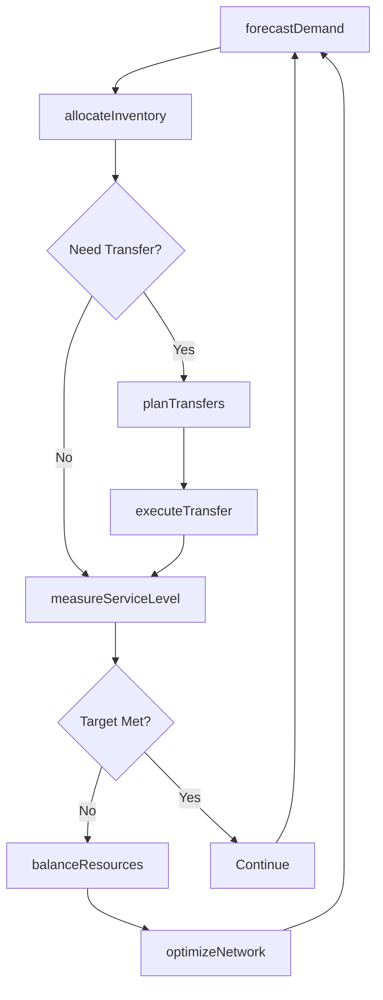
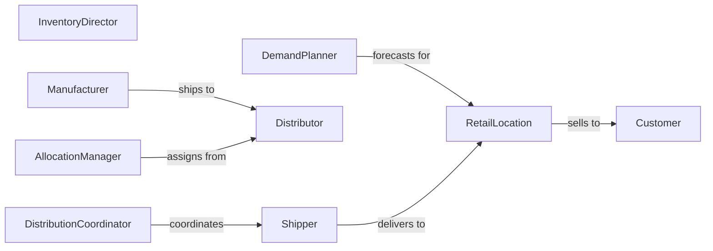

# Manage Inventories Products Organizational Resources

> Business-as-Code definition for managing product inventories and organizational resources. Models demand planning, allocation, distribution, and optimization across multi-location operations.

## Overview

Product and resource inventory management balances supply with demand across the organization, optimizing allocation to maximize service levels while minimizing costs. This definition provides actions for demand forecasting, allocation decisions, distribution planning, and performance analytics.

## Actors

| Actor | Description |
|-------|-------------|
| Manufacturer | Produces finished goods for sale |
| Distributor | Stores and ships products to customers |
| RetailLocation | Sells products directly to end consumers |
| Customer | Purchases products from inventory |
| Shipper | Transports products between locations |
| Forecaster | Provides demand predictions and analytics |

## Roles

| Role | Description |
|------|-------------|
| InventoryDirector | Sets overall inventory strategy and targets |
| DemandPlanner | Forecasts product needs by location and time |
| AllocationManager | Assigns available inventory to locations |
| DistributionCoordinator | Plans shipments between facilities |

## Entities

| Entity | Description |
|--------|-------------|
| Product | A finished good available for sale |
| Location | A facility that holds or consumes inventory |
| DemandForecast | Predicted future product requirements |
| Allocation | Product quantity assigned to a location |
| Transfer | A shipment moving inventory between sites |
| ServiceLevel | Measure of inventory availability performance |

## Actions

| Action | Description |
|--------|-------------|
| forecastDemand | Predict future product requirements |
| allocateInventory | Assign available products to locations |
| planTransfers | Schedule shipments between facilities |
| executeTransfer | Move products from source to destination |
| measureServiceLevel | Calculate inventory availability metrics |
| optimizeNetwork | Adjust stocking levels and flows |
| balanceResources | Redistribute inventory to match demand |

## Events

| Event | Description |
|-------|-------------|
| demandForecasted | Future requirements have been predicted |
| inventoryAllocated | Products have been assigned to locations |
| transferPlanned | Shipment has been scheduled |
| transferCompleted | Products have arrived at destination |
| serviceLevelMeasured | Performance metrics have been calculated |
| networkOptimized | Stocking strategy has been adjusted |
| resourcesBalanced | Inventory has been redistributed |

## Searches

| Search | Description |
|--------|-------------|
| getForecast | Retrieve demand predictions by product and location |
| getAllocations | List current product assignments |
| getTransfers | Find scheduled or in-transit shipments |
| getServiceLevels | Retrieve inventory performance metrics |

## Workflow



## Actor Relationships



## Usage

### Calling Actions

```typescript
import { manageInventoriesProductsOrganizationalResources } from '@headlessly/manage-inventories-products-organizational-resources'

const inventory = manageInventoriesProductsOrganizationalResources()

// Forecast demand for next quarter
const forecast = await inventory.forecastDemand({
  products: ['PROD-001', 'PROD-002'],
  locations: ['STORE-EAST', 'STORE-WEST'],
  period: { start: '2026-03-01', end: '2026-05-31' }
})

// Allocate available inventory
await inventory.allocateInventory({
  productId: 'PROD-001',
  allocations: [
    { locationId: 'STORE-EAST', quantity: 500 },
    { locationId: 'STORE-WEST', quantity: 300 }
  ]
})

// Plan transfer between locations
await inventory.planTransfers({
  productId: 'PROD-002',
  from: 'DC-CENTRAL',
  to: 'STORE-EAST',
  quantity: 200,
  shipDate: '2026-02-08'
})
```

### Event-Driven Automation

```typescript
// Auto-balance inventory when service levels drop
inventory.serviceLevelMeasured(async ({ locationId, productId, serviceLevel }) => {
  if (serviceLevel < 0.95) {
    await inventory.balanceResources({
      productId,
      priorityLocation: locationId
    })
  }
})

// Optimize network after demand forecast updates
inventory.demandForecasted(async ({ period }) => {
  await inventory.optimizeNetwork({
    period,
    objective: 'minimize-cost'
  })
})
```
