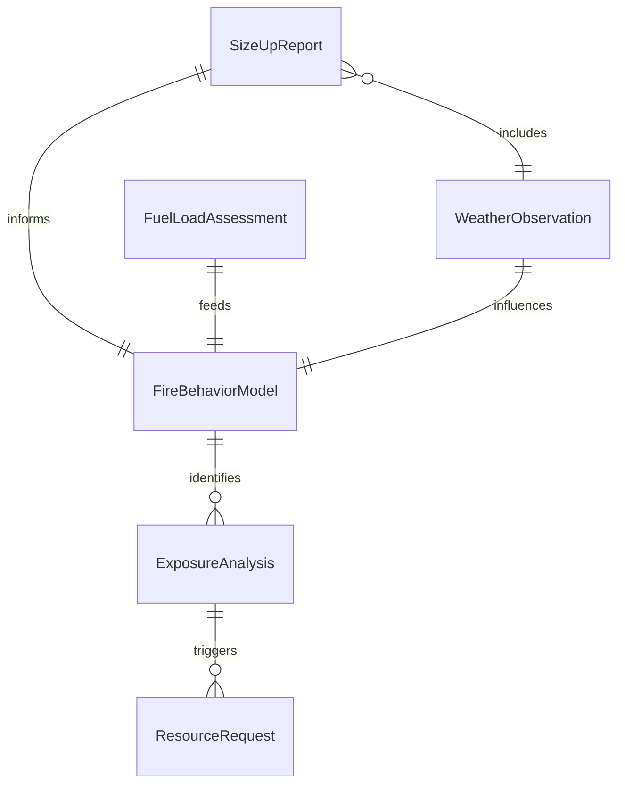
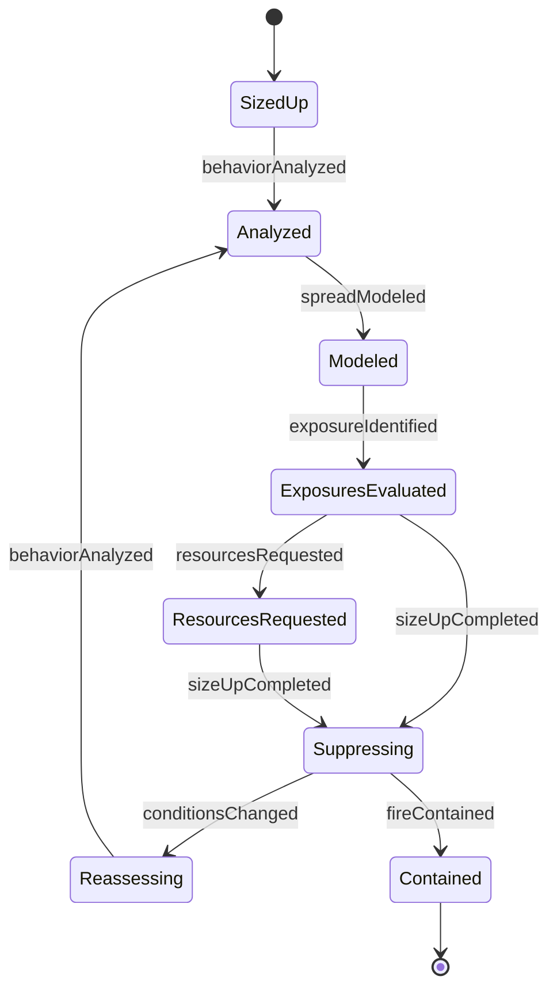
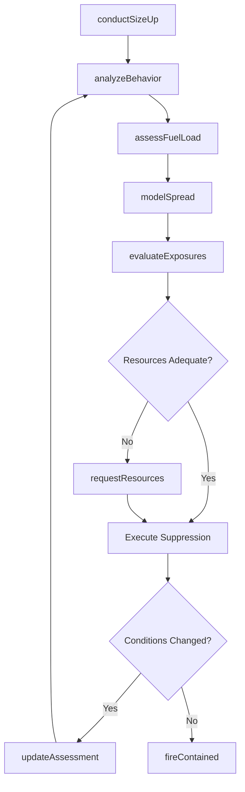
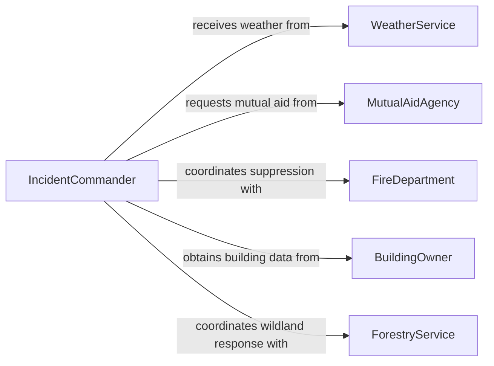

# Assess Characteristics Fires

> Business-as-Code definition for assessing the characteristics of fires. Models the fire evaluation lifecycle from initial size-up through behavior analysis and suppression strategy determination.

## Overview

Fire characteristics assessment involves evaluating the size, intensity, spread rate, fuel type, smoke conditions, and structural involvement of active fires to inform suppression tactics and resource deployment. Assessors analyze wind patterns, terrain, building construction, and available fuel loads to predict fire behavior and identify exposure risks. The assessment drives decisions on attack mode, evacuation zones, resource requests, and incident command structure adjustments throughout the duration of a fire event.

## Actors

| Actor | Description |
|-------|-------------|
| FireDepartment | Municipal or regional agency providing fire suppression and rescue services |
| ForestryService | Federal or state agency managing wildland fire suppression on public lands |
| BuildingOwner | Property owner providing structural plans and hazardous materials information |
| WeatherService | Meteorological agency supplying wind, humidity, and temperature forecasts |
| MutualAidAgency | Neighboring fire department providing additional resources during large incidents |

## Roles

| Role | Description |
|------|-------------|
| IncidentCommander | Directs overall fire suppression strategy based on assessment findings |
| FireInvestigator | Analyzes fire origin, cause, and behavior patterns for post-incident reporting |
| OperationsSectionChief | Manages tactical operations and resource deployment on the fireground |
| SizeUpOfficer | Conducts initial and ongoing assessments of fire conditions and behavior |

## Entities

| Entity | Description |
|--------|-------------|
| SizeUpReport | Initial assessment of fire conditions including size, location, and exposures |
| FireBehaviorModel | Predictive analysis of fire spread, intensity, and direction based on current conditions |
| FuelLoadAssessment | Evaluation of combustible materials present in the fire area |
| WeatherObservation | On-scene or forecast weather data affecting fire behavior |
| ResourceRequest | A formal request for additional personnel, apparatus, or equipment |
| ExposureAnalysis | Assessment of structures, vegetation, or populations threatened by fire spread |

## Actions

| Action | Description |
|--------|-------------|
| conductSizeUp | Perform initial assessment of fire location, size, conditions, and exposures |
| analyzeBehavior | Evaluate fire spread rate, direction, intensity, and smoke conditions |
| assessFuelLoad | Determine the type, quantity, and arrangement of combustible materials |
| modelSpread | Predict fire progression based on weather, terrain, and fuel factors |
| evaluateExposures | Identify and prioritize structures and areas threatened by fire extension |
| requestResources | Submit formal requests for additional apparatus, personnel, or aircraft |
| updateAssessment | Revise the fire assessment as conditions change during suppression operations |

## Events

| Event | Description |
|-------|-------------|
| sizeUpCompleted | The initial fire assessment has been documented and communicated |
| behaviorAnalyzed | Fire behavior characteristics have been evaluated and classified |
| spreadModeled | A fire progression prediction has been generated |
| exposureIdentified | A structure or area at risk from fire extension has been flagged |
| resourcesRequested | A request for additional suppression resources has been submitted |
| conditionsChanged | Fire behavior has shifted significantly requiring reassessment |
| fireContained | The fire perimeter has been fully established and spread halted |

## Searches

| Search | Description |
|--------|-------------|
| findActiveIncidents | Retrieve currently active fire incidents by region, type, or severity |
| getSizeUpHistory | List size-up reports for a specific incident over time |
| getWeatherConditions | Retrieve current and forecast weather data for a fire location |
| findResourceAvailability | Look up available apparatus and personnel by type and proximity |

## Entity Relationships



## State Diagram



## Workflow



## Actor Relationships



## Usage

### Calling Actions

```typescript
import { assessCharacteristicsFires } from '@headlessly/assess-characteristics-fires'

const fire = assessCharacteristicsFires()

// Conduct initial size-up of a structure fire
const sizeUp = await fire.conductSizeUp({
  incidentId: 'inc-2026-0847',
  location: { address: '1420 Industrial Blvd', lat: 37.7749, lng: -122.4194 },
  type: 'commercial-structure',
  conditions: {
    size: '2000 sq ft involved',
    smoke: 'heavy black pushing from roof',
    flames: 'visible from side charlie',
    exposures: ['adjacent warehouse 30ft north']
  }
})

// Analyze fire behavior based on current observations
await fire.analyzeBehavior({
  incidentId: 'inc-2026-0847',
  spreadRate: 'rapid',
  direction: 'north-northeast',
  intensity: 'high',
  smokeConditions: 'heavy black transitioning to gray',
  windSpeed: 15,
  windDirection: 'SSW'
})

// Request additional resources for a growing incident
await fire.requestResources({
  incidentId: 'inc-2026-0847',
  resources: [
    { type: 'engine', quantity: 2 },
    { type: 'ladder', quantity: 1 },
    { type: 'battalion-chief', quantity: 1 }
  ],
  urgency: 'immediate',
  justification: 'Fire extending to exposure bravo, defensive operations needed'
})
```

### Event-Driven Automation

```typescript
// Auto-escalate when conditions change significantly
fire.conditionsChanged(async ({ incidentId, previousIntensity, currentIntensity }) => {
  if (currentIntensity === 'extreme' && previousIntensity !== 'extreme') {
    await fire.requestResources({
      incidentId,
      resources: [{ type: 'strike-team', quantity: 1 }],
      urgency: 'immediate',
      justification: 'Conditions escalated to extreme intensity'
    })
  }
})

// Notify command when fire is contained
fire.fireContained(async ({ incidentId, containmentTime }) => {
  await notify({
    to: 'dispatch',
    message: `Incident ${incidentId} contained at ${containmentTime}. Begin demobilization planning.`
  })
})
```
