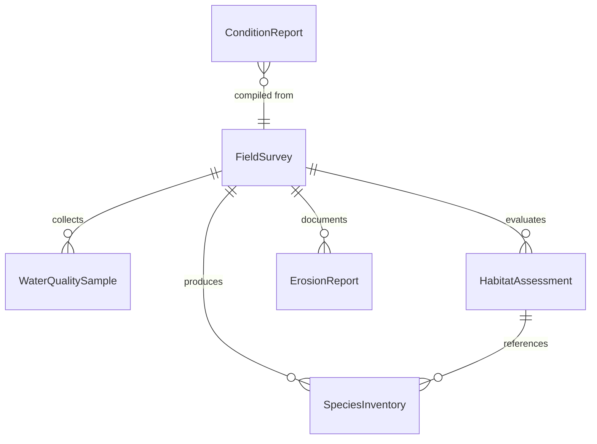
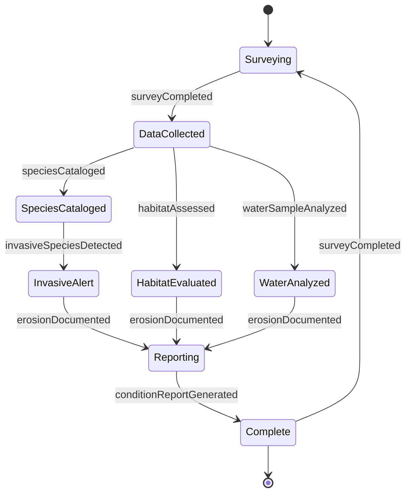
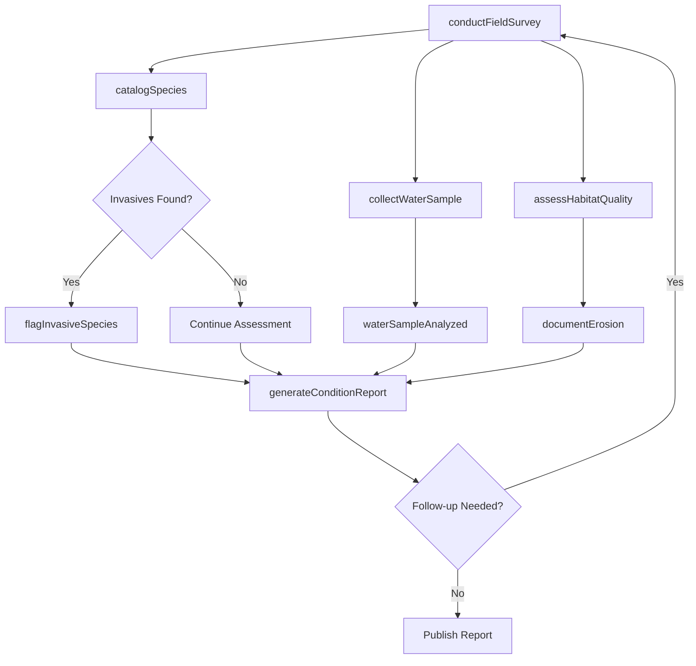
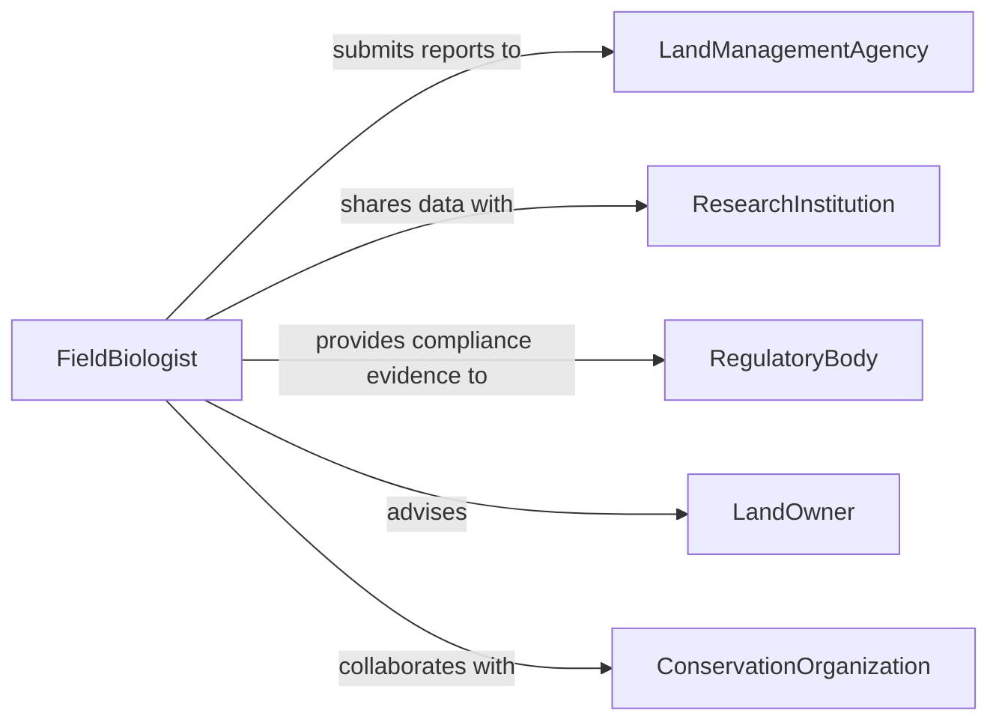

# Inspect Condition Natural Environments

> Business-as-Code definition for inspecting the condition of natural environments. Models the ecological assessment lifecycle from field survey through condition reporting and conservation planning.

## Overview

Natural environment inspection involves evaluating the health, integrity, and ecological condition of forests, wetlands, waterways, grasslands, and other natural areas. Inspectors assess biodiversity indicators, habitat quality, water quality, erosion patterns, and evidence of human impact or invasive species. The findings inform land management decisions, conservation priorities, regulatory compliance, and restoration planning for both public lands and private holdings.

## Actors

| Actor | Description |
|-------|-------------|
| LandManagementAgency | Federal or state agency overseeing public lands and natural resources |
| ConservationOrganization | Nonprofit entity funding and advocating for habitat protection |
| LandOwner | Private party responsible for stewardship of natural areas on their property |
| RegulatoryBody | Environmental protection agency enforcing habitat and water quality standards |
| ResearchInstitution | University or lab conducting ecological studies in the inspected areas |

## Roles

| Role | Description |
|------|-------------|
| FieldBiologist | Conducts on-site ecological surveys and species assessments |
| EnvironmentalInspector | Evaluates compliance with environmental regulations and permit conditions |
| WaterQualityAnalyst | Tests and interprets water chemistry, turbidity, and biological indicators |
| ConservationPlanner | Develops management recommendations based on inspection findings |

## Entities

| Entity | Description |
|--------|-------------|
| FieldSurvey | A structured on-site assessment of ecological conditions at a specific location |
| SpeciesInventory | A catalog of plant and animal species observed during a survey |
| WaterQualitySample | Collected water specimen with lab results for dissolved oxygen, pH, and pollutants |
| HabitatAssessment | An evaluation of habitat structure, connectivity, and suitability for target species |
| ErosionReport | Documentation of soil erosion extent, causes, and severity at a site |
| ConditionReport | A comprehensive summary of environmental health findings and recommendations |

## Actions

| Action | Description |
|--------|-------------|
| conductFieldSurvey | Perform a structured ecological assessment at a designated site |
| catalogSpecies | Record observed plant and animal species with abundance and health notes |
| collectWaterSample | Gather water specimens from streams, ponds, or wetlands for lab analysis |
| assessHabitatQuality | Evaluate structural diversity, connectivity, and condition of habitat areas |
| documentErosion | Record the location, severity, and probable causes of soil erosion |
| generateConditionReport | Compile survey findings into a formal environmental condition report |
| flagInvasiveSpecies | Identify and document the presence of non-native invasive organisms |

## Events

| Event | Description |
|-------|-------------|
| surveyCompleted | A field survey has been finished and raw data recorded |
| speciesCataloged | Species observations have been compiled into the inventory |
| waterSampleAnalyzed | Laboratory results for a water quality sample have been received |
| habitatAssessed | A habitat quality evaluation has been completed for a site |
| erosionDocumented | Erosion conditions have been recorded and severity classified |
| conditionReportGenerated | A formal condition report has been finalized and distributed |
| invasiveSpeciesDetected | A non-native invasive species has been confirmed at a site |

## Searches

| Search | Description |
|--------|-------------|
| findSurveysBySite | Retrieve field survey records for a specific location or region |
| getSpeciesRecords | Look up species observations filtered by site, date, or conservation status |
| getWaterQualityTrends | Retrieve water quality data over time for a specific waterbody |
| findErosionSites | List locations with documented erosion filtered by severity or cause |

## Entity Relationships



## State Diagram



## Workflow



## Actor Relationships



## Usage

### Calling Actions

```typescript
import { inspectConditionNaturalEnvironments } from '@headlessly/inspect-condition-natural-environments'

const environment = inspectConditionNaturalEnvironments()

// Conduct a field survey of a riparian corridor
const survey = await environment.conductFieldSurvey({
  siteId: 'site-elk-creek-north',
  coordinates: { lat: 44.3521, lng: -121.1743 },
  surveyType: 'riparian',
  biologist: 'bio-234'
})

// Catalog species observed during the survey
await environment.catalogSpecies({
  surveyId: survey.id,
  observations: [
    { species: 'Oncorhynchus mykiss', commonName: 'Rainbow Trout', count: 12, health: 'good' },
    { species: 'Alnus rubra', commonName: 'Red Alder', coverage: '40%', health: 'fair' },
    { species: 'Hedera helix', commonName: 'English Ivy', coverage: '15%', invasive: true }
  ]
})

// Flag invasive species found at the site
await environment.flagInvasiveSpecies({
  surveyId: survey.id,
  species: 'Hedera helix',
  coverage: '15%',
  threatLevel: 'moderate',
  recommendedAction: 'manual removal and herbicide treatment'
})
```

### Event-Driven Automation

```typescript
// Alert conservation team when invasive species are detected
environment.invasiveSpeciesDetected(async ({ siteId, species, threatLevel }) => {
  await notify({
    to: 'conservation-team',
    message: `Invasive species ${species} found at ${siteId} - threat level: ${threatLevel}`
  })
})

// Trigger condition report when all survey components are complete
environment.habitatAssessed(async ({ surveyId }) => {
  const survey = await environment.findSurveysBySite({ surveyId })
  if (survey.speciesComplete && survey.waterComplete) {
    await environment.generateConditionReport({ surveyId })
  }
})
```
