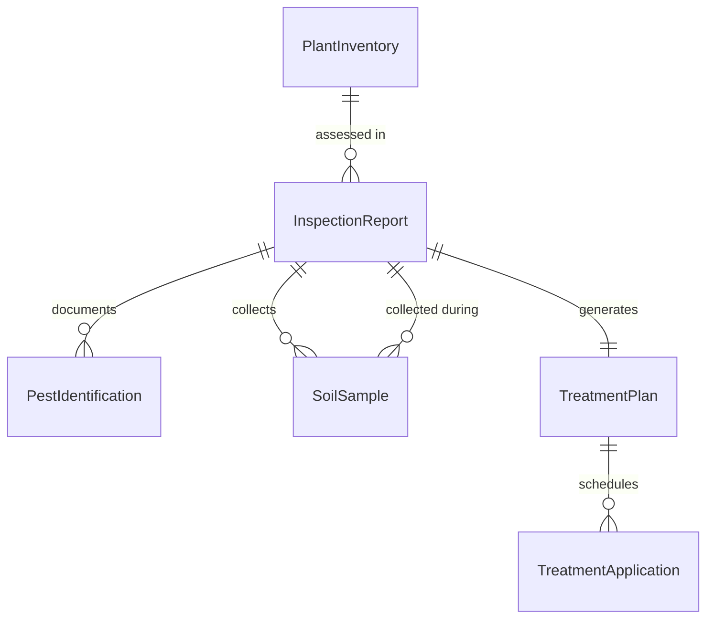
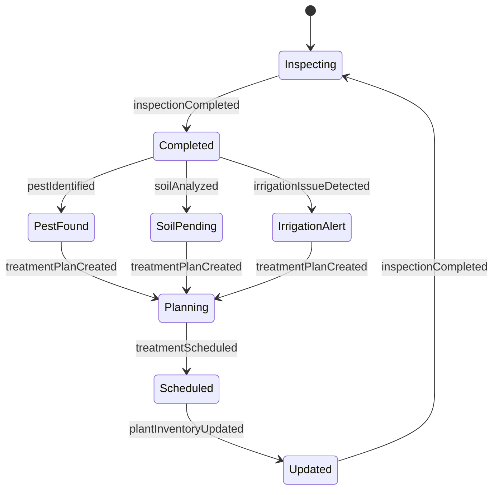
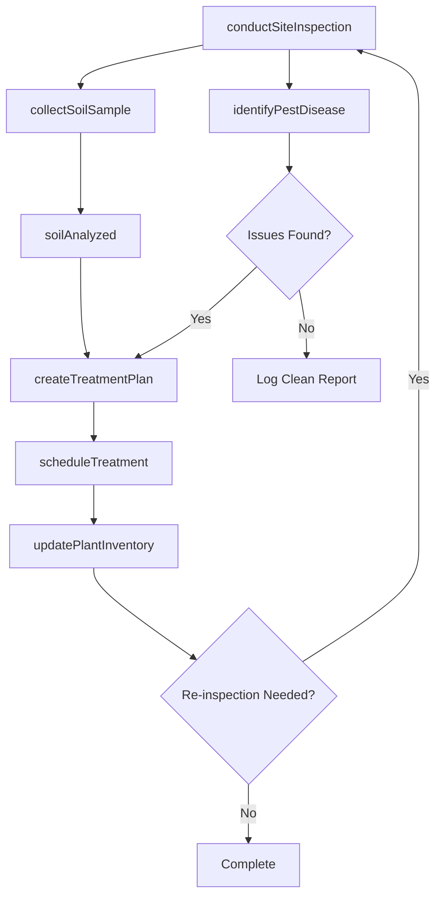
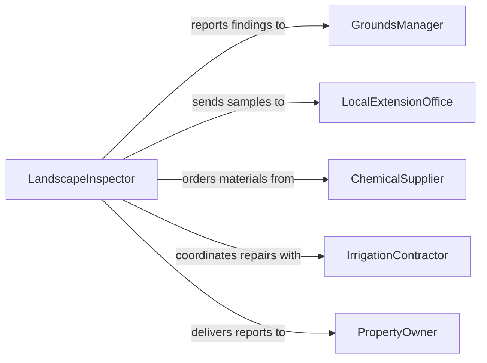

# Inspect Landscaping Determine Treatment Needs

> Business-as-Code definition for inspecting landscaping to determine treatment needs. Models the assessment lifecycle from site survey through treatment recommendation and scheduling.

## Overview

Landscaping inspection involves systematically evaluating turf, trees, shrubs, flower beds, and hardscape elements to identify pest infestations, disease symptoms, nutrient deficiencies, irrigation problems, and structural damage. Inspectors assess plant health, soil conditions, and drainage patterns to determine appropriate treatments such as fertilization, pest control applications, pruning, or replanting. The process produces actionable treatment plans that guide grounds maintenance crews and specialized applicators.

## Actors

| Actor | Description |
|-------|-------------|
| PropertyOwner | Individual or organization responsible for the landscaped property |
| ChemicalSupplier | Vendor providing fertilizers, herbicides, pesticides, and soil amendments |
| IrrigationContractor | Specialist who installs and repairs irrigation systems |
| LocalExtensionOffice | Agricultural advisory service providing plant disease identification support |
| RegulatoryAgency | Government body governing pesticide application and water usage |

## Roles

| Role | Description |
|------|-------------|
| LandscapeInspector | Conducts on-site assessments of plant health and site conditions |
| ArboristTechnician | Evaluates tree health, structural integrity, and pruning requirements |
| PestControlSpecialist | Identifies pest and disease issues and recommends treatment protocols |
| GroundsManager | Oversees the overall landscaping maintenance program and treatment schedules |

## Entities

| Entity | Description |
|--------|-------------|
| InspectionReport | Documented findings from a landscaping assessment including photos and notes |
| TreatmentPlan | A prescribed set of actions to address identified landscaping issues |
| PlantInventory | Catalog of plant species, locations, and health status on a property |
| SoilSample | A collected soil specimen with lab analysis results for pH, nutrients, and contaminants |
| PestIdentification | A confirmed diagnosis of insect, fungal, or bacterial infestation |
| TreatmentApplication | A record of chemical or organic treatment applied to a landscape area |

## Actions

| Action | Description |
|--------|-------------|
| conductSiteInspection | Perform a walk-through assessment of all landscaping zones |
| collectSoilSample | Gather soil specimens for laboratory nutrient and pH analysis |
| identifyPestDisease | Diagnose plant health issues based on visual symptoms and testing |
| createTreatmentPlan | Develop a recommended course of action for identified landscape issues |
| assessIrrigation | Evaluate sprinkler coverage, water pressure, and drainage adequacy |
| scheduleTreatment | Assign treatment applications to specific dates and crews |
| updatePlantInventory | Record changes to plant stock including removals, additions, and health updates |

## Events

| Event | Description |
|-------|-------------|
| inspectionCompleted | A site inspection has been finished and findings documented |
| pestIdentified | A pest or disease has been confirmed on the property |
| soilAnalyzed | Soil sample laboratory results have been received and recorded |
| treatmentPlanCreated | A treatment plan has been developed and is ready for approval |
| treatmentScheduled | A treatment application has been assigned to a date and crew |
| irrigationIssueDetected | A problem with the irrigation system has been identified |
| plantInventoryUpdated | The property plant inventory has been modified with new findings |

## Searches

| Search | Description |
|--------|-------------|
| findInspectionsByProperty | Retrieve inspection reports for a specific property or zone |
| getActiveTreatmentPlans | List current treatment plans filtered by status or urgency |
| getPestHistory | Look up past pest and disease identifications for a property |
| getSoilResults | Retrieve soil analysis results by property, zone, or date range |

## Entity Relationships



## State Diagram



## Workflow



## Actor Relationships



## Usage

### Calling Actions

```typescript
import { inspectLandscapingDetermineTreatmentNeeds } from '@headlessly/inspect-landscaping-determine-treatment-needs'

const landscaping = inspectLandscapingDetermineTreatmentNeeds()

// Conduct a site inspection of a commercial property
const inspection = await landscaping.conductSiteInspection({
  propertyId: 'prop-2240',
  zones: ['front-entrance', 'parking-islands', 'rear-courtyard'],
  inspectorId: 'insp-018'
})

// Identify a pest issue found during inspection
await landscaping.identifyPestDisease({
  inspectionId: inspection.id,
  zone: 'parking-islands',
  symptoms: ['yellowing leaves', 'webbing on undersides'],
  suspectedPest: 'spider mites',
  severity: 'moderate'
})

// Create a treatment plan based on findings
await landscaping.createTreatmentPlan({
  inspectionId: inspection.id,
  treatments: [
    { zone: 'parking-islands', action: 'miticide application', product: 'horticultural oil', timing: 'within 7 days' },
    { zone: 'front-entrance', action: 'fertilization', product: '15-5-10 slow release', timing: 'next scheduled visit' }
  ]
})
```

### Event-Driven Automation

```typescript
// Notify grounds manager when pest is identified
landscaping.pestIdentified(async ({ propertyId, zone, pest, severity }) => {
  await notify({
    to: 'grounds-manager',
    message: `${pest} detected in ${zone} at property ${propertyId} - severity: ${severity}`
  })
})

// Auto-schedule urgent treatments
landscaping.treatmentPlanCreated(async ({ planId, treatments }) => {
  const urgent = treatments.filter(t => t.timing === 'within 7 days')
  for (const treatment of urgent) {
    await landscaping.scheduleTreatment({
      planId,
      zone: treatment.zone,
      scheduledDate: nextAvailableDate()
    })
  }
})
```
