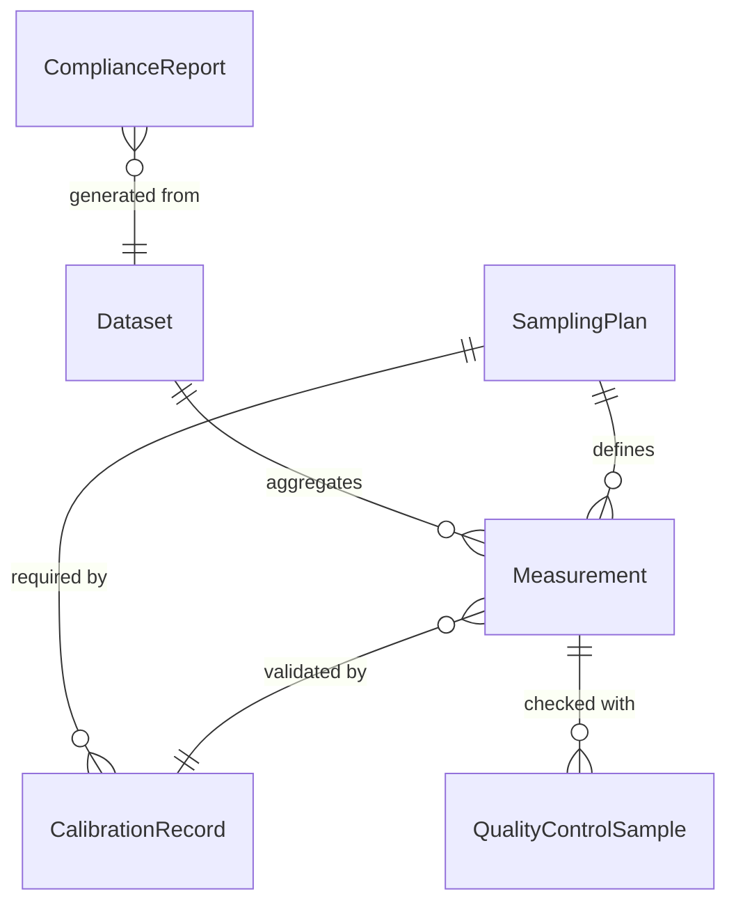
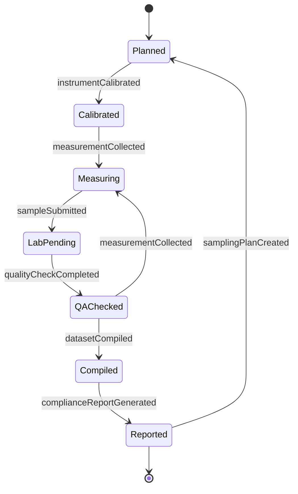
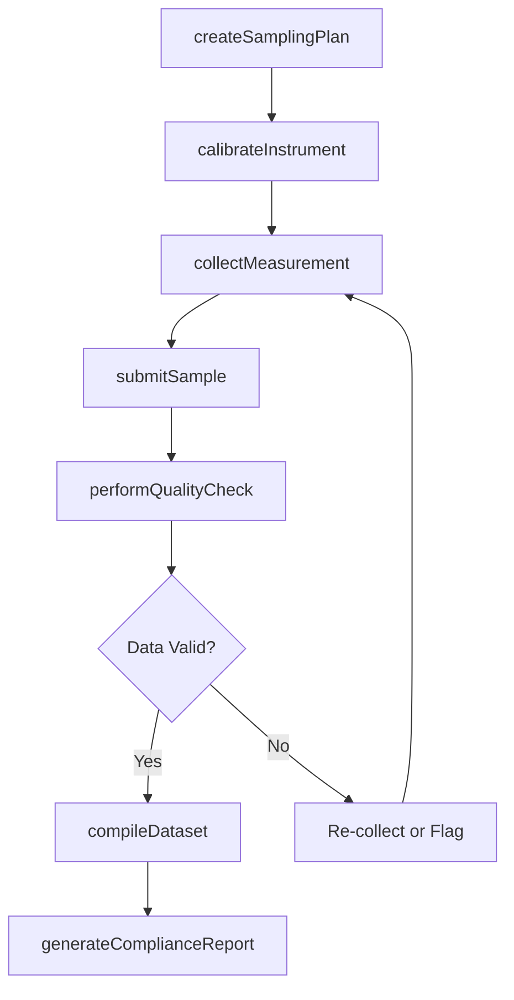
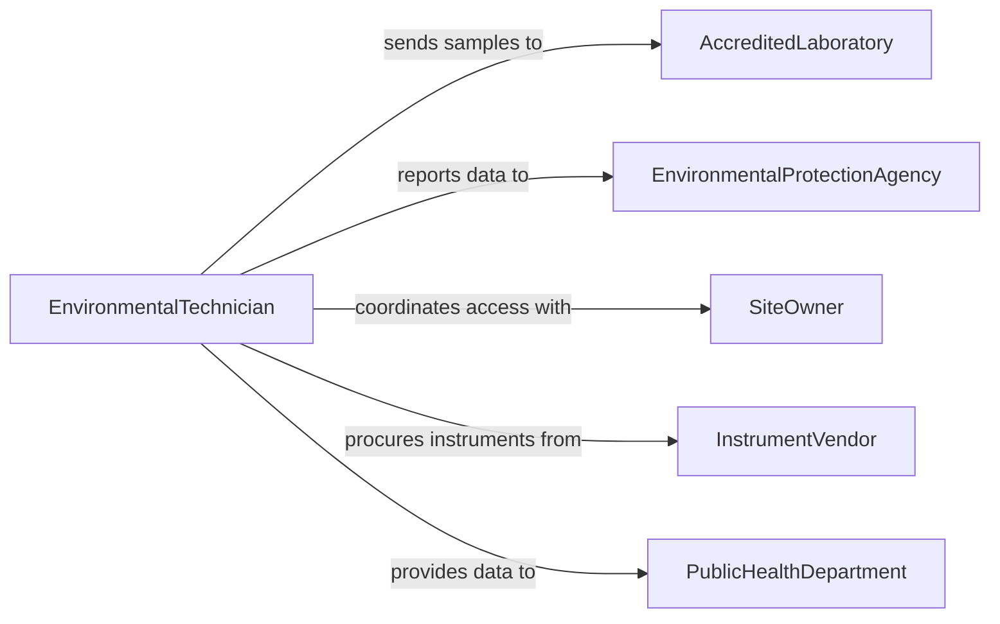

# Measure Environmental Characteristics

> Business-as-Code definition for measuring environmental characteristics. Models the data collection lifecycle from instrument setup through measurement recording, quality assurance, and reporting.

## Overview

Measuring environmental characteristics involves the systematic collection of quantitative data on air quality, water quality, soil composition, noise levels, radiation, temperature, humidity, and other physical or chemical parameters of the natural and built environment. Technicians deploy calibrated instruments, follow standardized sampling protocols, and record measurements with precise metadata. The resulting datasets support regulatory compliance reporting, environmental impact assessments, public health surveillance, and scientific research.

## Actors

| Actor | Description |
|-------|-------------|
| EnvironmentalProtectionAgency | Federal or state body setting measurement standards and receiving compliance data |
| AccreditedLaboratory | Certified lab performing chemical and biological analysis of collected samples |
| SiteOwner | Organization or individual responsible for the location being measured |
| InstrumentVendor | Manufacturer or supplier of calibrated measurement devices and consumables |
| PublicHealthDepartment | Government agency using environmental data to assess community health risks |

## Roles

| Role | Description |
|------|-------------|
| EnvironmentalTechnician | Operates instruments and collects field measurements following standard protocols |
| QualityAssuranceOfficer | Validates data accuracy, reviews calibration records, and enforces measurement standards |
| EnvironmentalScientist | Designs measurement programs and interprets collected data for reports |
| FieldSupervisor | Coordinates measurement crews and ensures proper equipment deployment |

## Entities

| Entity | Description |
|--------|-------------|
| Measurement | A single quantitative observation of an environmental parameter with metadata |
| SamplingPlan | A documented protocol specifying what, where, when, and how to measure |
| CalibrationRecord | Documentation of instrument calibration against reference standards |
| Dataset | A collection of related measurements organized for analysis and reporting |
| QualityControlSample | A blank, duplicate, or standard used to verify measurement accuracy |
| ComplianceReport | A formal submission of measurement data to regulatory authorities |

## Actions

| Action | Description |
|--------|-------------|
| createSamplingPlan | Define measurement locations, parameters, frequencies, and methods |
| calibrateInstrument | Verify and adjust instrument accuracy using certified reference standards |
| collectMeasurement | Capture an environmental parameter reading with location and time metadata |
| submitSample | Send collected specimens to an accredited laboratory for analysis |
| performQualityCheck | Validate measurement data against quality control criteria |
| compileDataset | Aggregate individual measurements into an organized dataset for analysis |
| generateComplianceReport | Produce a regulatory submission from validated measurement datasets |

## Events

| Event | Description |
|-------|-------------|
| samplingPlanCreated | A measurement protocol has been defined and approved |
| instrumentCalibrated | A measurement device has been verified and adjusted for accuracy |
| measurementCollected | An environmental parameter reading has been recorded |
| sampleSubmitted | A specimen has been sent to a laboratory for analysis |
| qualityCheckCompleted | Data validation has been performed and results recorded |
| datasetCompiled | Measurements have been aggregated into a structured dataset |
| complianceReportGenerated | A regulatory data submission has been finalized |

## Searches

| Search | Description |
|--------|-------------|
| findMeasurements | Retrieve measurements by parameter, location, date range, or method |
| getCalibrationHistory | Look up calibration records for a specific instrument over time |
| getDatasetsByProject | List compiled datasets filtered by project, site, or reporting period |
| findExceedances | Identify measurements that exceed regulatory or project-specific limits |

## Entity Relationships



## State Diagram



## Workflow



## Actor Relationships



## Usage

### Calling Actions

```typescript
import { measureEnvironmentalCharacteristics } from '@headlessly/measure-environmental-characteristics'

const envMeasure = measureEnvironmentalCharacteristics()

// Create a sampling plan for quarterly groundwater monitoring
const plan = await envMeasure.createSamplingPlan({
  projectId: 'proj-gw-2026',
  siteId: 'site-landfill-east',
  parameters: ['pH', 'dissolved-oxygen', 'nitrate', 'lead', 'arsenic'],
  locations: ['MW-01', 'MW-02', 'MW-03', 'MW-04'],
  frequency: 'quarterly',
  method: 'EPA-600/R-94/111'
})

// Collect a field measurement
await envMeasure.collectMeasurement({
  planId: plan.id,
  location: 'MW-01',
  parameter: 'pH',
  value: 6.8,
  unit: 'standard units',
  instrument: 'YSI-Pro20',
  timestamp: '2026-03-15T09:15:00Z'
})

// Submit water samples for laboratory analysis
await envMeasure.submitSample({
  planId: plan.id,
  location: 'MW-01',
  laboratory: 'TestAmerica-Sacramento',
  parameters: ['nitrate', 'lead', 'arsenic'],
  chainOfCustody: 'COC-2026-0412'
})
```

### Event-Driven Automation

```typescript
// Alert on regulatory exceedances
envMeasure.measurementCollected(async ({ parameter, value, location, regulatoryLimit }) => {
  if (regulatoryLimit && value > regulatoryLimit) {
    await notify({
      to: 'environmental-scientist',
      message: `${parameter} at ${location} measured ${value}, exceeding limit of ${regulatoryLimit}`
    })
  }
})

// Auto-generate compliance report when dataset is complete
envMeasure.datasetCompiled(async ({ datasetId, projectId, reportingPeriod }) => {
  await envMeasure.generateComplianceReport({
    datasetId,
    projectId,
    period: reportingPeriod,
    submissionDeadline: getQuarterEndDate(reportingPeriod)
  })
})
```
