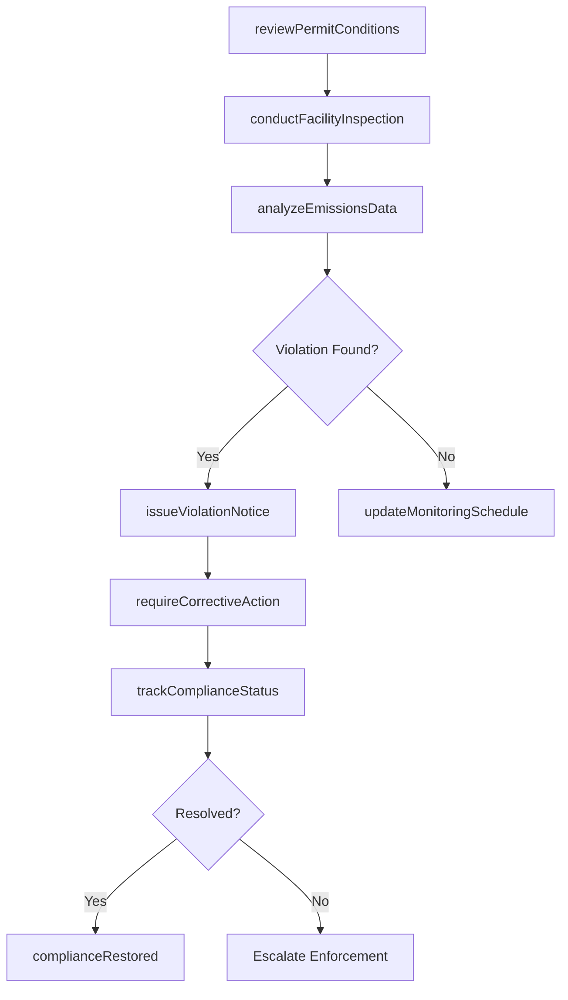
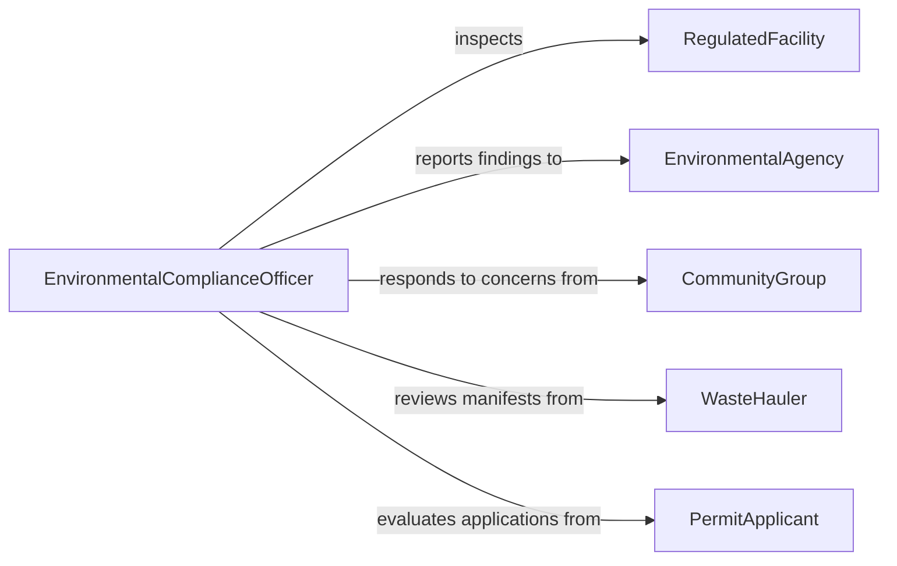

# Monitor Activities Affecting Environmental Quality

> Business-as-Code definition for monitoring activities that affect environmental quality. Models the oversight lifecycle from permit tracking through emissions monitoring, violation detection, and enforcement action.

## Overview

Monitoring activities affecting environmental quality involves tracking industrial operations, construction projects, waste disposal practices, agricultural runoff, and other human activities that can degrade air, water, or soil quality. Monitors review discharge permits, inspect facility operations, analyze emissions data, and evaluate waste handling procedures to ensure compliance with environmental regulations. When violations are identified, the process triggers corrective action requirements, penalty assessments, and follow-up inspections to restore environmental standards.

## Actors

| Actor | Description |
|-------|-------------|
| RegulatedFacility | Industrial or commercial operation subject to environmental permits and monitoring |
| EnvironmentalAgency | Federal, state, or local authority responsible for environmental regulation enforcement |
| CommunityGroup | Local residents or advocacy organizations raising environmental quality concerns |
| WasteHauler | Licensed company transporting hazardous or solid waste from regulated facilities |
| PermitApplicant | Entity seeking authorization for activities with potential environmental impacts |

## Roles

| Role | Description |
|------|-------------|
| EnvironmentalComplianceOfficer | Oversees monitoring programs and ensures regulated activities meet permit conditions |
| FieldInspector | Conducts on-site inspections of facilities and operations for regulatory compliance |
| EmissionsAnalyst | Reviews and interprets air and water discharge monitoring data |
| EnforcementSpecialist | Manages violation cases, corrective action orders, and penalty assessments |

## Entities

| Entity | Description |
|--------|-------------|
| EnvironmentalPermit | A legal authorization specifying allowable discharge limits and operating conditions |
| InspectionRecord | Documentation of an on-site compliance evaluation with findings and observations |
| EmissionsReport | Data on pollutant discharges submitted by a facility for a reporting period |
| ViolationNotice | A formal finding that a regulated entity has exceeded permit conditions |
| CorrectiveActionPlan | A documented set of steps a facility must take to resolve a violation |
| MonitoringSchedule | A calendar of planned inspections, sampling events, and reporting deadlines |

## Actions

| Action | Description |
|--------|-------------|
| reviewPermitConditions | Examine current permit requirements and discharge limits for a facility |
| conductFacilityInspection | Perform an on-site evaluation of operations against permit conditions |
| analyzeEmissionsData | Review pollutant discharge reports for trends and limit exceedances |
| issueViolationNotice | Formally notify a facility of non-compliance with environmental regulations |
| requireCorrectiveAction | Mandate specific remediation steps and deadlines for a violation |
| trackComplianceStatus | Monitor facility progress toward resolving outstanding violations |
| updateMonitoringSchedule | Adjust inspection and sampling frequencies based on compliance history |

## Events

| Event | Description |
|-------|-------------|
| inspectionCompleted | An on-site facility inspection has been finished and documented |
| emissionsDataAnalyzed | Pollutant discharge data has been reviewed and findings recorded |
| violationDetected | A non-compliance condition has been identified at a regulated facility |
| violationNoticeIssued | A formal violation notification has been delivered to a facility |
| correctiveActionRequired | A remediation plan and deadline have been mandated for a facility |
| complianceRestored | A facility has successfully resolved all outstanding violations |
| permitRenewed | An environmental permit has been reviewed, updated, and reissued |

## Searches

| Search | Description |
|--------|-------------|
| findOpenViolations | Retrieve unresolved violations filtered by facility, type, or severity |
| getInspectionHistory | List past inspections for a facility by date range or inspector |
| getEmissionsTrends | Retrieve pollutant discharge data over time for a specific facility or parameter |
| findUpcomingInspections | Look up scheduled inspections by facility, region, or date range |

## Workflow



## Actor Relationships



## Usage

### Calling Actions

```typescript
import { monitorActivitiesAffectingEnvironmentalQuality } from '@headlessly/monitor-activities-affecting-environmental-quality'

const envQuality = monitorActivitiesAffectingEnvironmentalQuality()

// Conduct a facility inspection
const inspection = await envQuality.conductFacilityInspection({
  facilityId: 'fac-refinery-042',
  permitId: 'NPDES-CA-0012345',
  inspectorId: 'insp-307',
  inspectionType: 'routine',
  areas: ['wastewater-outfall', 'stormwater-basins', 'tank-farm']
})

// Analyze quarterly emissions data
const analysis = await envQuality.analyzeEmissionsData({
  facilityId: 'fac-refinery-042',
  reportingPeriod: '2026-Q1',
  parameters: ['BOD', 'TSS', 'oil-and-grease', 'pH'],
  permitLimits: {
    BOD: { daily: 45, monthly: 30, unit: 'mg/L' },
    TSS: { daily: 45, monthly: 30, unit: 'mg/L' }
  }
})

// Issue a violation notice for a permit exceedance
await envQuality.issueViolationNotice({
  facilityId: 'fac-refinery-042',
  permitId: 'NPDES-CA-0012345',
  violation: {
    parameter: 'TSS',
    observedValue: 52,
    permitLimit: 45,
    unit: 'mg/L',
    date: '2026-02-18'
  },
  responseDeadline: '2026-04-01'
})
```

### Event-Driven Automation

```typescript
// Escalate repeat violations
envQuality.violationDetected(async ({ facilityId, parameter, violationCount }) => {
  if (violationCount >= 3) {
    await notify({
      to: 'enforcement-specialist',
      message: `Facility ${facilityId} has ${violationCount} violations for ${parameter}. Escalation recommended.`
    })
  }
})

// Schedule follow-up inspection when corrective action is required
envQuality.correctiveActionRequired(async ({ facilityId, deadline }) => {
  await envQuality.updateMonitoringSchedule({
    facilityId,
    addInspection: {
      type: 'follow-up',
      scheduledDate: deadline,
      purpose: 'Verify corrective action completion'
    }
  })
})
```
