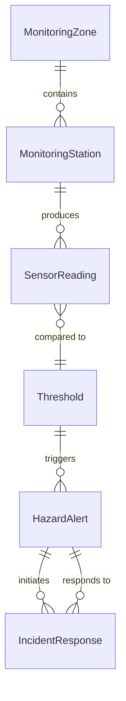
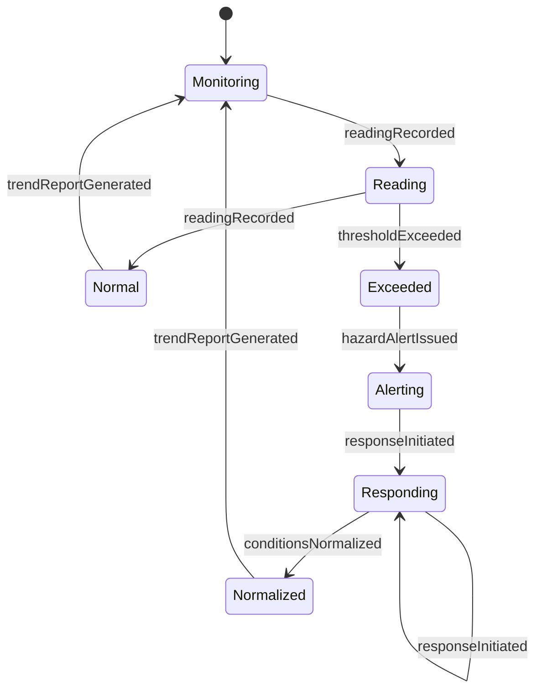
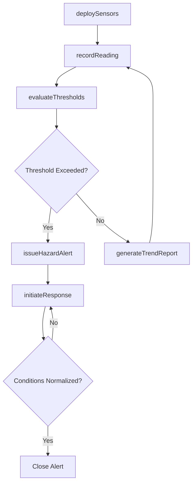
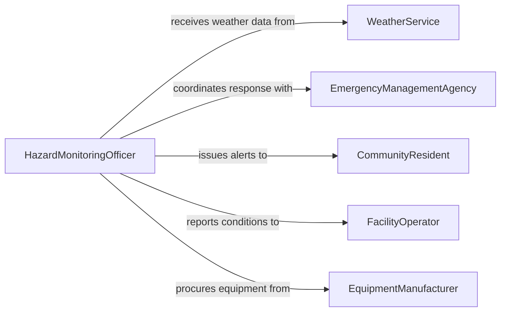

# Monitor Environmental Conditions Detect Hazards

> Business-as-Code definition for monitoring environmental conditions to detect hazards. Models the continuous observation lifecycle from sensor deployment through hazard alerting and response coordination.

## Overview

Environmental hazard monitoring involves the continuous or periodic observation of atmospheric, geological, hydrological, and chemical conditions to detect threats such as toxic gas releases, flooding, landslides, extreme weather, and radiation exposure. Monitoring systems combine sensor networks, weather data feeds, and manual observations to provide early warning of hazardous conditions. When thresholds are exceeded, automated alerts trigger evacuation procedures, containment responses, and regulatory notifications.

## Actors

| Actor | Description |
|-------|-------------|
| EmergencyManagementAgency | Government body coordinating disaster preparedness and emergency response |
| WeatherService | National or regional agency providing meteorological data and severe weather alerts |
| FacilityOperator | Organization operating an industrial site subject to environmental monitoring |
| CommunityResident | Members of the public in proximity to monitored hazard zones |
| EquipmentManufacturer | Vendor supplying and calibrating environmental sensors and monitoring devices |

## Roles

| Role | Description |
|------|-------------|
| HazardMonitoringOfficer | Oversees all environmental monitoring operations and alert protocols |
| SensorTechnician | Installs, calibrates, and maintains environmental monitoring equipment |
| EmergencyCoordinator | Manages response actions when hazardous conditions are confirmed |
| DataAnalyst | Interprets sensor data trends to identify emerging hazard patterns |

## Entities

| Entity | Description |
|--------|-------------|
| MonitoringStation | A fixed or mobile installation housing environmental sensors |
| SensorReading | A timestamped data point from an environmental monitoring device |
| HazardAlert | A notification triggered when monitored conditions exceed safety thresholds |
| Threshold | A defined limit for an environmental parameter that triggers an alert |
| IncidentResponse | A coordinated set of actions taken in response to a confirmed hazard |
| MonitoringZone | A geographic area assigned to specific monitoring stations and protocols |

## Actions

| Action | Description |
|--------|-------------|
| deploySensors | Install and configure environmental monitoring equipment at a station |
| recordReading | Capture and store a sensor measurement with timestamp and location |
| evaluateThresholds | Compare current readings against defined safety limits |
| issueHazardAlert | Generate and distribute an alert when hazardous conditions are detected |
| initiateResponse | Activate emergency response procedures for a confirmed hazard event |
| calibrateSensor | Adjust sensor accuracy using reference standards and field verification |
| generateTrendReport | Produce analysis of environmental data patterns over a specified period |

## Events

| Event | Description |
|-------|-------------|
| readingRecorded | A new sensor measurement has been captured and stored |
| thresholdExceeded | An environmental parameter has surpassed its defined safety limit |
| hazardAlertIssued | A hazard notification has been generated and distributed to stakeholders |
| responseInitiated | Emergency response procedures have been activated for a hazard event |
| sensorCalibrated | A monitoring sensor has been adjusted and verified for accuracy |
| conditionsNormalized | Environmental readings have returned to within safe thresholds |
| trendReportGenerated | An environmental trend analysis has been compiled and distributed |

## Searches

| Search | Description |
|--------|-------------|
| findActiveAlerts | Retrieve currently active hazard alerts by zone, type, or severity |
| getReadingHistory | List sensor readings filtered by station, parameter, or time range |
| getThresholdViolations | Find instances where readings exceeded defined safety limits |
| findMonitoringStations | Look up monitoring stations by zone, sensor type, or operational status |

## Entity Relationships



## State Diagram



## Workflow



## Actor Relationships



## Usage

### Calling Actions

```typescript
import { monitorEnvironmentalConditionsDetectHazards } from '@headlessly/monitor-environmental-conditions-detect-hazards'

const hazards = monitorEnvironmentalConditionsDetectHazards()

// Record a sensor reading from an air quality station
await hazards.recordReading({
  stationId: 'station-aq-north',
  parameter: 'PM2.5',
  value: 38.2,
  unit: 'ug/m3',
  timestamp: '2026-03-15T10:30:00Z'
})

// Evaluate current readings against thresholds
const evaluation = await hazards.evaluateThresholds({
  zone: 'industrial-corridor',
  parameters: ['PM2.5', 'SO2', 'NO2', 'O3']
})

// Issue a hazard alert when air quality deteriorates
await hazards.issueHazardAlert({
  zone: 'industrial-corridor',
  type: 'airQuality',
  parameter: 'PM2.5',
  currentValue: 156.4,
  threshold: 150,
  severity: 'high',
  message: 'PM2.5 exceeds unhealthy threshold for sensitive groups'
})
```

### Event-Driven Automation

```typescript
// Trigger emergency response on critical threshold breach
hazards.thresholdExceeded(async ({ zone, parameter, currentValue, threshold, severity }) => {
  if (severity === 'critical') {
    await hazards.initiateResponse({
      zone,
      type: 'evacuation',
      reason: `${parameter} at ${currentValue} exceeds critical limit of ${threshold}`
    })
  }
})

// Auto-close alerts when conditions normalize
hazards.conditionsNormalized(async ({ alertId, zone }) => {
  await notify({
    to: 'emergency-coordinator',
    message: `Conditions in ${zone} have returned to safe levels. Alert ${alertId} can be closed.`
  })
})
```
