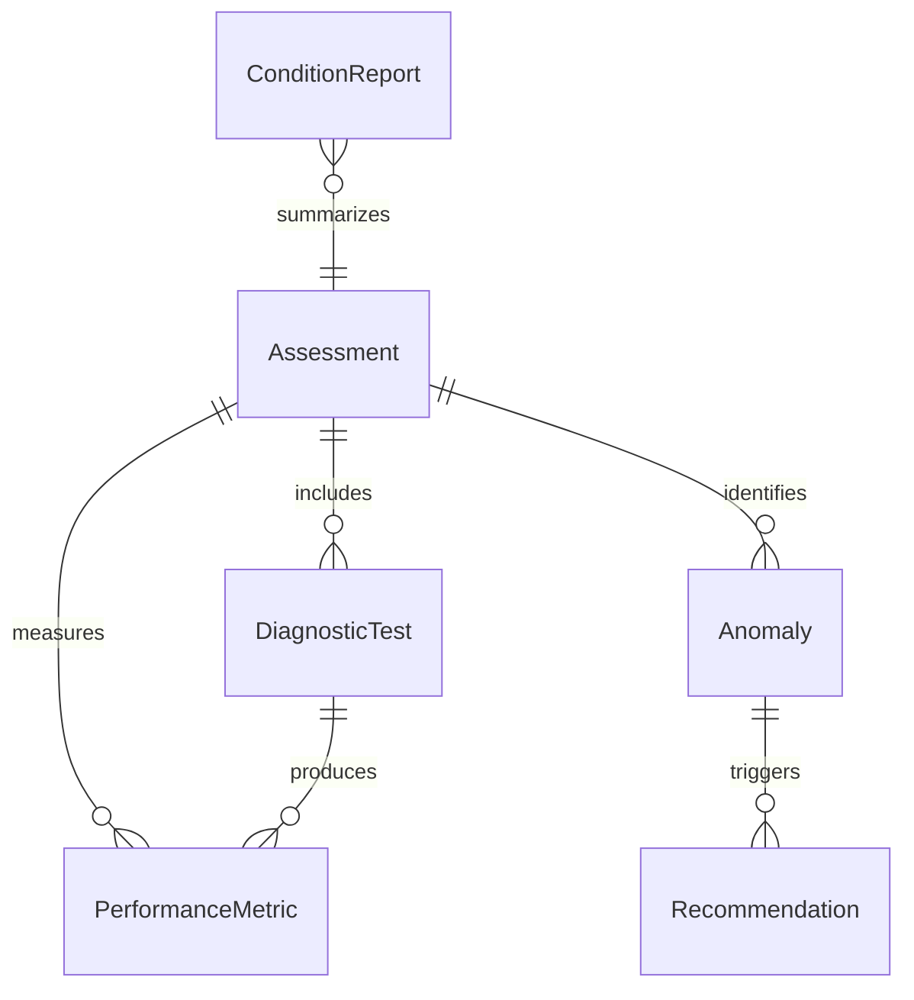
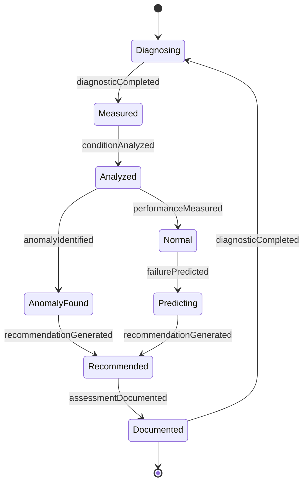
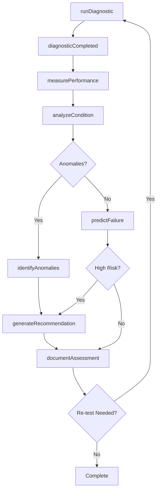
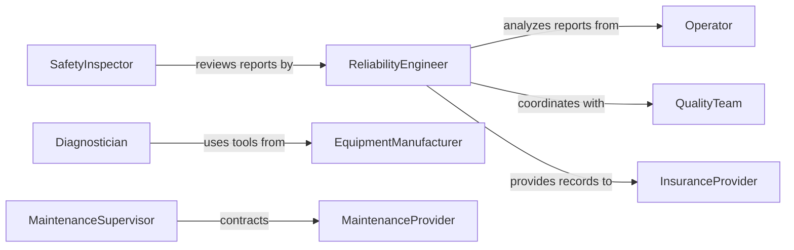

# Assess Equipment Functioning

> Business-as-Code definition for evaluating equipment operational status and performance. Models diagnostic testing, performance analysis, reliability assessment, and predictive maintenance workflows.

## Overview

Equipment functioning assessment involves systematic evaluation of machinery performance, reliability, and operational status to identify issues before they cause failures. This definition provides actions for diagnostic testing, performance benchmarking, condition analysis, and predictive maintenance recommendations.

## Actors

| Actor | Description |
|-------|-------------|
| EquipmentManufacturer | Provides specifications and diagnostic tools |
| MaintenanceProvider | Performs repairs based on assessment findings |
| Operator | Reports operational issues and performance concerns |
| QualityTeam | Monitors equipment impact on product quality |
| SafetyInspector | Verifies equipment meets safety standards |
| InsuranceProvider | Requires assessment records for coverage |

## Roles

| Role | Description |
|------|-------------|
| ReliabilityEngineer | Analyzes equipment performance trends |
| Diagnostician | Performs technical assessments and tests |
| MaintenanceSupervisor | Plans corrective actions based on findings |
| DataAnalyst | Interprets equipment performance data |

## Entities

| Entity | Description |
|--------|-------------|
| Assessment | A comprehensive evaluation of equipment status |
| DiagnosticTest | A specific test measuring equipment parameter |
| PerformanceMetric | A quantifiable measure of equipment operation |
| Anomaly | A deviation from expected performance |
| Recommendation | A suggested action based on assessment |
| ConditionReport | Documentation of current equipment state |

## Actions

| Action | Description |
|--------|-------------|
| runDiagnostic | Execute automated or manual tests |
| measurePerformance | Capture operational metrics |
| analyzeCondition | Evaluate equipment health status |
| identifyAnomalies | Detect deviations from normal operation |
| predictFailure | Forecast potential equipment breakdowns |
| generateRecommendation | Suggest maintenance or operational changes |
| documentAssessment | Create formal record of findings |

## Events

| Event | Description |
|-------|-------------|
| diagnosticCompleted | Testing has finished with results |
| performanceMeasured | Operational metrics have been captured |
| conditionAnalyzed | Equipment health has been evaluated |
| anomalyIdentified | Abnormal behavior has been detected |
| failurePredicted | Breakdown risk has been forecasted |
| recommendationGenerated | Action has been suggested |
| assessmentDocumented | Report has been created |

## Searches

| Search | Description |
|--------|-------------|
| getAssessmentHistory | Retrieve past evaluations for equipment |
| getAnomalies | Find detected performance deviations |
| getRecommendations | List suggested actions for equipment |
| getPerformanceTrends | Analyze metrics over time |

## Entity Relationships



## State Diagram



## Workflow



## Actor Relationships



## Usage

### Calling Actions

```typescript
import { assessEquipmentFunctioning } from '@headlessly/assess-equipment-functioning'

const assessment = assessEquipmentFunctioning()

// Run diagnostic on production equipment
const diagnostic = await assessment.runDiagnostic({
  equipmentId: 'CNC-MILL-03',
  tests: ['vibration', 'temperature', 'alignment', 'motor-current'],
  duration: 300
})

// Measure current performance
const performance = await assessment.measurePerformance({
  equipmentId: 'CNC-MILL-03',
  metrics: ['throughput', 'quality-rate', 'uptime', 'cycle-time']
})

// Analyze overall condition
const condition = await assessment.analyzeCondition({
  equipmentId: 'CNC-MILL-03',
  diagnosticId: diagnostic.id,
  performanceId: performance.id
})
```

### Event-Driven Automation

```typescript
// Auto-escalate critical anomalies
assessment.anomalyIdentified(async ({ equipmentId, anomaly, severity }) => {
  if (severity === 'critical') {
    await notify({
      to: 'maintenance-supervisor',
      message: `CRITICAL: ${anomaly.type} detected on ${equipmentId}`,
      priority: 'urgent'
    })
  }
})

// Schedule maintenance on failure prediction
assessment.failurePredicted(async ({ equipmentId, probability, timeframe }) => {
  if (probability > 0.7) {
    await createWorkOrder({
      equipmentId,
      type: 'preventive',
      deadline: timeframe.end,
      reason: 'predictive-maintenance'
    })
  }
})
```
