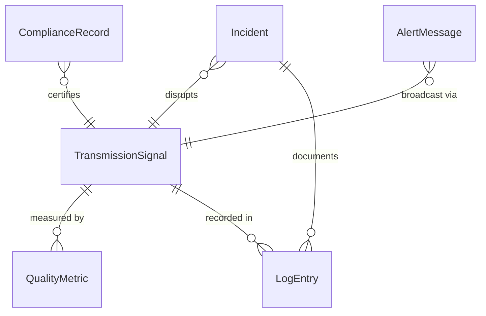
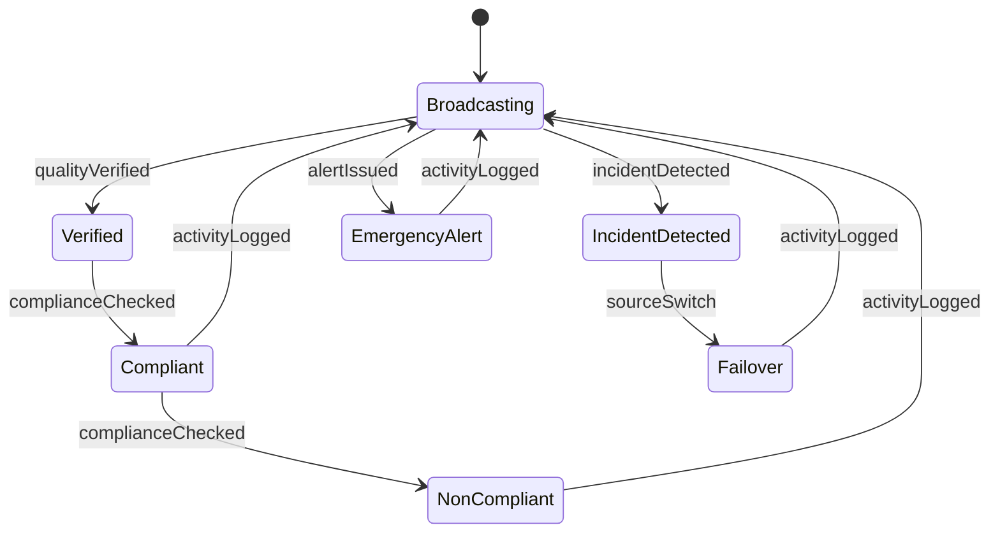
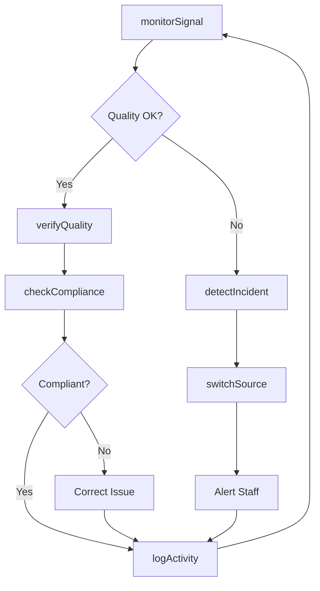
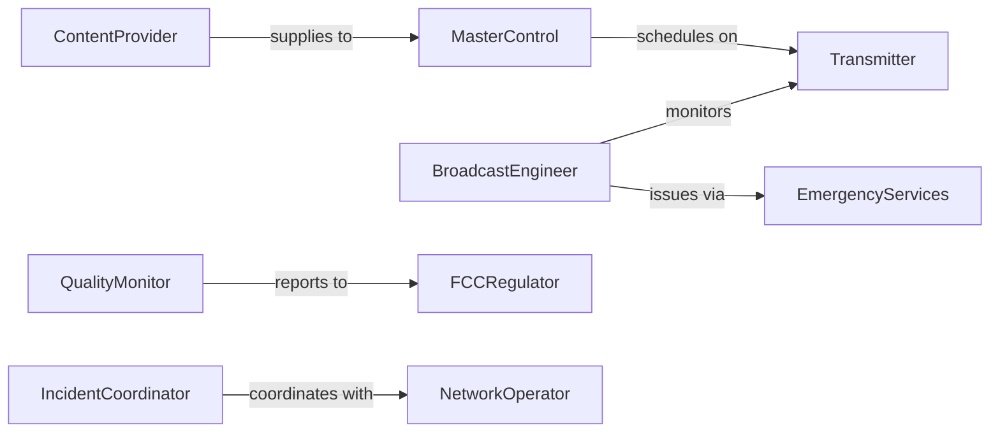

# Monitor Broadcasting Operations Ensure Proper

> Business-as-Code definition for monitoring broadcast transmission systems. Models real-time signal monitoring, quality assurance, regulatory compliance, and incident response for radio, television, and streaming operations.

## Overview

Broadcasting operations monitoring ensures continuous, high-quality transmission while maintaining regulatory compliance and responding immediately to technical issues. This definition provides actions for signal monitoring, quality verification, compliance tracking, and incident management.

## Actors

| Actor | Description |
|-------|-------------|
| Transmitter | Broadcasts signals to audience |
| ContentProvider | Supplies programming for broadcast |
| FCCRegulator | Enforces broadcasting standards and licenses |
| Audience | Receives and reports signal quality issues |
| NetworkOperator | Manages interconnected broadcast facilities |
| EmergencyServices | Coordinates emergency broadcast alerts |

## Roles

| Role | Description |
|------|-------------|
| BroadcastEngineer | Oversees technical transmission operations |
| MasterControl | Manages program scheduling and automation |
| QualityMonitor | Verifies signal integrity and compliance |
| IncidentCoordinator | Responds to broadcast interruptions |

## Entities

| Entity | Description |
|--------|-------------|
| TransmissionSignal | The live broadcast output |
| QualityMetric | A measurable signal or content parameter |
| ComplianceRecord | Documentation of regulatory adherence |
| Incident | A disruption or degradation of service |
| AlertMessage | An emergency broadcast notification |
| LogEntry | A timestamped record of broadcast activity |

## Actions

| Action | Description |
|--------|-------------|
| monitorSignal | Track real-time transmission parameters |
| verifyQuality | Check signal meets technical standards |
| checkCompliance | Ensure adherence to regulatory requirements |
| detectIncident | Identify transmission problems |
| switchSource | Change to backup transmission path |
| issueAlert | Broadcast emergency notification |
| logActivity | Record operational events |

## Events

| Event | Description |
|-------|-------------|
| signalMonitored | Transmission parameters have been checked |
| qualityVerified | Signal meets technical standards |
| complianceChecked | Regulatory requirements have been confirmed |
| incidentDetected | Transmission problem has been identified |
| sourceSwitch | Backup transmission path has been activated |
| alertIssued | Emergency notification has been broadcast |
| activityLogged | Operational event has been recorded |

## Searches

| Search | Description |
|--------|-------------|
| getSignalHistory | Retrieve past transmission parameters |
| getIncidents | List broadcast disruptions by date or type |
| getComplianceRecords | Find regulatory documentation |
| getQualityMetrics | Analyze signal quality over time |

## Entity Relationships



## State Diagram



## Workflow



## Actor Relationships



## Usage

### Calling Actions

```typescript
import { monitorBroadcastingOperationsEnsureProper } from '@headlessly/monitor-broadcasting-operations-ensure-proper'

const broadcast = monitorBroadcastingOperationsEnsureProper()

// Monitor transmission signal
const signal = await broadcast.monitorSignal({
  transmitterId: 'TX-FM-101.5',
  parameters: ['power', 'frequency', 'modulation', 'audio-level']
})

// Verify signal quality
const quality = await broadcast.verifyQuality({
  transmitterId: 'TX-FM-101.5',
  standards: ['ITU-R-BS.412', 'FCC-73.1570']
})

// Issue emergency alert
await broadcast.issueAlert({
  type: 'severe-weather',
  message: 'Tornado warning in effect until 6:00 PM',
  duration: 120,
  priority: 'immediate'
})
```

### Event-Driven Automation

```typescript
// Auto-switch to backup on signal loss
broadcast.incidentDetected(async ({ transmitterId, incidentType }) => {
  if (incidentType === 'signal-loss') {
    await broadcast.switchSource({
      transmitterId,
      backupSource: 'TX-BACKUP-01'
    })
    await notify({
      to: 'broadcast-engineer',
      message: `Automatic failover activated for ${transmitterId}`
    })
  }
})

// Alert on compliance violations
broadcast.complianceChecked(async ({ transmitterId, violations }) => {
  if (violations.length > 0) {
    await escalate({
      to: 'chief-engineer',
      subject: `Compliance violations: ${transmitterId}`,
      details: violations
    })
  }
})
```
