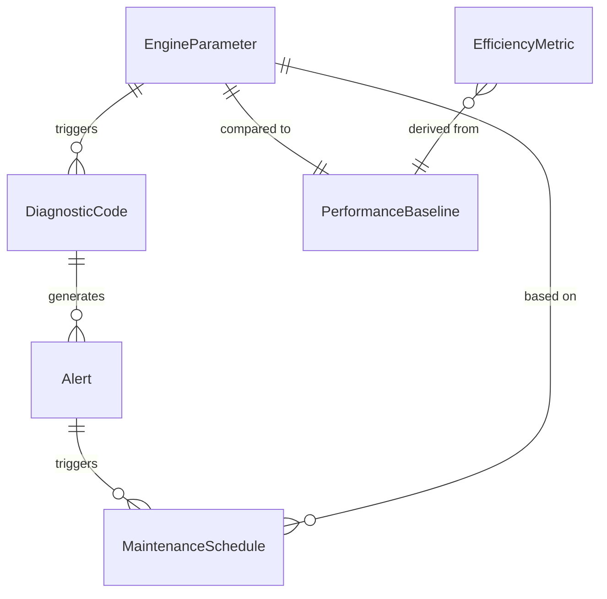
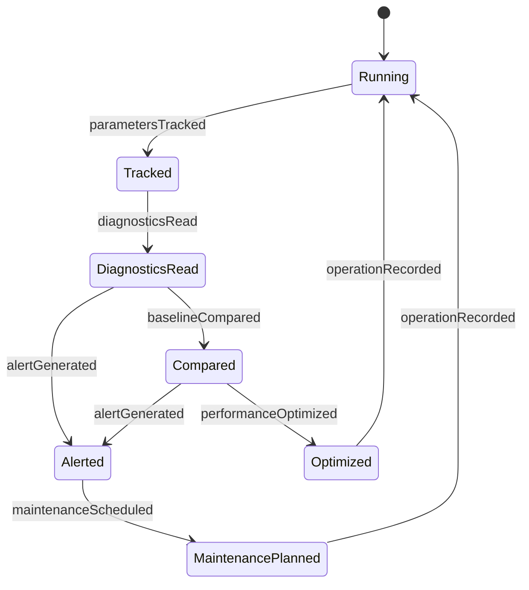
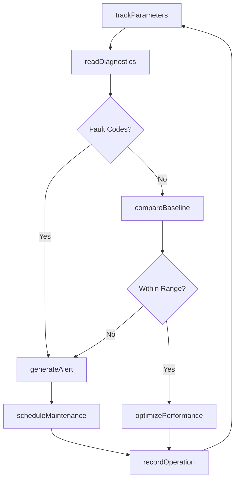
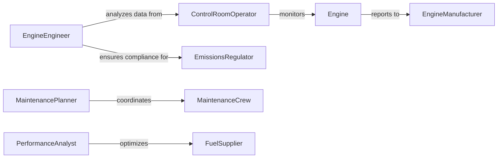

# Monitor Engine Operation Functioning

> Business-as-Code definition for monitoring engine performance and operational status. Models real-time parameter tracking, diagnostic analysis, maintenance alerting, and performance optimization for combustion and electric engines.

## Overview

Engine operation monitoring tracks critical parameters including temperature, pressure, vibration, and efficiency to ensure optimal performance and prevent failures. This definition provides actions for continuous monitoring, diagnostic evaluation, maintenance scheduling, and performance optimization.

## Actors

| Actor | Description |
|-------|-------------|
| EngineManufacturer | Provides specifications and diagnostic protocols |
| FuelSupplier | Supplies diesel, gasoline, or energy for operation |
| MaintenanceCrew | Performs repairs and preventive service |
| Operator | Controls engine operation and reports issues |
| EmissionsRegulator | Monitors compliance with environmental standards |
| InsuranceProvider | Requires operational records for coverage |

## Roles

| Role | Description |
|------|-------------|
| EngineEngineer | Analyzes performance data and diagnoses issues |
| ControlRoomOperator | Monitors real-time engine parameters |
| MaintenancePlanner | Schedules service based on operational data |
| PerformanceAnalyst | Optimizes engine efficiency and reliability |

## Entities

| Entity | Description |
|--------|-------------|
| EngineParameter | A measurable operational characteristic |
| DiagnosticCode | A fault indicator from engine control system |
| PerformanceBaseline | Expected values for normal operation |
| Alert | A notification of abnormal parameter reading |
| MaintenanceSchedule | Planned service based on operating hours |
| EfficiencyMetric | A measure of engine performance optimization |

## Actions

| Action | Description |
|--------|-------------|
| trackParameters | Monitor temperature, pressure, vibration, RPM |
| readDiagnostics | Retrieve fault codes from engine controller |
| compareBaseline | Evaluate current vs expected performance |
| generateAlert | Notify operators of abnormal conditions |
| scheduleMaintenance | Plan service based on operating hours |
| optimizePerformance | Adjust settings for efficiency |
| recordOperation | Log engine runtime and conditions |

## Events

| Event | Description |
|-------|-------------|
| parametersTracked | Operational readings have been captured |
| diagnosticsRead | Fault codes have been retrieved |
| baselineCompared | Performance has been evaluated |
| alertGenerated | Abnormal condition has been detected |
| maintenanceScheduled | Service has been planned |
| performanceOptimized | Settings have been adjusted |
| operationRecorded | Runtime has been logged |

## Searches

| Search | Description |
|--------|-------------|
| getParameterHistory | Retrieve past operational readings |
| getDiagnosticCodes | List active and historic fault codes |
| getAlerts | Find notifications by severity or type |
| getEfficiencyTrends | Analyze performance over time |

## Entity Relationships



## State Diagram



## Workflow



## Actor Relationships



## Usage

### Calling Actions

```typescript
import { monitorEngineOperationFunctioning } from '@headlessly/monitor-engine-operation-functioning'

const engine = monitorEngineOperationFunctioning()

// Track engine parameters
const parameters = await engine.trackParameters({
  engineId: 'ENG-DIESEL-001',
  sensors: [
    'coolant-temperature',
    'oil-pressure',
    'exhaust-temperature',
    'rpm',
    'vibration'
  ]
})

// Read diagnostic codes
const diagnostics = await engine.readDiagnostics({
  engineId: 'ENG-DIESEL-001'
})

// Compare to baseline performance
const comparison = await engine.compareBaseline({
  engineId: 'ENG-DIESEL-001',
  currentParameters: parameters.id,
  baselineId: 'BASELINE-2026'
})
```

### Event-Driven Automation

```typescript
// Auto-alert on critical parameter exceedance
engine.parametersTracked(async ({ engineId, parameters }) => {
  const critical = parameters.filter(p => p.value > p.criticalThreshold)
  if (critical.length > 0) {
    await engine.generateAlert({
      engineId,
      severity: 'critical',
      parameters: critical
    })
  }
})

// Schedule maintenance on operating hours
engine.operationRecorded(async ({ engineId, totalHours }) => {
  const schedule = await getMaintenanceSchedule(engineId)
  if (totalHours >= schedule.nextServiceHours) {
    await engine.scheduleMaintenance({
      engineId,
      type: 'interval-based',
      dueBy: addDays(new Date(), 7)
    })
  }
})
```
