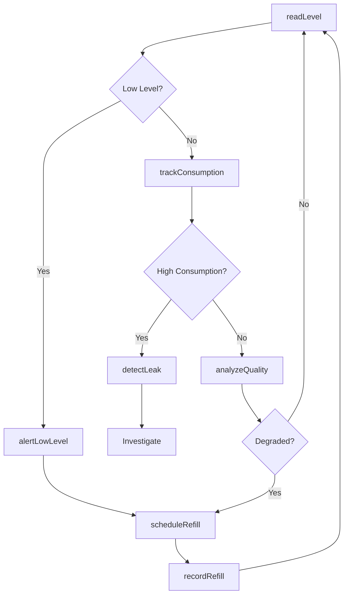
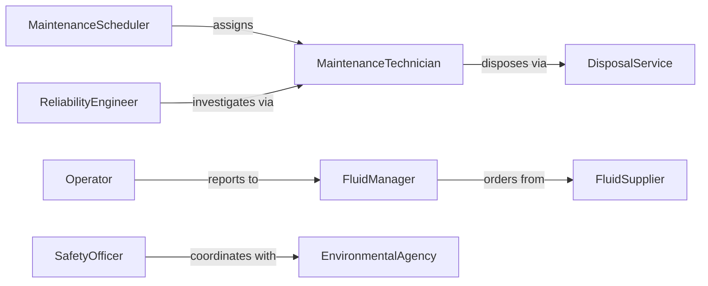

# Monitor Equipment Fluid Levels

> Business-as-Code definition for tracking fluid levels in machinery and equipment. Models level monitoring, consumption analysis, refill scheduling, and leak detection for hydraulic, lubricant, coolant, and fuel systems.

## Overview

Equipment fluid level monitoring ensures adequate lubrication, cooling, and hydraulic function while detecting leaks and excessive consumption that indicate equipment problems. This definition provides actions for level tracking, consumption analysis, automatic refill scheduling, and leak detection.

## Actors

| Actor | Description |
|-------|-------------|
| FluidSupplier | Provides lubricants, coolants, and hydraulic fluids |
| MaintenanceTechnician | Refills fluids and investigates consumption issues |
| Operator | Reports low fluid warnings from equipment |
| EnvironmentalAgency | Monitors spills and leak remediation |
| EquipmentManufacturer | Specifies fluid types and change intervals |
| DisposalService | Handles used fluid removal and recycling |

## Roles

| Role | Description |
|------|-------------|
| FluidManager | Oversees fluid inventory and consumption |
| ReliabilityEngineer | Analyzes consumption patterns for problems |
| MaintenanceScheduler | Plans fluid changes and top-offs |
| SafetyOfficer | Responds to spills and environmental concerns |

## Entities

| Entity | Description |
|--------|-------------|
| FluidReservoir | A container holding fluid in equipment |
| LevelReading | A measurement of current fluid quantity |
| ConsumptionRate | The rate at which fluid is used or lost |
| RefillEvent | A record of fluid addition to reservoir |
| LeakAlert | A notification of abnormal fluid loss |
| ChangeInterval | The schedule for complete fluid replacement |

## Actions

| Action | Description |
|--------|-------------|
| readLevel | Measure current fluid quantity in reservoir |
| trackConsumption | Calculate usage rate over time |
| detectLeak | Identify abnormal fluid loss patterns |
| scheduleRefill | Plan fluid top-off or replacement |
| recordRefill | Log fluid addition to reservoir |
| analyzeQuality | Assess fluid condition for degradation |
| alertLowLevel | Notify operators of inadequate fluid |

## Events

| Event | Description |
|-------|-------------|
| levelRead | Fluid quantity has been measured |
| consumptionTracked | Usage rate has been calculated |
| leakDetected | Abnormal fluid loss has been identified |
| refillScheduled | Fluid addition has been planned |
| refillRecorded | Fluid has been added to reservoir |
| qualityAnalyzed | Fluid condition has been assessed |
| lowLevelAlerted | Inadequate fluid notification sent |

## Searches

| Search | Description |
|--------|-------------|
| getLevelHistory | Retrieve past fluid measurements |
| getConsumptionTrends | Analyze usage patterns over time |
| getLeaks | List detected abnormal losses |
| getRefillSchedule | Find planned fluid additions |

## Workflow



## Actor Relationships



## Usage

### Calling Actions

```typescript
import { monitorEquipmentFluidLevels } from '@headlessly/monitor-equipment-fluid-levels'

const fluids = monitorEquipmentFluidLevels()

// Read current fluid levels
const levels = await fluids.readLevel({
  equipmentId: 'HYD-PRESS-05',
  reservoirs: ['hydraulic-oil', 'coolant', 'lubricant']
})

// Track consumption rate
const consumption = await fluids.trackConsumption({
  equipmentId: 'HYD-PRESS-05',
  reservoirId: 'hydraulic-oil',
  period: { start: '2026-01-01', end: '2026-02-05' }
})

// Detect potential leaks
const leakCheck = await fluids.detectLeak({
  equipmentId: 'HYD-PRESS-05',
  consumptionThreshold: 1.5
})
```

### Event-Driven Automation

```typescript
// Auto-schedule refill on low level
fluids.levelRead(async ({ equipmentId, reservoirId, level, minimumLevel }) => {
  if (level <= minimumLevel) {
    await fluids.scheduleRefill({
      equipmentId,
      reservoirId,
      priority: level < minimumLevel * 0.8 ? 'urgent' : 'normal'
    })
  }
})

// Escalate leak detection
fluids.leakDetected(async ({ equipmentId, reservoirId, lossRate }) => {
  await notify({
    to: 'reliability-engineer',
    message: `Potential leak detected: ${equipmentId} ${reservoirId} losing ${lossRate} per hour`
  })
  await createWorkOrder({
    equipmentId,
    type: 'inspection',
    priority: 'high',
    description: 'Investigate fluid leak'
  })
})
```
