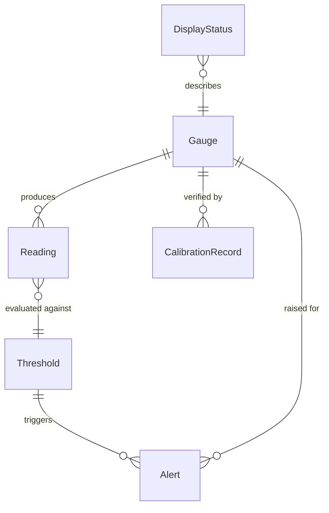
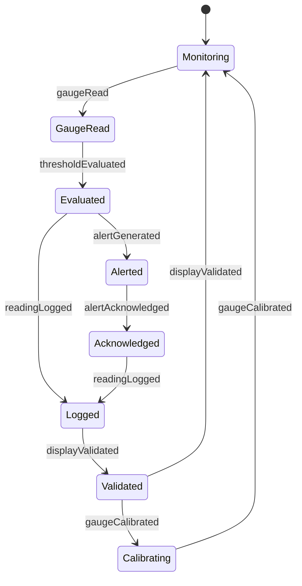
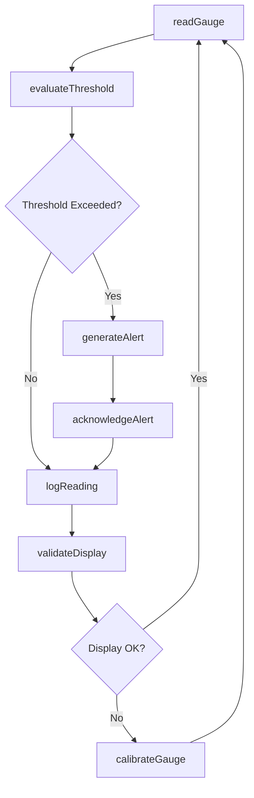
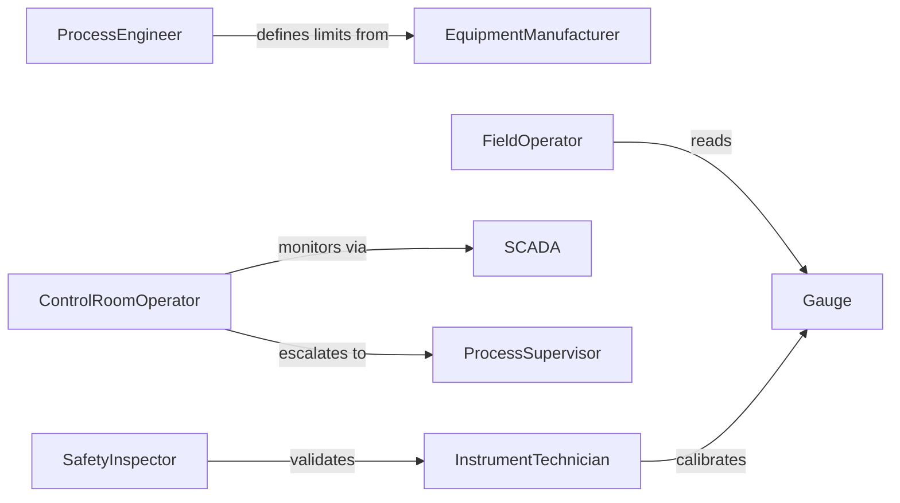

# Monitor Equipment Gauges Displays Ensure

> Business-as-Code definition for monitoring equipment instrumentation and displays. Models real-time gauge reading, threshold alerting, display validation, and operator notification workflows.

## Overview

Equipment gauge and display monitoring ensures operators have accurate, real-time information about equipment status by tracking readings, validating display accuracy, and alerting on threshold exceedances. This definition provides actions for gauge polling, threshold evaluation, display health checks, and automated operator alerts.

## Actors

| Actor | Description |
|-------|-------------|
| EquipmentManufacturer | Provides gauge specifications and calibration standards |
| Operator | Monitors displays and responds to alerts |
| CalibrationTechnician | Verifies gauge accuracy and repairs displays |
| ProcessEngineer | Sets operational thresholds and limits |
| SafetyInspector | Validates critical gauge functionality |
| SCADA | Centralized monitoring system for remote visibility |

## Roles

| Role | Description |
|------|-------------|
| ControlRoomOperator | Watches real-time displays and responds to alerts |
| FieldOperator | Performs local gauge checks and adjustments |
| InstrumentTechnician | Maintains and calibrates gauges and displays |
| ProcessSupervisor | Defines operational limits and procedures |

## Entities

| Entity | Description |
|--------|-------------|
| Gauge | A physical or digital instrument showing a parameter |
| Reading | A timestamped value from a gauge |
| Threshold | An operational limit triggering alerts |
| Alert | A notification of threshold exceedance |
| DisplayStatus | The health condition of a gauge or screen |
| CalibrationRecord | Documentation of gauge accuracy verification |

## Actions

| Action | Description |
|--------|-------------|
| readGauge | Capture current value from instrument |
| evaluateThreshold | Compare reading to operational limits |
| validateDisplay | Check gauge or screen functionality |
| generateAlert | Notify operators of abnormal readings |
| logReading | Record gauge value with timestamp |
| calibrateGauge | Verify and adjust instrument accuracy |
| acknowledgeAlert | Confirm operator awareness of notification |

## Events

| Event | Description |
|-------|-------------|
| gaugeRead | Instrument value has been captured |
| thresholdEvaluated | Reading has been compared to limits |
| displayValidated | Gauge functionality has been checked |
| alertGenerated | Abnormal reading notification has been sent |
| readingLogged | Value has been recorded |
| gaugeCalibrated | Instrument accuracy has been verified |
| alertAcknowledged | Operator has confirmed awareness |

## Searches

| Search | Description |
|--------|-------------|
| getReadingHistory | Retrieve past gauge values |
| getActiveAlerts | List unacknowledged notifications |
| getThresholds | Find operational limits for equipment |
| getCalibrationDue | List gauges needing accuracy checks |

## Entity Relationships



## State Diagram



## Workflow



## Actor Relationships



## Usage

### Calling Actions

```typescript
import { monitorEquipmentGaugesDisplaysEnsure } from '@headlessly/monitor-equipment-gauges-displays-ensure'

const gauges = monitorEquipmentGaugesDisplaysEnsure()

// Read gauge values
const readings = await gauges.readGauge({
  equipmentId: 'BOILER-01',
  gauges: ['pressure', 'temperature', 'level', 'flow']
})

// Evaluate against thresholds
for (const reading of readings) {
  await gauges.evaluateThreshold({
    gaugeId: reading.gaugeId,
    value: reading.value,
    thresholds: await getThresholds(reading.gaugeId)
  })
}

// Validate display functionality
const validation = await gauges.validateDisplay({
  displayId: 'PANEL-CONTROL-01',
  checks: ['power', 'backlight', 'response-time', 'accuracy']
})
```

### Event-Driven Automation

```typescript
// Auto-alert operators on threshold exceedance
gauges.thresholdEvaluated(async ({ gaugeId, value, threshold, exceeded }) => {
  if (exceeded) {
    await gauges.generateAlert({
      gaugeId,
      severity: threshold.severity,
      message: `${gaugeId} reading ${value} exceeds ${threshold.type} limit ${threshold.value}`,
      recipients: ['control-room', 'field-supervisor']
    })
  }
})

// Schedule calibration on validation failure
gauges.displayValidated(async ({ displayId, status, failures }) => {
  if (failures.length > 0) {
    await createWorkOrder({
      type: 'calibration',
      equipmentId: displayId,
      priority: 'high',
      tasks: failures.map(f => `Repair/calibrate ${f}`)
    })
  }
})
```
