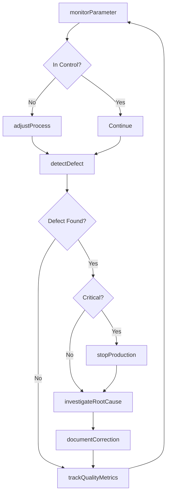
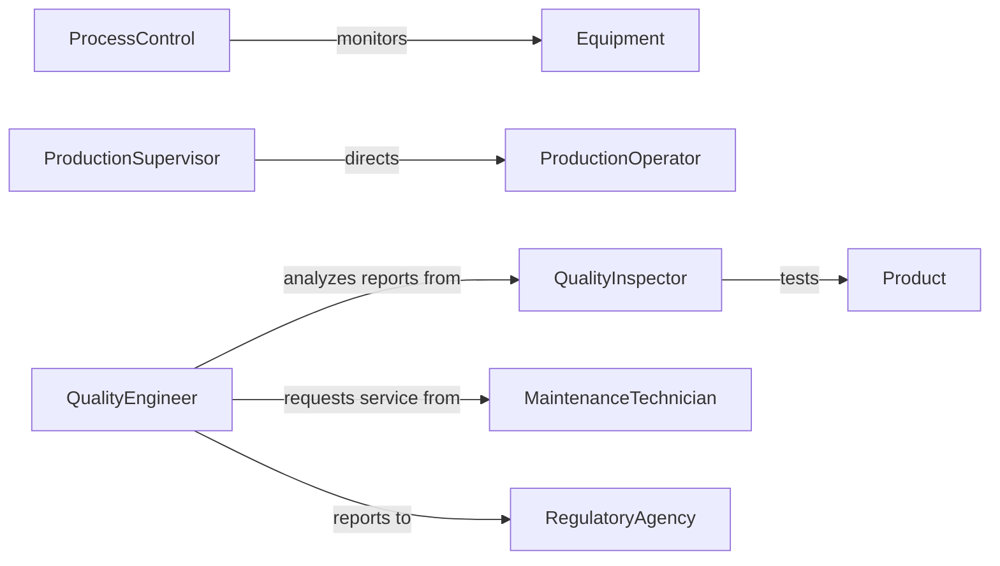

# Monitor Equipment Operation Ensure Products

> Business-as-Code definition for monitoring equipment to prevent product defects. Models real-time quality monitoring, defect detection, process adjustment, and root cause analysis workflows.

## Overview

Equipment monitoring for product quality involves continuous tracking of operational parameters that affect output, detecting defects early, and adjusting processes to prevent flaws. This definition provides actions for quality parameter monitoring, defect detection, process control, and statistical analysis.

## Actors

| Actor | Description |
|-------|-------------|
| EquipmentManufacturer | Provides optimal operating parameters |
| QualityInspector | Verifies product meets specifications |
| ProductionOperator | Adjusts equipment based on quality feedback |
| MaintenanceTechnician | Repairs equipment causing quality issues |
| Customer | Receives products and reports defects |
| RegulatoryAgency | Enforces product quality standards |

## Roles

| Role | Description |
|------|-------------|
| QualityEngineer | Analyzes defect patterns and root causes |
| ProcessControl | Monitors and adjusts operational parameters |
| ProductionSupervisor | Responds to quality alerts and escalations |
| DataAnalyst | Tracks quality metrics and trends |

## Entities

| Entity | Description |
|--------|-------------|
| QualityParameter | A measurable characteristic affecting output |
| DefectRecord | Documentation of a product flaw |
| ProcessAdjustment | A change to equipment settings |
| ControlLimit | Statistical threshold for acceptable variation |
| RootCauseAnalysis | Investigation of defect origin |
| QualityMetric | A measure of product conformance |

## Actions

| Action | Description |
|--------|-------------|
| monitorParameter | Track quality-critical equipment settings |
| detectDefect | Identify product flaws during production |
| adjustProcess | Modify equipment settings to correct quality |
| investigateRootCause | Determine source of defects |
| trackQualityMetrics | Calculate defect rates and trends |
| stopProduction | Halt equipment when quality is unacceptable |
| documentCorrection | Record actions taken to resolve issues |

## Events

| Event | Description |
|-------|-------------|
| parameterMonitored | Quality setting has been checked |
| defectDetected | Product flaw has been identified |
| processAdjusted | Equipment settings have been modified |
| rootCauseInvestigated | Defect source has been analyzed |
| metricsTracked | Quality statistics have been calculated |
| productionStopped | Equipment has been halted for quality |
| correctionDocumented | Resolution has been recorded |

## Searches

| Search | Description |
|--------|-------------|
| getDefectHistory | Retrieve past product flaws by type |
| getParameterTrends | Analyze quality settings over time |
| getQualityMetrics | Find defect rates and conformance statistics |
| getRootCauses | List identified sources of quality issues |

## Workflow



## Actor Relationships



## Usage

### Calling Actions

```typescript
import { monitorEquipmentOperationEnsureProducts } from '@headlessly/monitor-equipment-operation-ensure-products'

const quality = monitorEquipmentOperationEnsureProducts()

// Monitor quality-critical parameters
const parameters = await quality.monitorParameter({
  equipmentId: 'INJECTION-MOLD-03',
  parameters: [
    'temperature',
    'pressure',
    'cycle-time',
    'cooling-rate'
  ]
})

// Detect defects during inspection
const inspection = await quality.detectDefect({
  equipmentId: 'INJECTION-MOLD-03',
  batchId: 'BATCH-20260205-001',
  inspectionType: 'visual',
  sampleSize: 50
})

// Adjust process to correct quality issue
await quality.adjustProcess({
  equipmentId: 'INJECTION-MOLD-03',
  parameter: 'injection-pressure',
  currentValue: 1200,
  targetValue: 1150,
  reason: 'flash-reduction'
})
```

### Event-Driven Automation

```typescript
// Auto-stop on critical defect
quality.defectDetected(async ({ equipmentId, defectType, severity }) => {
  if (severity === 'critical') {
    await quality.stopProduction({
      equipmentId,
      reason: `Critical defect: ${defectType}`
    })
    await notify({
      to: 'production-supervisor',
      message: `Equipment ${equipmentId} stopped due to critical quality issue`,
      priority: 'urgent'
    })
  }
})

// Trigger root cause analysis on pattern detection
quality.metricsTracked(async ({ equipmentId, defectRate, trend }) => {
  if (defectRate > 0.05 && trend === 'increasing') {
    await quality.investigateRootCause({
      equipmentId,
      timeframe: { hours: 24 },
      methods: ['5-why', 'fishbone']
    })
  }
})
```
