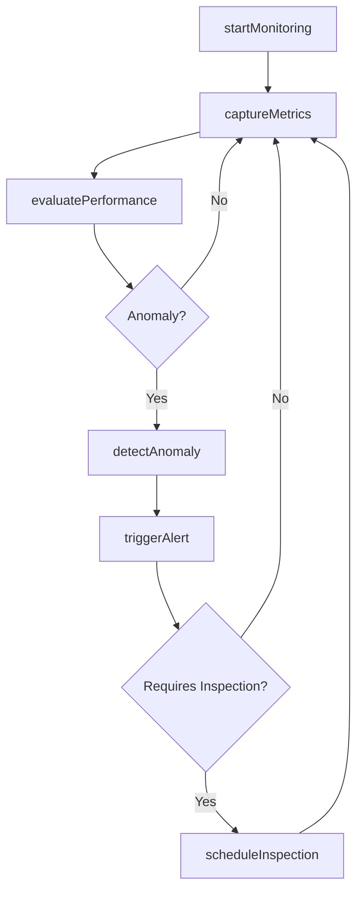
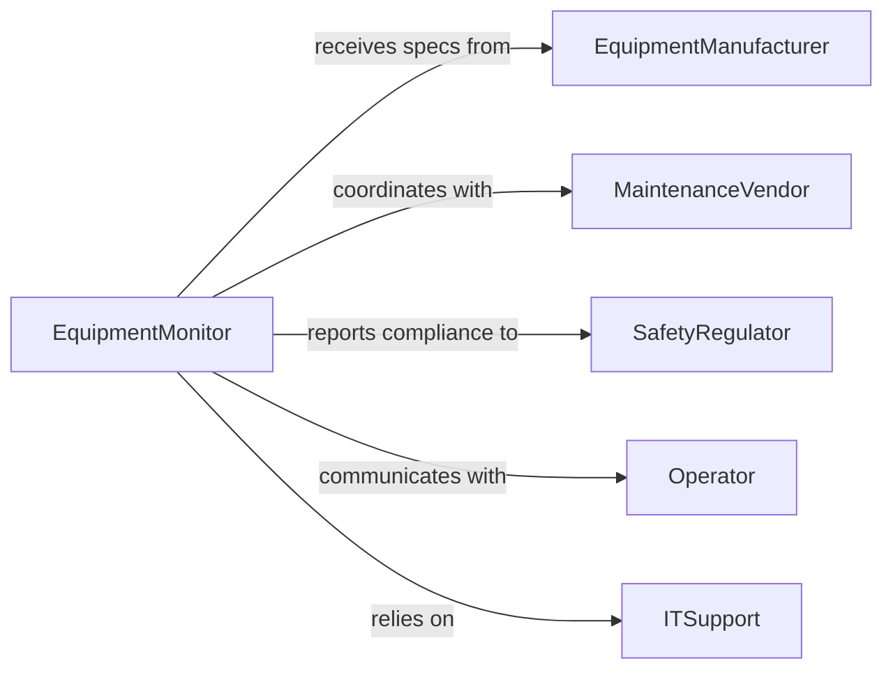

# Monitor Equipment Operation Ensure Proper

> Business-as-Code definition for continuous equipment monitoring to ensure proper operational status, performance, and safety compliance.

## Overview

Equipment operation monitoring involves real-time observation and analysis of machine performance, operational parameters, and safety metrics to ensure proper functioning. This definition provides actions for monitoring workflows, events for automated alerting, and searches for retrieving equipment status and performance data.

## Actors

| Actor | Description |
|-------|-------------|
| EquipmentManufacturer | Provides operational specifications and maintenance guidelines |
| MaintenanceVendor | Services equipment and responds to performance issues |
| SafetyRegulator | Enforces compliance with operational safety standards |
| Operator | Runs equipment and reports operational anomalies |
| ITSupport | Maintains monitoring systems and sensor networks |
| SupplyChainPartner | Coordinates with equipment availability and production schedules |

## Roles

| Role | Description |
|------|-------------|
| EquipmentMonitor | Oversees real-time monitoring dashboards and alerts |
| MaintenanceTechnician | Responds to equipment issues and performs repairs |
| ProductionSupervisor | Manages production flow and equipment utilization |
| SafetyOfficer | Ensures equipment operations meet safety standards |

## Entities

| Entity | Description |
|--------|-------------|
| Equipment | Physical asset being monitored |
| OperatingParameter | Measurable value such as temperature, pressure, or speed |
| Alert | Notification triggered by parameter deviation |
| PerformanceMetric | Calculated measure of equipment efficiency |
| MaintenanceSchedule | Planned downtime and service intervals |
| IncidentReport | Documentation of equipment malfunction or safety event |

## Actions

| Action | Description |
|--------|-------------|
| startMonitoring | Begin real-time tracking of equipment parameters |
| captureMetrics | Record current operating parameters |
| evaluatePerformance | Assess equipment efficiency against targets |
| detectAnomaly | Identify deviations from normal operating conditions |
| triggerAlert | Generate notification for out-of-range parameters |
| scheduleInspection | Plan manual verification of equipment status |
| stopMonitoring | Cease monitoring during maintenance or shutdown |

## Events

| Event | Description |
|-------|-------------|
| monitoringStarted | Equipment monitoring has been activated |
| metricsCaptured | Operating parameters have been recorded |
| performanceEvaluated | Equipment efficiency assessment is complete |
| anomalyDetected | Abnormal operating condition has been identified |
| alertTriggered | Notification sent for parameter deviation |
| inspectionScheduled | Manual verification has been planned |
| monitoringStopped | Monitoring has been deactivated |

## Searches

| Search | Description |
|--------|-------------|
| findEquipment | List equipment by location, type, or status |
| getOperatingParameters | Retrieve current or historical parameter values |
| getAlerts | Find active or historical alerts by severity or equipment |
| getPerformanceMetrics | Retrieve efficiency and uptime metrics |

## Workflow



## Actor Relationships



## Usage

### Calling Actions

```typescript
import { monitorEquipmentOperationEnsureProper } from '@headlessly/monitor-equipment-operation-ensure-proper'

const monitor = monitorEquipmentOperationEnsureProper()

// Start monitoring a production line
await monitor.startMonitoring({
  equipmentId: 'line-3-press',
  parameters: ['temperature', 'pressure', 'cycleTime'],
  interval: 5000 // ms
})

// Capture and evaluate current metrics
const metrics = await monitor.captureMetrics({
  equipmentId: 'line-3-press'
})

const evaluation = await monitor.evaluatePerformance({
  equipmentId: 'line-3-press',
  metrics,
  targets: {
    temperature: { min: 150, max: 200 },
    pressure: { min: 80, max: 120 },
    cycleTime: { max: 45 }
  }
})
```

### Event-Driven Automation

```typescript
// Trigger alerts on anomaly detection
monitor.anomalyDetected(async ({ equipmentId, parameter, value }) => {
  await monitor.triggerAlert({
    equipmentId,
    severity: 'high',
    message: `${parameter} out of range: ${value}`
  })
})

// Auto-schedule inspections for critical alerts
monitor.alertTriggered(async ({ equipmentId, severity }) => {
  if (severity === 'critical') {
    await monitor.scheduleInspection({
      equipmentId,
      priority: 'urgent',
      assignedTo: 'maintenance-team'
    })
  }
})
```
