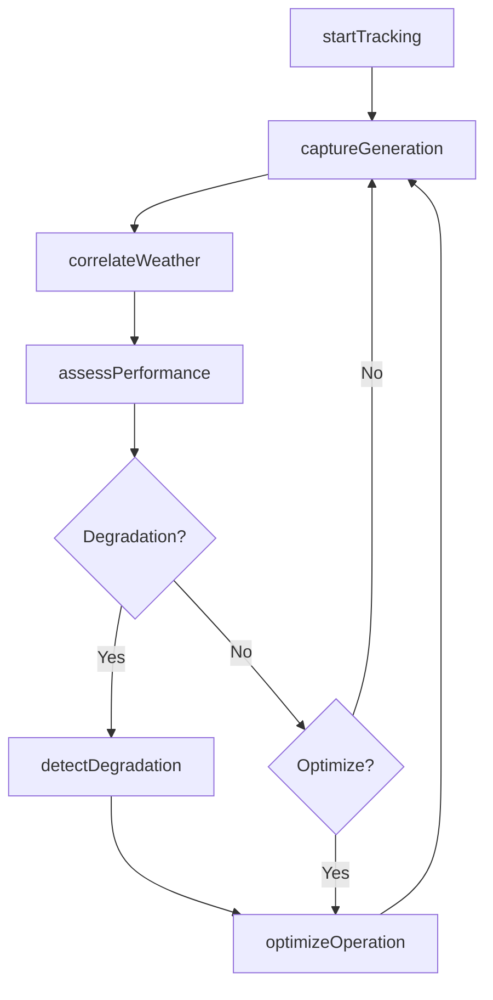
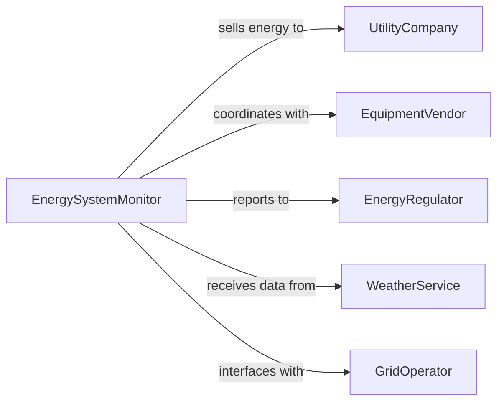

# Monitor Green Energy Equipment Systems

> Business-as-Code definition for continuous monitoring of renewable energy systems including solar, wind, geothermal, and other clean energy infrastructure.

## Overview

Green energy equipment monitoring involves real-time tracking of renewable energy generation, storage, and distribution systems to optimize efficiency, ensure reliability, and maximize energy yield. This definition provides actions for monitoring energy production, events for automated optimization, and searches for performance analytics.

## Actors

| Actor | Description |
|-------|-------------|
| UtilityCompany | Purchases energy or manages grid interconnection |
| EquipmentVendor | Supplies and services renewable energy systems |
| EnergyRegulator | Enforces renewable energy standards and compliance |
| WeatherService | Provides forecast data for production planning |
| GridOperator | Manages energy distribution and demand balancing |
| MaintenanceContractor | Performs preventive and corrective maintenance |

## Roles

| Role | Description |
|------|-------------|
| EnergySystemMonitor | Oversees renewable energy generation and storage |
| PerformanceAnalyst | Analyzes efficiency and identifies optimization opportunities |
| FieldTechnician | Performs on-site inspections and repairs |
| GridCoordinator | Manages interconnection and energy dispatch |

## Entities

| Entity | Description |
|--------|-------------|
| EnergySystem | Renewable energy generation or storage facility |
| GenerationMetric | Measurement of energy output and efficiency |
| StorageStatus | Current state of battery or storage system |
| WeatherCondition | Environmental factors affecting energy production |
| MaintenanceEvent | Scheduled or unplanned service activity |
| PerformanceReport | Analysis of energy yield and system efficiency |

## Actions

| Action | Description |
|--------|-------------|
| startTracking | Begin monitoring energy generation and storage |
| captureGeneration | Record current energy output and efficiency |
| assessPerformance | Evaluate system efficiency against capacity |
| correlateWeather | Match production data with weather conditions |
| detectDegradation | Identify declining performance trends |
| optimizeOperation | Adjust system parameters for maximum yield |
| reportCompliance | Generate regulatory reporting data |

## Events

| Event | Description |
|-------|-------------|
| trackingStarted | Energy system monitoring has been activated |
| generationCaptured | Energy output data has been recorded |
| performanceAssessed | System efficiency evaluation is complete |
| weatherCorrelated | Production matched with weather data |
| degradationDetected | Performance decline has been identified |
| operationOptimized | System parameters have been adjusted |
| complianceReported | Regulatory report has been generated |

## Searches

| Search | Description |
|--------|-------------|
| findSystems | List energy systems by type, location, or status |
| getGenerationData | Retrieve energy output by timeframe or system |
| getEfficiency | Find efficiency metrics and capacity factors |
| getDegradation | Retrieve systems with declining performance |

## Workflow



## Actor Relationships



## Usage

### Calling Actions

```typescript
import { monitorGreenEnergyEquipmentSystems } from '@headlessly/monitor-green-energy-equipment-systems'

const monitor = monitorGreenEnergyEquipmentSystems()

// Start tracking a solar farm
await monitor.startTracking({
  systemId: 'solar-farm-east',
  systemType: 'photovoltaic',
  capacity: 5000, // kW
  captureInterval: 60000 // ms
})

// Capture and assess current generation
const generation = await monitor.captureGeneration({
  systemId: 'solar-farm-east'
})

const weather = await monitor.correlateWeather({
  systemId: 'solar-farm-east',
  generation
})

const assessment = await monitor.assessPerformance({
  systemId: 'solar-farm-east',
  generation,
  weather,
  expectedCapacityFactor: 0.22
})
```

### Event-Driven Automation

```typescript
// Optimize when performance drops
monitor.degradationDetected(async ({ systemId, performanceDrop }) => {
  if (performanceDrop > 5) {
    await monitor.optimizeOperation({
      systemId,
      adjustments: ['tilt', 'tracking', 'cleaning']
    })
  }
})

// Generate compliance reports monthly
monitor.generationCaptured(async ({ systemId, timestamp }) => {
  if (isMonthEnd(timestamp)) {
    await monitor.reportCompliance({
      systemId,
      period: 'monthly',
      reportTo: 'state-energy-office'
    })
  }
})
```
