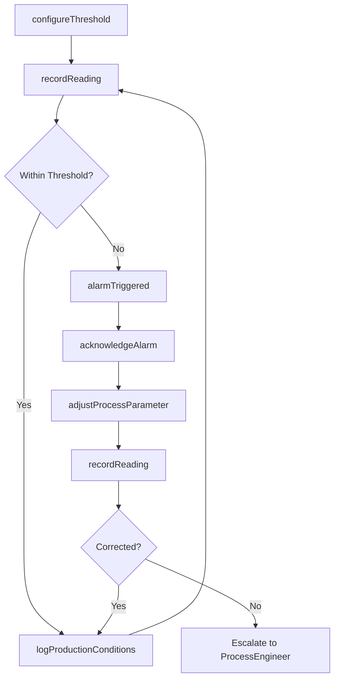
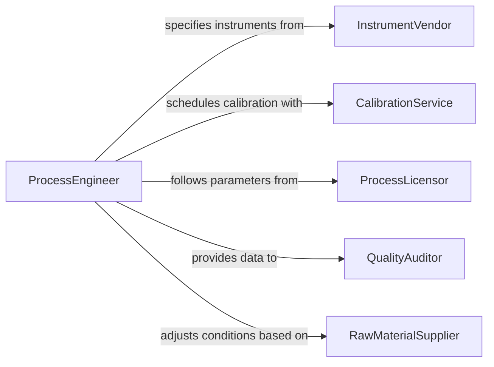

# Monitor Instruments Ensure Proper Production

> Business-as-Code definition for monitoring gauges, sensors, and instruments to ensure proper production conditions are maintained. Covers process parameter tracking, threshold alerting, and instrument calibration management.

## Overview

Monitoring production instruments involves continuously reading and interpreting gauges, sensors, meters, and control panels to verify that process parameters such as temperature, pressure, flow rate, humidity, and chemical composition remain within specified ranges. This definition provides actions for configuring instrument thresholds, recording readings, managing alarms, and ensuring instruments are properly calibrated to maintain accurate production conditions.

## Actors

| Actor | Description |
|-------|-------------|
| InstrumentVendor | Manufacturer of sensors, gauges, and monitoring instruments |
| CalibrationService | Accredited laboratory performing instrument calibration |
| ProcessLicensor | Technology provider specifying required production parameters |
| QualityAuditor | External auditor verifying instrument accuracy and data integrity |
| RawMaterialSupplier | Provider of inputs whose quality affects required process conditions |

## Roles

| Role | Description |
|------|-------------|
| ProcessOperator | Monitors instruments during production shifts and responds to alarms |
| InstrumentTechnician | Installs, calibrates, and maintains monitoring instruments |
| ProcessEngineer | Sets instrument thresholds and optimizes production parameters |
| ShiftLeader | Oversees production operations and authorizes process adjustments |
| QualityControlTechnician | Verifies that instrument readings correlate with product quality |

## Entities

| Entity | Description |
|--------|-------------|
| Instrument | A sensor, gauge, or meter measuring a production parameter |
| Reading | A recorded value from an instrument at a specific time |
| Threshold | A defined acceptable range for a production parameter |
| Alarm | An alert triggered when an instrument reading exceeds a threshold |
| CalibrationRecord | Documentation of an instrument's calibration status and history |
| ProductionRun | A specific batch or continuous production session being monitored |

## Actions

| Action | Description |
|--------|-------------|
| configureThreshold | Set acceptable min/max ranges for an instrument measurement |
| recordReading | Capture an instrument value at a specific time |
| acknowledgeAlarm | Respond to and acknowledge a threshold breach alarm |
| adjustProcessParameter | Modify a production setting to bring conditions back into range |
| initiateCalibration | Schedule or perform calibration for an instrument |
| verifyInstrumentAccuracy | Confirm an instrument is reading within acceptable accuracy |
| logProductionConditions | Record a snapshot of all instrument readings for a production run |

## Events

| Event | Description |
|-------|-------------|
| thresholdConfigured | Acceptable ranges have been set for an instrument |
| readingRecorded | An instrument value has been captured |
| alarmTriggered | A reading has exceeded its configured threshold |
| alarmAcknowledged | An operator has responded to a threshold breach alarm |
| parameterAdjusted | A production setting has been modified to correct conditions |
| calibrationCompleted | An instrument has been calibrated and verified |
| productionConditionsLogged | A snapshot of production conditions has been recorded |

## Searches

| Search | Description |
|--------|-------------|
| findInstruments | List instruments by type, location, or calibration status |
| getReadings | Retrieve readings by instrument, time range, or production run |
| getAlarms | Find alarms by status, severity, or instrument |
| getCalibrationSchedule | Retrieve upcoming calibration due dates for instruments |

## Workflow



## Actor Relationships



## Usage

### Calling Actions

```typescript
import { monitorInstrumentsEnsureProperProduction } from '@headlessly/monitor-instruments-ensure-proper-production'

const instruments = monitorInstrumentsEnsureProperProduction()

// Configure thresholds for a reactor temperature sensor
await instruments.configureThreshold({
  instrumentId: 'TEMP-REACTOR-04',
  parameter: 'temperature',
  min: 165,
  max: 175,
  unit: 'celsius',
  alarmDelay: 5
})

// Record a reading from the instrument
await instruments.recordReading({
  instrumentId: 'TEMP-REACTOR-04',
  value: 172.3,
  unit: 'celsius',
  productionRunId: 'RUN-2026-03-0015'
})

// Initiate calibration for an instrument
await instruments.initiateCalibration({
  instrumentId: 'PRESS-VESSEL-02',
  calibrationService: 'precision-cal-lab',
  dueDate: '2026-04-15'
})
```

### Event-Driven Automation

```typescript
// Auto-adjust process when threshold is breached
instruments.alarmTriggered(async ({ instrumentId, parameter, value, threshold }) => {
  await instruments.acknowledgeAlarm({ instrumentId })
  const adjustment = value > threshold.max ? 'decrease' : 'increase'
  await instruments.adjustProcessParameter({
    parameter,
    direction: adjustment,
    amount: Math.abs(value - (adjustment === 'decrease' ? threshold.max : threshold.min))
  })
})

// Notify when calibration is coming due
instruments.calibrationCompleted(async ({ instrumentId, nextDueDate }) => {
  await scheduleReminder({
    instrumentId,
    reminderDate: subtractDays(nextDueDate, 14),
    message: `Calibration due in 14 days for ${instrumentId}`
  })
})
```
