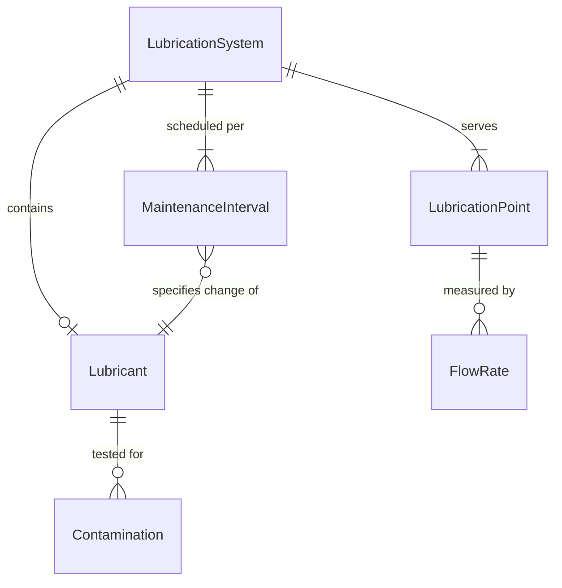
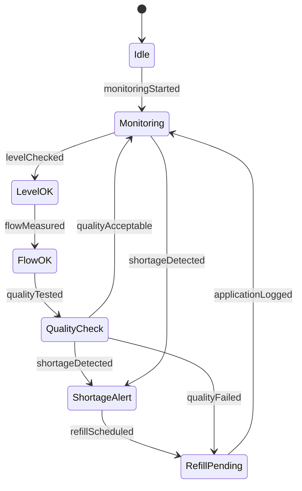
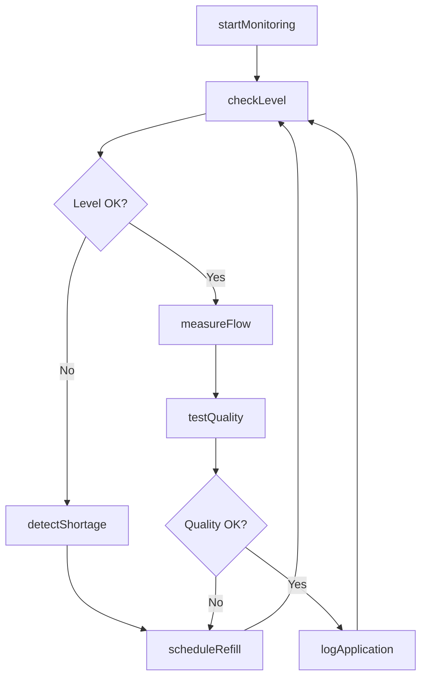
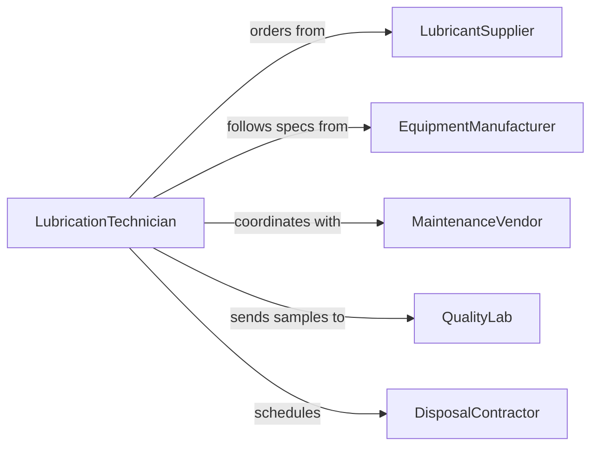

# Monitor Lubrication Equipment Workpieces

> Business-as-Code definition for continuous monitoring of lubrication systems to ensure proper fluid levels, quality, and application on equipment and workpieces.

## Overview

Lubrication monitoring involves tracking lubricant levels, flow rates, contamination, and application effectiveness to prevent equipment wear, reduce friction, and extend component lifespan. This definition provides actions for lubrication management, events for automated maintenance scheduling, and searches for lubrication system health data.

## Actors

| Actor | Description |
|-------|-------------|
| LubricantSupplier | Provides lubricants and technical specifications |
| EquipmentManufacturer | Defines lubrication requirements for machinery |
| MaintenanceVendor | Services lubrication systems and performs analysis |
| QualityLab | Tests lubricant samples for contamination and degradation |
| DisposalContractor | Handles used lubricant removal and recycling |
| Operator | Monitors lubrication indicators during production |

## Roles

| Role | Description |
|------|-------------|
| LubricationTechnician | Manages lubrication systems and schedules |
| MaintenanceSupervisor | Oversees preventive maintenance activities |
| QualityInspector | Verifies lubricant quality and application |
| ProductionOperator | Observes lubrication during equipment operation |

## Entities

| Entity | Description |
|--------|-------------|
| LubricationSystem | Automated or manual lubrication equipment |
| Lubricant | Oil, grease, or other friction-reducing substance |
| LubricationPoint | Specific location requiring lubrication |
| FlowRate | Volume of lubricant delivered per unit time |
| Contamination | Particles or degradation in lubricant |
| MaintenanceInterval | Scheduled lubrication or fluid change frequency |

## Actions

| Action | Description |
|--------|-------------|
| startMonitoring | Begin tracking lubrication system status |
| checkLevel | Verify lubricant volume in reservoir |
| measureFlow | Assess lubricant delivery rate to components |
| testQuality | Analyze lubricant for contamination or breakdown |
| detectShortage | Identify insufficient lubricant levels |
| scheduleRefill | Plan lubricant replenishment |
| logApplication | Record lubrication events for maintenance history |

## Events

| Event | Description |
|-------|-------------|
| monitoringStarted | Lubrication monitoring has been activated |
| levelChecked | Lubricant volume has been verified |
| flowMeasured | Delivery rate has been assessed |
| qualityTested | Lubricant analysis is complete |
| shortageDetected | Insufficient lubricant level identified |
| refillScheduled | Replenishment has been planned |
| applicationLogged | Lubrication event has been recorded |

## Searches

| Search | Description |
|--------|-------------|
| findSystems | List lubrication systems by equipment or location |
| getLubricantLevels | Retrieve current reservoir volumes |
| getFlowRates | Find delivery rates by lubrication point |
| getContamination | Retrieve systems with quality issues |

## Entity Relationships



## State Diagram



## Workflow



## Actor Relationships



## Usage

### Calling Actions

```typescript
import { monitorLubricationEquipmentWorkpieces } from '@headlessly/monitor-lubrication-equipment-workpieces'

const monitor = monitorLubricationEquipmentWorkpieces()

// Start monitoring a lubrication system
await monitor.startMonitoring({
  systemId: 'cnc-mill-lube',
  lubricationType: 'cutting-oil',
  points: ['spindle', 'ways', 'ballscrews'],
  checkInterval: 3600000 // ms
})

// Check levels and flow
const level = await monitor.checkLevel({
  systemId: 'cnc-mill-lube',
  reservoir: 'main-tank'
})

const flow = await monitor.measureFlow({
  systemId: 'cnc-mill-lube',
  point: 'spindle',
  expectedRate: 0.5 // liters per hour
})
```

### Event-Driven Automation

```typescript
// Auto-schedule refill on shortage
monitor.shortageDetected(async ({ systemId, currentLevel, minLevel }) => {
  await monitor.scheduleRefill({
    systemId,
    targetLevel: minLevel * 2,
    priority: 'high',
    assignedTo: 'maintenance-team'
  })
})

// Test quality after extended operation
monitor.applicationLogged(async ({ systemId, operatingHours }) => {
  if (operatingHours % 500 === 0) {
    await monitor.testQuality({
      systemId,
      sampleVolume: 100,
      testFor: ['viscosity', 'particulates', 'acidity']
    })
  }
})
```
